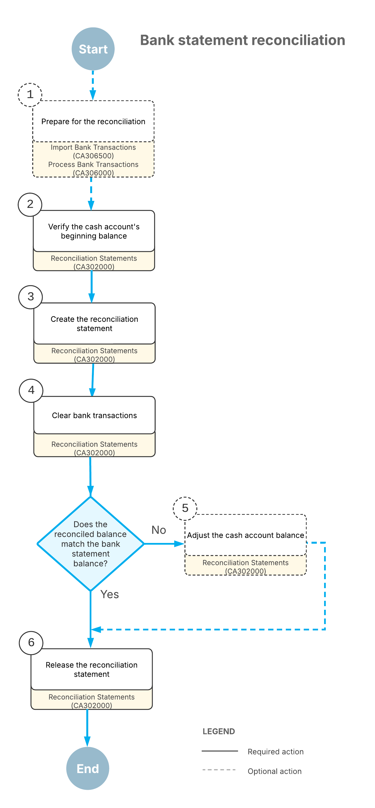

# Bank Reconciliation: General Information {#_04f2d20d-6cd4-4368-996d-d0618748b2d9 .concept}

If you are reconciling your cash accounts, you need quick and accurate tools to ensure that the third-party records match the transactions—cash transactions, payments to vendors, quick checks, incoming payments from customers, and cash sales—recorded in your system. Acumatica ERP offers you capabilities that ease the processes of importing, tracking, and matching the transactions.

## Learning Objectives {#section_f12_kjv_vxb .section}

You will learn how to reconcile a cash account with a statement from a third-party financial institution.

## Applicable Scenarios {#section_h12_kjv_vxb .section}

If you are reconciling an account from a financial institution, you compare its statement to the transactions of the cash account as tracked in your system. Because financial institutions offer a variety of online banking services, you do not need to wait for a monthly statement; you can instead download a list of recent banking transactions in a suitable format as needed. Regular reconciliations can reduce the number of errors on accounts and make it easier to find overlooked transactions, such as missing sales invoices or checks that have been lost in transit.

If you are reconciling a cash account other than a bank account \(for instance, a cash register account\), you can upload a list of amounts that are confirmed with the cash register receipts or with point-of-sale \(or similar\) reports.

## Steps of the Reconciliation Process {#section_k12_kjv_vxb .section}

In general, you perform the following steps when you reconcile each cash account:

1.  *Preparing for the reconciliation*: During or after each financial period, on the [Process Bank Transactions](CA_30_60_00.md) \(CA306000\) form, you clear transactions for the account as you receive information that the financial institution has processed them. For details, see [Bank Reconciliation: Uploading and Processing of Bank Transactions](Finance_Bank_Reconciliation_Preparation.md).
2.  *Verifying the beginning balance of the cash account*: At the end of the financial period, on the [Reconciliation Statements](CA_30_20_00.md) \(CA302000\) form, you verify that the beginning balance of the cash account in Acumatica ERP matches the beginning balance on the bank statement \(or on your record of the petty cash account\); if they do not match, you void the earlier statement and fix all errors. Also, you can review unreconciled transactions from previous financial periods and see which of them have been preliminarily cleared.

    **Attention:** If a transaction has been matched to an entry on a bank statement on the [Process Bank Transactions](CA_30_60_00.md) form, the **Cleared** check box is selected for the transaction on the [Reconciliation Statements](CA_30_20_00.md) form. Also, a transaction is cleared if a user has selected the **Cleared** check box for it on the form where the transaction was entered.

3.  *Creating the reconciliation statement*: You create a new reconciliation statement for the cash account on the [Reconciliation Statements](CA_30_20_00.md) form and enter the statement balance—for instance, the ending balance from the bank statement.
4.  *Clearing the transactions*: If you have used the [Process Bank Transactions](CA_30_60_00.md) form to clear bank transactions, on the [Reconciliation Statements](CA_30_20_00.md) form, you click the **Reconcile Processed** button on the table toolbar, and the system selects the **Reconciled** check boxes in the table for all released documents that were processed on the [Process Bank Transactions](CA_30_60_00.md) form.

    If you have been manually clearing transactions during the financial period for which you have created the reconciliation statement and are sure that the clearing is valid, you select the **Reconciled** check box for each cleared transaction.

    If no transactions have been cleared, by using a bank statement or other paper documents confirming transactions, you compare the transactions to the lines of the bank statement by using transaction identifiers, dates, and amounts. For each confirmed transaction, you select the **Reconciled** check box.

    **Tip:** You can perform reconciliation in as many sessions as you need. You can save the reconciliation statement at any time to continue to work with it later.

5.  *Adjusting the cash account balance*: As you progress through the list on the [Reconciliation Statements](CA_30_20_00.md) form, you can view the updated value of the difference between the reconciled balance of the cash account and the balance of the statement you have entered. You can create cash adjustments for transactions \(such as bank interest or service charges\) that have occurred but were not recorded to the account in Acumatica ERP. The reconciliation is finished when the difference between the reconciled balance of the cash account and the balance of the statement is zero. For details, see [Adjustment of a Cash Account Balance](#_d4305923-ad97-43e2-b013-52c158ef1d96).
6.  *Confirming the reconciliation results*: When you have finished comparing the cash account transactions to a bank statement on the [Reconciliation Statements](CA_30_20_00.md) form and the difference between the reconciled balance of the cash account and the balance of the statement is zero, you save the reconciliation statement. You can now release the reconciliation statement, which confirms that the cash account balance is reconciled for the financial period. For details, see the [Release of a Reconciliation Statement](#_d9edf953-3f01-4bee-864d-3bf25fc70141) section of this topic.

## Process Diagram {#section_q12_kjv_vxb .section}

The following diagram illustrates the process of bank statement reconciliation if approvals have not been set up in the system. \(For details about the workflow when approvals are set up, see [Bank Reconciliation: Approval of Reconciliation Statements](Finance_Bank_Reconciliation_Approvals.md).\)

## Creation of the First Reconciliation Statement {#section_s12_kjv_vxb .section}

If you have never performed reconciliation for a particular account and then decide to start reconciling the account on a specific date \(for example, when you are converting a cash account into a bank account\), consider creating a first reconciliation statement that includes all the transactions that had been recorded to this account before this specific date and that were not recorded to another source.

To start the first reconciliation, you need to know the starting balance of your first reconciliation statement. On the [Cash Account Details](CA_30_30_00.md) \(CA303000\) form, select the cash account and the date range for which the transactions are displayed \(from the date of the first transaction to the date that immediately precedes the date of conversion\). Make sure that all transactions that you are going to reconcile are posted to the general ledger. Then write down the value of the **Ending Balance** box \(in the Summary area\)—this will be your first reconciliation statement balance, which you enter in the **Statement Balance** box on the [Reconciliation Statements](CA_30_20_00.md) \(CA302000\) form.

**Tip:** You can use the [Cash Account Summary](CA_63_30_00.md) \(CA633000\) report to find out the ending balance of a cash account.

When you know the balance of your first reconciliation statement, you create the reconciliation statement and mark the transactions as reconciled. When the reconciled balance and the statement balance are equal, you save and release the reconciliation statement.

When you are reconciling the account for the second time, if you detect transactions that should belong to the first statement, you void the first statement, add these transactions, and release the statement again.

## Adjustment of a Cash Account Balance {#_d4305923-ad97-43e2-b013-52c158ef1d96 .section}

If you are reconciling a bank account, you compare the cash account transactions to the bank account records \(which are usually found in a bank statement\). Theoretically, the balance of the bank account should reconcile with the balance of the associated cash account as shown in your system. However, a transaction may be recorded on your books sooner or later than the bank actually reflects that change in the corresponding account. Also, the bank may invoke service charges of amounts that are not known in advance.

If you do not use automatic processing of the bank transactions, you may encounter a transaction that is in a bank statement, but is not recorded to the system. In Acumatica ERP, you can create cash adjustments for these transactions that have occurred but were not recorded to the account by clicking **Create Adjustment** on the table toolbar of the [Reconciliation Statements](CA_30_20_00.md) \(CA302000\) form.

## Release of a Reconciliation Statement {#_d9edf953-3f01-4bee-864d-3bf25fc70141 .section}

You can release a balanced statement by clicking **Release** on the form toolbar of the [Reconciliation Statement History](CA_30_20_10.md) \(CA302010\) or [Reconciliation Statements](CA_30_20_00.md) \(CA302000\) form.

The released statement includes only documents for which the **Reconciled** check box is selected in the table on the [Reconciliation Statements](CA_30_20_00.md) form. When you release the reconciliation statement, the system assigns a date and a reconciliation statement reference number to all transactions marked as reconciled; these transactions will not appear on any future reconciliation statement.

If transactions were not marked as reconciled but were marked as cleared, they will keep the *Cleared* status and will appear on subsequent statements until they are reconciled.

**Attention:** The amounts of unreleased transactions with the *Cleared* status affect the available balance of a cash account only if the **Unreleased Cleared** check box is selected in the **Receipts to Add to Available Balances** and **Disbursements to Deduct From Available Balances** sections of the [Cash Management Preferences](CA_10_10_00.md) \(CA101000\) form. For details, see [Cash Account Configuration](CA__CON_CashAccount_Definition.md).

**Parent topic:**[Performing Bank Reconciliation](../UserGuide/Finance_Bank_Reconciliation_Mapref.md)

