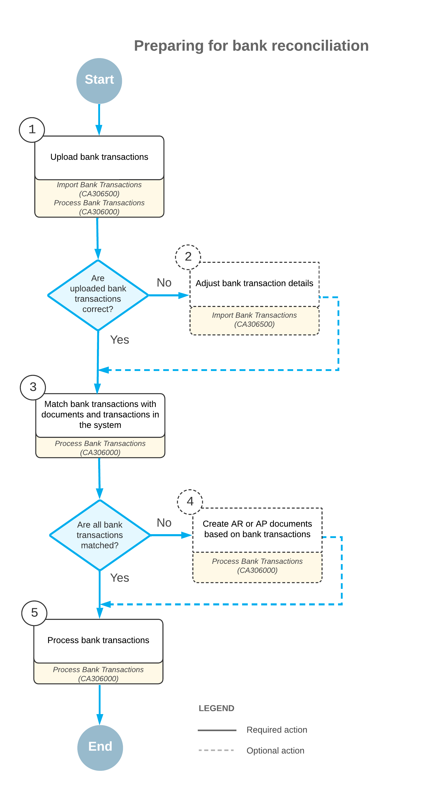

# Bank Reconciliation: Uploading and Processing of Bank Transactions {#_c9810aa3-dbf2-41fb-a260-eaeb6c4e91e9 .concept}

If your bank provides bank statements in Open Financial Exchange \(OFX\), QuickBooks Online \(QBO\), QFX, or Excel format, you process these statements by completing the steps described in the following sections.

## Uploading of Bank Transactions {#section_rd2_kjv_vxb .section}

In Acumatica ERP, you can use the following forms to upload transactions:

-   [Import Bank Transactions](CA_30_65_00.md) \(CA306500\): You use this form to upload and view transactions for each bank statement. When you use the form to upload a file with transactions for a cash account, the system immediately creates a document that represents the statement and displays the created statement on the form. When you use the form to upload a file with transactions for multiple cash accounts, the system doesn’t display any of the created statements. To view one of the statements, you need to select the needed cash account and the reference number of the statement.

    If you’re importing a file in OFX, QBO, or QFX format, the system imports the values to be inserted in the **Statement Date**, **Start Balance Date**, **End Balance Date**, and **Ending Balance** boxes from the file. The system validates the value of **Start Balance Date**, making sure it is equal to the end balance date of the previously imported statement.

    With the OFX, QBO, and QFX formats, the beginning balance of bank statements is not provided. Instead, the system uses the ending balance of the previous bank statement as the value in the **Beginning Balance** box. Also, the system checks whether the beginning balance plus the total imported receipts minus the total imported disbursements agrees with the imported ending balance of the bank statement.

    If you’re importing bank transactions in Excel format, you need to manually enter the statement date, end balance date, and ending balance. The system uses the ending balance of the previous bank statement as the beginning balance. Similarly, it uses the end balance date of the previous bank statement as the start balance.

    After uploading transactions, you can manually edit the transaction details provided by the bank before continuing to process the transactions in the system \(matching and clearing them\).

-   [Process Bank Transactions](CA_30_60_00.md) \(CA306000\): You use this form primarily to match and clear transactions from all the created statements for a selected cash account, but you can upload statements on this form as well. When you upload a file, the system doesn’t display the transactions, regardless of the number of cash accounts in the file. To view the uploaded transactions, you need to select a cash account; the system then displays all the transactions uploaded for this cash account that haven’t been processed \(matched and cleared\) yet.

**Attention:** When you’re importing transactions for the first time, the system creates the first bank statement. If you’re importing a file in OFX, QBO, or QFX format, the values to be inserted in **Statement Date**, **Start Balance Date**, **End Balance Date**, and **Ending Balance** boxes on the [Import Bank Transactions](CA_30_65_00.md) form are imported from the file; you have to specify the beginning balance of the first statement manually.

If you’re importing transactions from Excel or entering them manually, you have to enter all these values manually.

## Document Creation {#section_a22_kjv_vxb .section}

On the [Process Bank Transactions](CA_30_60_00.md) \(CA306000\) form, for the bank transactions that have no matches to any transaction that exists in the system, you can specify the details of documents that need to be created as you process transactions. To do so, on the **Create Payment** tab, you select a transaction that is marked as not matched and create a document.

On the **Create Payment** tab, in addition to creating a document, you can create a write-off with a positive amount or a negative amount. When you’re matching a bank transaction to a customer's AR invoice, a write-off with a positive amount can be used to record an amount underpaid by the customer and a negative amount can be used to record an amount overpaid by the customer.

The steps for recording a write-off are the following:

1.  In the Summary area of the **Create Payment** tab, you select the following settings:
    -   **Module**: *AR*
    -   **Business Account**: A customer whose payment you’re are matching to an invoice
2.  You click **Load Documents** so that the system loads the documents and displays them in the table or you click **Add Row** to add the needed document to the table.
3.  In the row with the needed invoice, you specify the following settings:

    |Column|Settings|
    |------|--------|
    |**Amount Paid \(Payment currency\)**|The amount specified in the bank transaction. The payment currency is shown in parentheses.|
    |**Balance Write-Off \(Payment currency\)**|Either of the following values:    -   A negative value: An overpaid amount to be written off, such as `-1.50`.
    -   A positive value: An underpaid amount to be written off, such as `2.00`.
The payment currency is shown in parentheses after the value.

|
    |**Write-Off Reason Code**|Either of the following values:     -   *CRWOFF - Credit Write Off* if the write-off is a negative value
    -   *BALWOFF - Balance Write Off* if the write-off is a positive value
|

On the **Create Payment** tab, you can create an AR payment or refund applied to an invoice or credit memo, or an AR payment or refund with an open balance, that is not applied to any document. An AR refund can be created for a bank transaction with the *Disbursement* type.

**Attention:** For details on processing customer refunds with an open balance, see [Refunds: To Create and Partially Apply a Refund](Finance_ProcessingCustomerRefunds_Activity3.md).

## Bank Transaction Processing {#section_g22_kjv_vxb .section}

You initiate the processing of the matched transactions on the [Process Bank Transactions](CA_30_60_00.md) \(CA306000\) form by clicking **Process** on the form toolbar. On the [Process Bank Transactions](CA_30_60_00.md) form, you perform the clearing of documents. The left pane displays unprocessed transactions imported from bank statements; you need to review these transactions.

The right pane contains the following tabs:

-   **Match to Payments**: Shows the payments that the system has evaluated as matching the transaction selected in the table on the left pane.
-   **Match to Invoices**: Displays the invoices that the system has evaluated as matching the transaction selected in the table on the left pane.
-   **Create Payment** tab: Can be used to quickly create a new document of the appropriate type for the transaction selected in the table on the left pane if it has no match.

For the bank transactions that had no match and for which you have specified information, the system creates the documents and transactions based on the specified information, releases the documents and transactions, and selects the read-only **Cleared** check box for every created document and transaction.

The settings of a payment method determine how the payment date is set for a payment document with the payment method selected. For the payment method, if the **Set Payment Date to Bank Transaction Date** check box is selected on the [Payment Methods](CA_20_40_00.md) \(CA204000\) form, when you match a bank transaction to an unreleased AR or AP payment document that is based on the payment method, the date of the payment document is set to the date of the bank transaction.

On the [Import Bank Transactions](CA_30_65_00.md) \(CA306500\) form, the **Processed** check box is selected for the transactions that have been processed.

## Process Diagram {#section_m22_kjv_vxb .section}

The following diagram illustrates the process of uploading and processing bank transactions.

**Parent topic:**[Performing Bank Reconciliation](../UserGuide/Finance_Bank_Reconciliation_Mapref.md)

