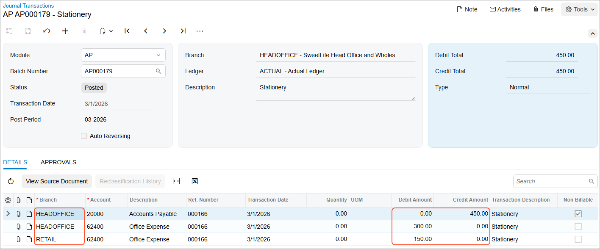
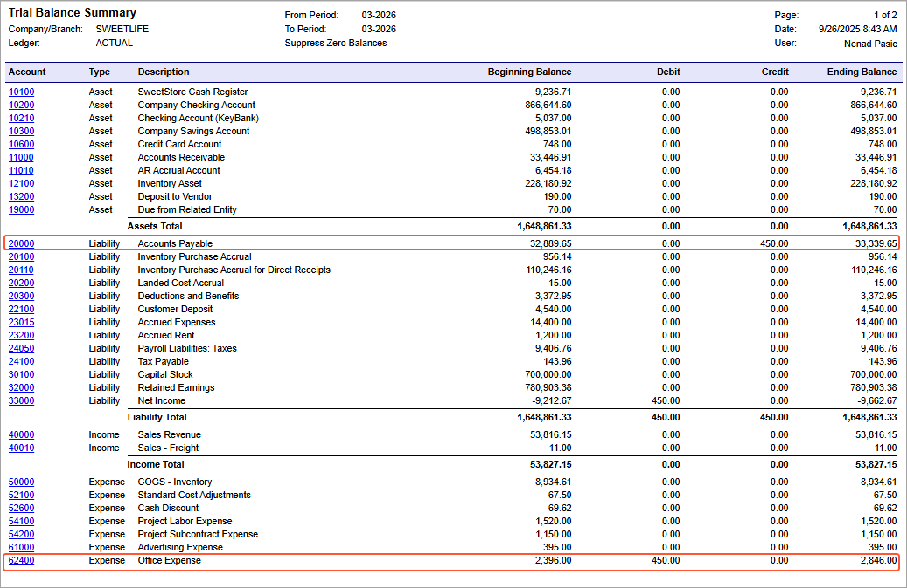

# Interbranch Bills Without Balancing: Process Activity {#_1ed08d40-d729-4cdc-b9b8-127f9210f7d6 .task}

In this activity, you will learn how to process a bill for branches that do not require balancing; you will then review the relevant account balances.

**Attention:** This activity is based on the *U100* dataset. If you are using another dataset or if any system settings have been changed in *U100*, these changes can affect the workflow of the activity and the results of the processing. To avoid issues, restore the *U100* dataset to its initial state.

## Story {#section_fsm_njv_vxb .section}

The head office of the SweetLife company needs to process a $450 bill that it has received from the Spectra Stationery Office vendor on March 1, 2026. The bill is for stationery that was purchased for the head office branch in the amount of $300 and for the retail store branch in the amount of $150. \(Transactions between these branches do not need to be balanced.\)

Acting as a SweetLife accountant, you need to create a bill in the system to reflect the bill received from the vendor, and then release the bill, which causes a batch to be generated for it.

## Configuration Overview {#section_tz4_djx_cnb .section}

In the *U100* dataset, the following tasks have been performed to support this activity:

-   On the [Companies](CS_10_15_00.md) \(CS101500\) form, the *SWEETLIFE* company has been defined.
-   On the [Branches](CS_10_20_00.md) \(CS102000\) form, the *HEADOFFICE* and *RETAIL* branches of the *SWEETLIFE* company have been created.
-   On the [Chart of Accounts](GL_20_25_00.md) \(GL202500\) form, multiple accounts have been created.
-   On the [Ledgers](GL_20_15_00.md) \(GL201500\) form, the *ACTUAL* ledger has been created.
-   On the [Vendors](AP_30_30_00.md) \(AP303000\) form, the *STATOFFICE* vendor has been created.

## Process Overview {#section_jsm_njv_vxb .section}

To process an interbranch bill for branches that do not require balancing, you will create and release the bill on the [Bills and Adjustments](AP_30_10_00.md) \(AP301000\) form. You will then review the generated batch on the [Journal Transactions](GL_30_10_00.md) \(GL301000\) form, check the account balances on the [Account Summary](GL_40_10_00.md) \(GL401000\) form, and generate the trial balance report by using the [Trial Balance Summary](GL_63_20_00.md) \(GL632000\) report form.

## System Preparation {#section_lsm_njv_vxb .section}

Before you begin performing the steps of this activity, do the following:

1.  Launch the Acumatica ERP website with the *U100* dataset preloaded, and sign in as an accountant Nenad Pasic by using the *pasic* username and the *123* password.
2.  In the info area, in the upper-right corner of the top pane of the Acumatica ERP screen, click the Business Date menu button and select *3/1/2026*.
3.  On the Company and Branch Selection menu on the top pane of the Acumatica ERP screen, make sure that the *SweetLife Head Office and Wholesale Center* branch is selected. If it is not selected, click the Company and Branch Selection menu to view the list of branches that you have access to, and then click *SweetLife Head Office and Wholesale Center*.

## Step 1: Reviewing the Account Balances Before Posting a Bill {#section_nsm_njv_vxb .section}

To review the account balances for the branches of the SweetLife company in the *03-2026* financial period, do the following:

1.  Open the [Account Summary](GL_40_10_00.md) \(GL401000\) form.
2.  To review the account balances in both branches, in the Summary area, make sure the following settings are specified:
    -   **Company/Branch**: *SWEETLIFE*
    -   **Ledger**: *ACTUAL - Actual Ledger*
    -   **Financial Period**: *03-2026*
3.  In the table, review the account balances.

    For the *HEADOFFICE* branch, for the *62400 - Office Expense* account, notice the amount in the **Debit Total** column is 0.00 and for the *20000 - Accounts Payable* account, the amount in the **Credit Total** column is 0.00.

    For the *RETAIL* branch, for the *20000 - Accounts Payable* account, note that the amount in the **Credit Total** column is 0.00 and the *62400 - Office Expense* account is not listed, meaning that the account balances are zero for the period.

Now you will create a bill between branches, which involves these accounts.

## Step 2: Creating and Processing a Bill for Branches Not Requiring Balancing {#section_ssm_njv_vxb .section}

To create and process an AP bill for stationery purchased for multiple branches \(*HEADOFFICE* and *RETAIL*\) that do not require balancing, do the following:

1.  Open the [Bills and Adjustments](AP_30_10_00.md) \(AP301000\) form.

    **Tip:** To open the form for creating a new record, type the form ID in the Search box, and on the Search form, point at the form title and click **New** right of the title.

2.  Click **Add New Record** on the form toolbar, and specify the following settings in the Summary area:
    -   **Type**: *Bill*
    -   **Vendor**: *STATOFFICE*
    -   **Date**: *3/1/2026* \(inserted by default\)
    -   **Description**: `Stationery`
3.  On the **Details** tab, click **Add Row**, and enter the following settings in the row you have added:
    -   **Branch**: *HEADOFFICE*
    -   **Transaction Descr.**: `Stationery`
    -   **Ext. Cost**: `300`
4.  Add another row with the following settings:

    -   **Branch**: *RETAIL*
    -   **Transaction Descr.**: `Stationery`
    -   **Ext. Cost**: `150`
    Notice the *62400 - Office Expense* account specified in the **Account** column for both lines, which is the expense account associated with the vendor.

5.  On the form toolbar, click **Save** to save the bill.
6.  On the form toolbar, click **Remove Hold** and click **Release** to release the bill.
7.  On the **Financial** tab, notice the originating branch of the bill \(*HEADOFFICE*\), which is specified in the **Branch** box. The system has filled in the **Branch** box automatically with the branch to which you are signed in. Also, notice the AP account \(*20000 - Accounts Payable*\), which is specified in the **AP Account** box.
8.  Click the link in the **Batch Nbr.** box, and review the GL batch, which the system has opened on the [Journal Transactions](GL_30_10_00.md) \(GL301000\) form \(see the following screenshot\).

    

When you released the bill, the system generated and posted the related GL transaction. The AP account of the originating branch of the bill has been credited with the amount of the bill \($450\) and accounts of the destination branches have been debited with the line amounts \($300 and $150\).

In the next step, you will check the balances of these accounts.

## Step 3: Reviewing the Account Balances {#section_ysm_njv_vxb .section}

To review the account balances for the branches in the *03-2026* financial period, do the following:

1.  Open the [Account Summary](GL_40_10_00.md) \(GL401000\) form.
2.  To review the account balances in the *HEADOFFICE* branch, in the Summary area, make sure the following settings are specified:
    -   **Company/Branch**: *HEADOFFICE*
    -   **Ledger**: *ACTUAL*
    -   **Period**: *03-2026*
3.  In the table, review the account balances. Notice the amount in the **Debit Total** column for the *62400 - Office Expense* account \($300\).
4.  In the **Company/Branch** box of the Summary area, select *RETAIL* to review the account balances in the *RETAIL* branch.
5.  In the table, review the account balances. Notice the amount in the **Debit Total** column for the *62400 - Office Expense* account \($150\).

Now you will review the balances for the financial period for the company as a whole.

## Step 4 \(Optional\): Reviewing the Balances for the Financial Period {#section_tcs_smw_3pb .section}

To review the balances for the *03-2026* financial period, do the following:

1.  Open the [Trial Balance Summary](GL_63_20_00.md) \(GL632000\) report form.
2.  On the **Report Parameters** tab, specify the following parameters:
    -   **Company/Branch**: *SWEETLIFE*
    -   **Ledger**: *ACTUAL*
    -   **From Period**: *03-2026*
    -   **To Period**: *03-2026*
    -   **Suppress Zero Balances**: Selected
3.  On the report form toolbar, click **Run Report**.
4.  In the generated report, review the account balances. The amount in the **Credit** column for the *20000 - Accounts Payable* account equals the amount in the **Debit** column for the *62400 - Office Expense* account, as shown in the following screenshot.

In this activity, you have created and processed a bill between branches that do not require balancing, and you have learned how to review the relevant account balances.

**Parent topic:**[Processing Interbranch Bills Without Balancing](../UserGuide/Finance_Bill_Between_Branches_Not_Requiring_Balancing_Mapref.md)

