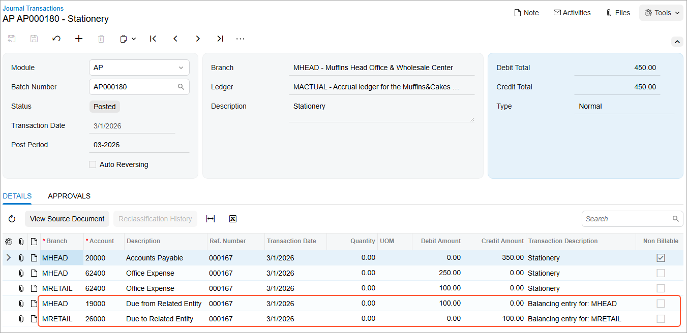
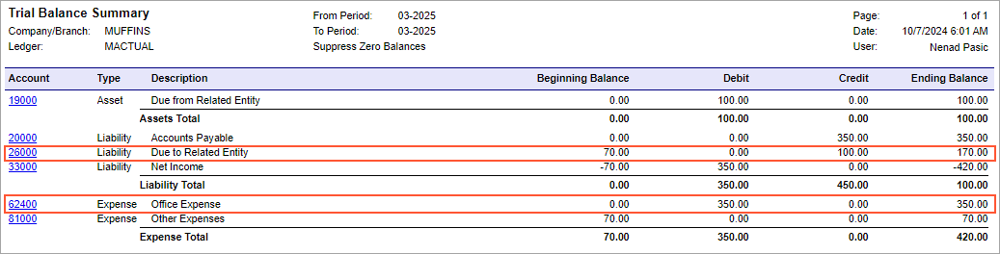

# Interbranch Bills with Balancing: Process Activity {#_b7be8e9b-a0c6-4e4d-b39d-39db66f23832 .task}

In this activity, you will learn how to create and process a bill for branches requiring balancing. You will then review the relevant account balances.

**Attention:** This activity is based on the *U100* dataset. If you are using another dataset or if any system settings have been changed in *U100*, these changes can affect the workflow of the activity and the results of the processing. To avoid issues, restore the *U100* dataset to its initial state.

## Story {#section_hcn_njv_vxb .section}

The head office of the Muffins &amp; Cakes company needs to process a $350 bill that it has received from the Spectra Stationery Office vendor on March 1, 2026. The bill is for stationery that is being purchased for the head office branch in the amount of $250 and for the retail store branch in the amount of $100; these entries need to be balanced.

Acting as a Muffins accountant, you need to create a bill in the system to reflect the bill received from the vendor, and then release the bill, which causes a batch to be generated for it.

## Configuration Overview {#section_tz4_djx_cnb .section}

In the *U100* dataset, the following tasks have been performed to support this activity:

-   On the [Companies](CS_10_15_00.md) \(CS101500\) form, the *MUFFINS* company has been defined.
-   On the [Branches](CS_10_20_00.md) \(CS102000\) form, the *MHEAD* and *MRETAIL* branches of the *MUFFINS* company have been created.
-   On the [Chart of Accounts](GL_20_25_00.md) \(GL202500\) form, multiple accounts have been created.
-   On the [Ledgers](GL_20_15_00.md) \(GL201500\) form, the *MACTUAL* ledger has been created.
-   On the [Vendors](AP_30_30_00.md) \(AP303000\) form, the *STATOFFICE* vendor has been created.
-   On the [Inter-Branch Account Mapping](GL_10_10_10.md) \(GL101010\) form, the account mapping rules between the Muffins &amp; Cakes head office branch \(*MHEAD*\) and the Muffins &amp; Cakes retail store branch \(*MRETAIL*\) have been defined.

## Process Overview {#section_mcn_njv_vxb .section}

To process an interbranch bill between branches requiring balancing, you will create and release the bill on the [Bills and Adjustments](AP_30_10_00.md) \(AP301000\) form. You will then review the generated batch on the [Journal Transactions](GL_30_10_00.md) \(GL301000\) form and check the account balances on the [Account Summary](GL_40_10_00.md) \(GL401000\) form.

Finally, you will generate the trial balance report by using the [Trial Balance Summary](GL_63_20_00.md) \(GL632000\) report form.

## System Preparation {#section_pcn_njv_vxb .section}

Before you begin performing the steps of this activity, do the following:

1.  Launch the Acumatica ERP website with the *U100* dataset preloaded, and sign in as an accountant Nenad Pasic by using the *pasic* username and the *123* password.
2.  In the info area, in the upper-right corner of the top pane of the Acumatica ERP screen, make sure that the business date in your system is set to *3/1/2026*. If a different date is displayed, click the Business Date menu button and select *3/1/2026*.
3.  On the Company and Branch Selection menu on the top pane of the Acumatica ERP screen, select the *MHEAD - Muffins Head Office &amp; Wholesale Center* branch.

## Step 1: Creating and Processing a Bill for Branches Requiring Balancing {#section_rcn_njv_vxb .section}

To create and process an AP bill for stationery purchased for multiple branches \(*MHEAD* and *MRETAIL*\) that require balancing, do the following:

1.  Open the [Bills and Adjustments](AP_30_10_00.md) \(AP301000\) form.

    **Tip:** To open the form for creating a new record, type the form ID in the Search box, and on the Search form, point at the form title and click **New** right of the title.

2.  Click **Add New Record** on the form toolbar, and specify the following settings in the Summary area:
    -   **Type**: *Bill*
    -   **Vendor**: *STATOFFICE*
    -   **Date**: *3/1/2026* \(inserted by default\)
    -   **Description**: `Stationery`
3.  On the **Details** tab, click **Add Row**, and specify the following settings in the row you have added:
    -   **Branch**: *MHEAD*
    -   **Transaction Descr.**: `Stationery`
    -   **Ext. Cost**: `250`
4.  Add another row with the following settings:

    -   **Branch**: *MRETAIL*
    -   **Transaction Descr.**: `Stationery`
    -   **Ext. Cost**: `100`
    Notice that the *62400 - Office Expense* account has been inserted in the **Account** column for both lines automatically because it is the expense account associated with the vendor.

5.  On the form toolbar, click **Save** to save the bill.
6.  On the form toolbar, click **Remove Hold** and then click **Release** to release the bill.
7.  On the **Financial** tab, notice that the originating branch of the bill is *MHEAD*, which is specified in the **Branch** box. The system has filled in the **Branch** box automatically with the branch to which you are signed in. Also, notice *20000 - Accounts Payable* account is specified in the **AP Account** box.
8.  Click the link in the **Batch Nbr.** box, and review the GL batch, which the system has opened on the [Journal Transactions](GL_30_10_00.md) \(GL301000\) form.

    When you released the bill, the system generated and posted the related GL transaction. The AP account of the originating branch of the bill has been credited and accounts from each document line have been debited in the destination branch specified in detail lines. Notice that the system added the balancing entries to the batch during the posting process \(see the following screenshot\). The balancing entries have been created based on the mapping rule that has been configured on the [Inter-Branch Account Mapping](GL_10_10_10.md) \(GL101010\) form.

    

You have added an AP bill that includes items purchased for two branches requiring balancing, and you have released this bill and reviewed the batch created when the bill was released. In the next step, you will check the account balances in each of the branches.

## Step 2: Reviewing the Account Balances {#section_xcn_njv_vxb .section}

To review the account balances for the *MHEAD* and *MRETAIL* branches and the *03-2026* financial period, do the following:

1.  Open the [Account Summary](GL_40_10_00.md) \(GL401000\) form.
2.  To review the account balances in the *MHEAD* branch, in the Summary area, specify the following settings:
    -   **Company/Branch**: *MHEAD*
    -   **Ledger**: *MACTUAL*
    -   **Period**: *03-2026*
3.  In the table, review the account balances. Notice that the amount in the **Ending Balance** column for the *20000 - Accounts Payable* account is $350.00, for the *62400 - Office Expense* account is $250.00, and for the *19000 - Due from Related Entity* account is $100.00.
4.  In the **Company/Branch** box of the Summary area, select *MRETAIL* to review the account balances in the *MRETAIL* branch.
5.  In the table, review the account balances. Notice the amount in the **Ending Balance** column for the *62400 - Office Expense* account is $100.00 and for the *26000 - Due to Related Entity* account is $100.00.

You have reviewed the account balances for the branches for which goods were purchased in the AP bill you created. Now you will review the balances for the financial period for the company as a whole.

## Step 3 \(Optional\): Reviewing the Balances for the Financial Period {#section_hwy_knw_3pb .section}

To review the balances for the *03-2026* financial period, do the following:

1.  Open the [Trial Balance Summary](GL_63_20_00.md) \(GL632000\) report form.
2.  To prepare this report for the *MHEAD* branch, on the **Report Parameters** tab, specify the following parameters:
    -   **Company/Branch**: *MHEAD*
    -   **Ledger**: *MACTUAL*
    -   **From Period**: *03-2026*
    -   **To Period**: *03-2026*
    -   **Suppress Zero Balances**: Selected
3.  On the report form toolbar, click **Run Report**.
4.  In the generated report, review the account balances. Notice the amount in the **Ending Balance** column for the *20000 - Accounts Payable* account, the *62400 - Office Expense* account, and the *19000 - Due from Related Entity* account.
5.  Run the same report for the whole company. To do so, in the **Company/Branch** box of the **Report Parameters** tab, select *MUFFINS*.
6.  In the generated report, review the account balances. Notice the amount in the **Ending Balance** column for the *62400 - Office Expense* account and the *26000 - Due to Related Entity* account, which are shown in the following screenshot.

In this activity, you have created and processed a bill that includes items purchased for branches that require balancing, and you have learned how to review the relevant account balances.

**Parent topic:**[Processing Interbranch Bills With Balancing](../UserGuide/Finance_Bill_Between_Branches_Requiring_Balancing_Mapref.md)

