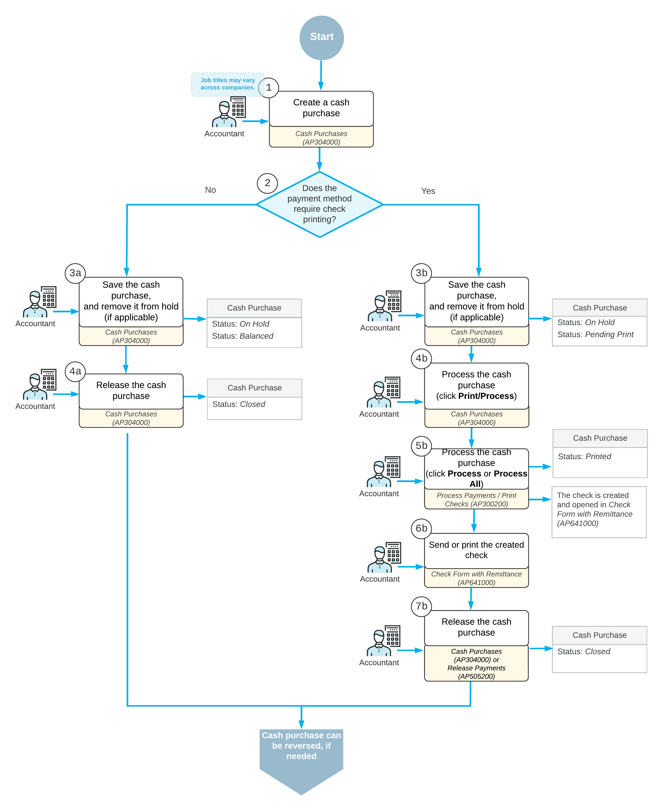

# Cash Purchases: General Information {#_4bcb9e59-688f-4f5d-bfc2-5f361d90a6cb .concept}

In Acumatica ERP, a cash purchase is a document of the *Cash Purchase* type, which you create on the [Cash Purchases](AP_30_40_00.md) \(AP304000\) form to record a purchase for which the payment was made at the time of the purchase—that is, without incurring any liabilities.

On the [Cash Purchases](AP_30_40_00.md) form, you can also record a full or partial refund for the items paid immediately by creating a document of the *Cash Return* type or reversing a cash purchase recorded before.

## Learning Objectives { .section}

In this chapter, you will learn how to create and process a cash purchase document in Acumatica ERP.

## Applicable Scenarios { .section}

You create and process a cash purchase document when you want to record a purchase of non-stock goods or services paid immediately.

## Workflow of the Cash Purchase Processing {#section_vv2_1y4_y4b .section}

The processing of a *Cash Purchase* document involves the actions shown in the following diagram.

## Cash Purchase Entry { .section}

You create cash purchases by using the [Cash Purchases](AP_30_40_00.md) \(AP304000\) form. On this form, you specify details of a cash purchase document, such as date, vendor, location, payment method and cash account \(if applicable\). On the **Details** tab, you enter one detail line or any number of detail lines. For each detail line, you can specify a particular non-stock item or service.

If the payments of the selected payment method will be processed by a bank, the bank may apply finance charges. On the **Charges** tab, you can add these charges and specify their particular amounts for the payment.

## Cash Purchase Processing { .section}

Depending on the payment method specified in the created cash purchase document, the processing workflow may vary.

If the payment method requires printing checks \(the **Print Checks** option button is selected on the **Settings for Use in AP** tab on the [Payment Methods](CA_20_40_00.md) \(CA204000\) form\), when you save a cash purchase document and remove it from hold, the system assigns the *Pending Print* status to it.

To proceed with the document, you click **Print/Process** on the form toolbar. The [Process Payments / Print Checks](AP_50_50_00.md) \(AP505000\) form opens on the same tab. On this form, you select the unlabeled check box in the table next to the cash purchase document to be processed, and click **Process** on the form toolbar. Upon clicking, the system generates a check for the selected document, and displays it on the [Check Form with Remittance](AP_64_10_00.md) \(AP641000\) form. At that moment, the *Cash Purchase* document is assigned with the *Printed* status. Now the cash purchase can be released on either the [Cash Purchases](AP_30_40_00.md) \(AP304000\) or the [Release Payments](AP_50_52_00.md) \(AP505200\) form.

If the payment method does not require printing checks, once you saved a cash purchase document and removed it from hold, it is assigned with the *Balanced* status. You can release it immediately.

For details on printing checks, including MICR \(Magnetic Ink Character Recognition\)–encoded checks, see [To Print Checks](AP__how_Printing_Checks.md).

## Expense Reclassification {#section_ax3_njv_vxb .section}

If expense reclassification is performed as a separate stage of document processing in your system, you can set up the workflow so that the users who enter cash purchases into the system will pre-release them, and later the authorized accountants will perform expense reclassification—that is, assign correct expense accounts \(and subaccounts\) and finally release them. For more information, see [Reclassification of Expenses: General Information](Finance_Reclassification_of_Expenses_General_Info.md).

## Reversal of a Cash Purchase { .section}

If for a cash purchase, a full or partial refund must be recorded, on the [Cash Purchases](AP_30_40_00.md) \(AP304000\) form, you can either reverse a cash purchase document, or manually create a cash return document, that is, a document of the *Cash Return* type.

You can reverse a cash purchase document of the *Closed* status. On the [Cash Purchases](AP_30_40_00.md) form, you open the document, and on the More menu, click the **Return** command. Once the command is clicked, the system creates the document of the *Cash Return* type and opens it on the current form. The system copies details of the **Details**, **Financial**, **Taxes** and **Remittance** tabs of the [Cash Purchases](AP_30_40_00.md) form from the original *Cash Purchase* document to the *Cash Return* document. On the **Financial** tab, the system inserts the reference number of the original cash purchase document in the **Orig. Ref. Nbr** box. On the **Details**, you can edit the details of the purchased items depending on whether they are recording a partial refund or a full refund. The system does not copy the settings on the **Approvals** tab and the **Charges** tab. However, in the *Cash Return* document, on the **Charges** tab, you can manually add a charge, either positive or negative.

You can also manually create a cash return document. On the [Cash Purchases](AP_30_40_00.md) form, you add a new document. In the Summary area of the form, in the **Type** box, select *Cash Return*, fill in all required details in the Summary area and on the **Details** tab of the form, and save the document.

## Application of Direct-Entry Taxes to Cash Purchases {#section_jx3_njv_vxb .section}

On the [Cash Purchases](AP_30_40_00.md) \(AP304000\) form, a direct-entry tax is applied to a document if both of the following conditions are met:

-   The vendor's tax zone includes the direct-entry.
-   The tax category selected in the document line contains the direct-entry tax and has the **Exclude Listed Taxes** check box cleared on the [Tax Categories](TX_20_55_00.md) \(TX205500\) form.

For a direct-entry tax, the following columns cannot be edited on the **Taxes** tab of the [Cash Purchases](AP_30_40_00.md) form: **Taxable Amount**, **Tax Amount**, **Tax Rate**, and **Expense Amount**; also, the **Deferral Code** column on the **Details** tab cannot be edited.

You cannot manually delete a direct-entry tax from the **Taxes** tab by selecting the row with the tax and clicking **Delete Row** on the table toolbar. To delete a direct-entry tax, on the **Details** tab, you should change the tax category for the document line or delete the document line with the tax.

If a cash purchase with a direct-entry tax line is voided, the voided cash purchase is created with the same direct-entry tax line and tax amount.

If the *Net/Gross Entry Mode* feature is enabled on the [Enable/Disable Features](CS_10_00_00.md) \(CS100000\) form, the tax calculation mode selected for the cash purchase on the **Financial** tab \(**Tax and Terms** section\) of the [Cash Purchases](AP_30_40_00.md) form does not affect the tax calculated for the line with a direct-entry tax.

For details on direct-entry taxes, see [Direct Tax Payment: General Information](Taxes_Paying_Tax_Directly_GeneralInfo.md).

**Parent topic:**[Processing Cash Purchases](../UserGuide/Finance_Processing_Cash_Purchases_Mapref.md)

