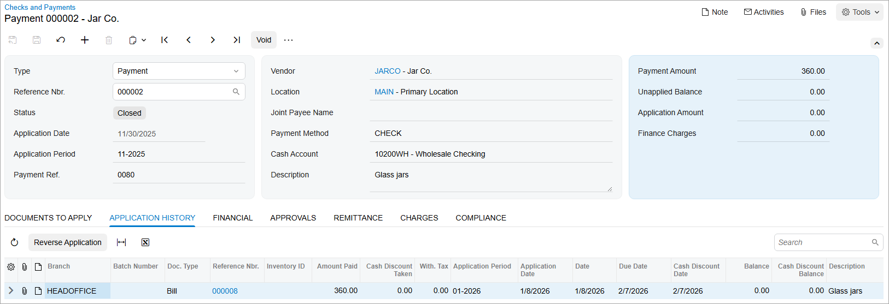

# Check Reprinting: Process Activity {#_abdf6b04-5556-4cab-9cf2-1b0a7c492886 .task}

The following activity will walk you through the process of printing, correcting, and reprinting a check.

**Attention:** This activity is based on the *U100* dataset. If you are using another dataset or if any system settings have been changed in *U100*, these changes can affect the workflow of the activity and the results of the processing. To avoid issues, restore the *U100* dataset to its initial state.

## Story {#section_zrj_njv_vxb .section}

Suppose that in November 2025, the SweetLife Fruits &amp; Jams company bought glass jars and lids from Jar Co. in the amount of $410, and a check was entered in the system.

Acting as a SweetLife accountant, you have to print the check to prepare it for further processing. Further suppose that after printing the check, you find out that the items in one of the two bills included in this check \(with an amount of $50\) have not been delivered. You have to exclude this bill from the check, reprint the check, and release the check.

## Configuration Overview {#section_csj_njv_vxb .section}

For the purposes of this activity, on the [Accounts Payable Preferences](AP_10_10_00.md) \(AP101000\) form, the **Hold Documents on Entry** check box has been selected in the **Data Entry Settings** section.

## Process Overview {#section_esj_njv_vxb .section}

You will initially print a check on the [Checks and Payments](AP_30_20_00.md) \(AP302000\) form. When you discover that the check you printed was in error, on the [Process Payments / Print Checks](AP_50_50_00.md) \(AP505000\) form, you will select the *Reprint* action for the check to change its status from *Printed* to *Pending Print*; this makes it possible to put the check on hold \(assign the *On Hold* status to it\) so that it can be edited. On the [Checks and Payments](AP_30_20_00.md) form, you will make necessary edits to the check. Then on the [Process Payments / Print Checks](AP_50_50_00.md) form, you will reprint the check on a new blank check with a new number. Finally, you will release the updated and reprinted check on the [Release Payments](AP_50_52_00.md) \(AP505200\) form.

## System Preparation {#section_gsj_njv_vxb .section}

To prepare the system, do the following:

1.  Launch the Acumatica ERP website, and sign in as an accountant by using the following credentials:
    -   Username: *johnson*
    -   Password: *123*
2.  In the info area, in the upper-right corner of the top pane of the Acumatica ERP screen, make sure that the business date in your system is set to *1/30/2026*. If a different date is displayed, click the Business Date menu button and select *1/30/2026*. For simplicity, in this activity, you will create and process all documents in the system on this business date.
3.  On the Company and Branch Selection menu, also on the top pane of the Acumatica ERP screen, make sure that the *SweetLife Head Office and Wholesale Center* branch is selected. If it is not selected, click the Company and Branch Selection menu to view the list of branches that you have access to, and then click *SweetLife Head Office and Wholesale Center*.

## Step 1: Finding and Printing a Check {#section_isj_njv_vxb .section}

To find a check and print it, do the following:

1.  Open the Checks and Payments \(AP3020PL\) list of records.
2.  Find a check with the *On Hold* status and an amount of $410 as follows:
    1.  In the filtering area, click the **Filter Settings** button.
    2.  Click the **Status** button and in the dialog box, select *On Hold*.
    3.  Click **Apply** to close the dialog box.
3.  In the table, find a check with the payment amount of $410.
4.  Click the link in the **Reference Nbr.** column.
5.  On the [Checks and Payments](AP_30_20_00.md) \(AP302000\) form, which opens for the check you want to print, click **Remove Hold** on the form toolbar, and save the check.

    Notice that the payment's status has changed to *Pending Print*.

6.  On the form toolbar, click **Print/Process**.
7.  On the [Process Payments / Print Checks](AP_50_50_00.md) \(AP505000\) form, which is opened with the payment listed in the table and the unlabeled check box selected for the row, review the details of the payment \(**Vendor ID** and **Payment Amount**\) and click **Process**.

    A separate browser tab is opened showing the printable version of the check.

8.  Review the printable version of the check, note the check number, and close the browser tab. \(For the purposes of this activity, you do not need to actually print the check. In a production setting, you would click **Print** on the form toolbar to print the check before closing the browser tab.\)

    The system opens the [Release Payments](AP_50_52_00.md) \(AP505200\) form with the payment ready for release. Do not release the payment yet.

## Step 2: Removing a Bill from the Check {#section_nsj_njv_vxb .section}

To remove the $50 bill, which contains the items not delivered, from the check, do the following:

1.  Open the Checks and Payments \(AP3020PL\) list of records.
2.  Click the **Status** column and in the dialog box that is displayed, click **Select All**. Click **Apply** to close the dialog box and clear the filter.
3.  In the table, find the check that you opened in Step 1 as follows:
    1.  In the filtering area, click the **Filter Settings** button.
    2.  Click the **Status** button and select *Printed*.
    3.  Click **Apply** to close the dialog box.
4.  In the table, review the payment. Notice its status \(*Printed*\) and payment amount \(*410.00*\).
5.  Open the [Release Payments](AP_50_52_00.md) \(AP505200\) form.
6.  In the **Action** box, select *Reprint with New Number*.

    With this action selected, for all checks you select and then process, the system will change the status from *Printed* to *Pending Print*. The number of this check will be kept in the system, and it will not be possible to reuse it for another check.

7.  In the table, select the unlabeled check box for the payment you have been working with, and on the form toolbar, click **Process**.
8.  In the **Processing** pop-up window, which is opened, click the **Processed** tab.
9.  Click the link in the **Reference Nbr.** column to again open the payment on the [Checks and Payments](AP_30_20_00.md) form.
10. On the form toolbar, click **Hold** to change the payment's status to *On Hold*.

    Now you can edit the payment to remove the bill of $50, whose products have not yet been delivered.

11. On the **Documents to Apply** tab, click the bill in the amount of $50, and click **Delete Row** on the table toolbar.
12. In the Summary area, enter `360` in the **Payment Amount** box.
13. In the **Description** box, enter `Glass jars`.
14. Save the payment, and on the form toolbar, click **Remove Hold**.

    The payment's status has changed again to *Pending Print*.

## Step 3: Reprinting the Check {#section_ssj_njv_vxb .section}

To reprint the already-printed check with a new number, because the blank with the old number cannot be used, do the following:

1.  While you are still viewing the payment on the [Checks and Payments](AP_30_20_00.md) \(AP302000\) form, on the form toolbar, click **Print/Process**.
2.  On the [Process Payments / Print Checks](AP_50_50_00.md) \(AP505000\) form, which is opened with the payment listed in the table and the unlabeled check box selected for the row, click **Process** on the form toolbar.

    A separate browser tab is opened showing the printable version of the check, which has a new check number but the updated amount of $360. You have not yet sent the check, but you have printed it on a blank. So you should reprint it with the new number on a new blank.

## Step 4: Releasing the Check {#section_vsj_njv_vxb .section}

To release the updated check, do the following:

1.  On the [Release Payments](AP_50_52_00.md) \(AP505200\) form, which opened after you printed the check, click the link in the **Reference Nbr.** column to open the payment on the [Checks and Payments](AP_30_20_00.md) \(AP302000\) form.

    Notice that the payment's status has changed again to *Printed*.

2.  On the form toolbar, click **Release** to release the payment.
3.  Click the **Application History** tab and make sure that the payment was applied to one bill in the amount of $360, as shown in the following screenshot.

**Parent topic:**[Check Correction and Reprinting](../UserGuide/Finance_CheckReprinting_Mapref.md)

