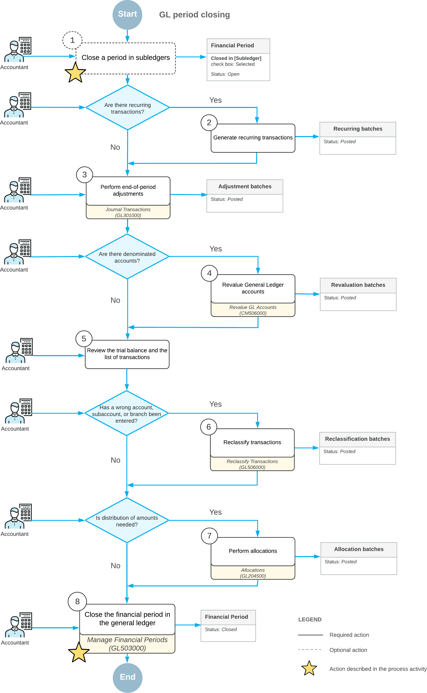

# Closing Financial Periods: General Information {#_46030371-514f-42d2-a83b-7976ec093ed9 .concept}

After all the needed transactions have been posted to a financial period and all figures have been verified, you can close the financial period in the system. The following capabilities and restrictions apply to the closing of financial periods:

-   You can close multiple periods at the same time \(for instance, all periods of a financial year\).
-   Financial periods can be closed starting from the first period of the first financial year. You cannot close a financial period if the previous one has not been closed yet, unless it is being closed at the same time.
-   Once closed, a period can later be reopened, if needed.
-   You generally close periods to prevent unauthorized users from posting new transactions to the period. However, you can allow users to enter documents and post transactions to the closed period.

## Learning Objectives {#section_gmj_mjv_vxb .section}

In this chapter, you will learn how to do the following:

-   Close a financial period in a subledger
-   Close a financial period in all the subledgers and in the general ledger at the same time

## Statuses of Financial Periods { .section}

Every financial period belongs to a range of periods that have a particular status—*Inactive*, *Open*, *Closed*, or *Locked*. The system can contain four period ranges, each with a different status.

The example shown in the following screenshot illustrates multiple period ranges in the system, with the periods in each range having a particular status that is valid in the system. You can see the following ranges of periods:

-   *01-2025* to *02-2025*, whose periods have the *Locked* status
-   *03-2025* to *04-2025*, whose periods have the *Closed* status
-   *05-2025* to *10-2025*, whose periods have the *Open* status
-   *11-2025* to *13-2025*, whose periods have the *Inactive* status

The following table lists the possible statuses of financial periods, describes each status, and presents the action or actions that you can perform to change the statuses of periods of each listed status. You can perform actions on periods on the [Manage Financial Periods](../Shared/../UserGuide/GL_50_30_00.md) \(GL503000\) form by clicking buttons on the form toolbar or the equivalent commands on the More menu.

|Status|Description of a Period with This Status|Actions That Can Be Performed|
|------|----------------------------------------|-----------------------------|
|*Inactive*|An inactive period has been generated in the system but has not yet been opened. Transactions cannot be posted to the period.|Open the period by clicking **Open**|
|*Open*|An open period can be selected in records, and transactions can be posted to it.|Close the period by clicking **Close** or deactivate it by clicking **Deactivate**|
|*Closed*|A closed period cannot be selected in records, and users can be restricted from posting to it.

 If the **Restrict Access to Closed Periods** check box is selected on the [General Ledger Preferences](../Shared/../UserGuide/GL_10_20_00.md) \(GL102000\) form, transactions can be posted to a closed period by only users to whom the *Financial Supervisor* role has been assigned. If this check box is cleared, any user can post to closed periods.

|Lock the period by clicking **Lock** or reopen it by clicking **Reopen**|
|*Locked*|A locked period cannot be selected in a record, and transactions cannot be posted to it in any subledger.

 You lock a period to prevent changes to period-specific data that has been verified and disclosed in reports.

|Unlock the period by clicking **Unlock**|

The following diagram illustrates the statuses in the lifetime of financial periods in the system, along with the actions that change the statuses of these periods.

The lifetime of a financial period in the system includes the following actions:

1.  A financial administrator generates the financial period with the *Inactive* status.
2.  To give users the ability to create a record in this period or post a transaction to the period under one of the company branches, the financial administrator must open the needed period in the company. This gives the period the *Open* status, and it can be used in all subledgers.
3.  Optional: The financial administrator inactivates an open period in the system to prevent users from posting transactions to this period. The inactivated period and the preceding periods will be assigned the *Inactive* status again.
4.  When all the needed records have been processed in the period, the financial administrator closes the period to prevent erroneous posting. For a period to be closed in a subledger, it must not contain any unreleased documents \(except for rejected and scheduled documents\), and the previous period has to be closed in this subledger. For a period to be closed in the general ledger, it must not contain any unposted transactions \(except for scheduled ones\), it has to be closed in all other subledgers, and the previous period has to be closed in the general ledger. When the financial administrator closes the period, the period and the preceding periods in the range \(that is, with the same status\) will be assigned the *Closed* status.
5.  Optional: A user to which the *Financial Supervisor* role is assigned reopens a closed period for posting. The reopening process sets the period's status to *Open* for the selected period or range of periods; optionally, the periods can be reopened in all subledgers.
6.  To keep the data unchanged by all the users and the validation processes, the financial administrator locks a closed period. The period can be locked only if the previous period is locked as well. This process assigns the *Locked* status to the range of periods to which the selected period belongs.
7.  Optional: If necessary, a user to which the *Financial Supervisor* role is assigned unlocks the period to assign the *Closed* status to it again so that the needed transactions can be posted to it.

## Closing of a Period in Subledgers {#_be94f79a-064a-4587-b226-e0dfa42d8373 .section}

Although you can close periods in subledgers and in the general ledger at the same time, you may decide to close periods in subledgers \(accounts payable, accounts receivable, cash management, inventory, and fixed assets\) separately in your system by using the forms listed below for each subledger. To view information about the status of periods, you can use the [Manage Financial Periods](GL_50_30_00.md) \(GL503000\) form.

Before you close a period in these subledgers, you should make sure that there are no unreleased documents that are to be posted to this period. \(For the fixed assets subledger, the system also checks whether all assets have been depreciated in the period.\) To close periods in the subledgers, you use the following forms:

-   In the accounts payable subledger, the [Close Financial Periods](AP_50_60_00.md) \(AP506000\) form
-   In the accounts receivable subledger, the [Close Financial Periods](AR_50_90_00.md) \(AR509000\) form
-   In the cash management subledger, the [Close Financial Periods](CA_50_60_00.md) \(CA506000\) form
-   In the inventory subledger, the [Close Financial Periods](IN_50_90_00.md) \(IN509000\) form
-   In the fixed assets subledger, the [Close Financial Periods](FA_50_90_00.md) \(FA509000\) form

When you close a given financial period in a subledger on any of these forms, all preceding open periods will be closed in the subledger as well.

## Closing of a Period in the General Ledger {#_82835322-d7a0-464d-b09f-adedf7354980 .section}

A period is assigned the *Closed* status only after it has been closed in the general ledger on the [Manage Financial Periods](GL_50_30_00.md) \(GL503000\) form. For instructions on how to close periods, see [Closing Financial Periods: To Close a Period in Subledgers and GL](Finance_ClosingPeriods_Process_Activity_2.md).

Before you close periods, you need to check whether there are unposted documents for the periods that you want to close. To do that, on the [Manage Financial Periods](GL_50_30_00.md) form, you select the periods you want to close and click **Unposted Documents** on the form toolbar. In the *Unposted Documents* report, which opens, you can review the list of documents that have not been posted to the selected periods.

Closing a period in the general ledger initiates the generation of auto-reversing batches if the **Generate Auto-Reversing Entries on Period Closing** check box is selected on the [General Ledger Preferences](GL_10_20_00.md) \(GL102000\) form and these batches have been prepared on the [Journal Transactions](GL_30_10_00.md) \(GL301000\) form. If auto-reversing entries should be generated when the applicable period is closed, you should not close the last financial period that was opened; you should always open at least one financial period before you close the most recent period.

You can view closed periods for a particular year on the [Master Financial Calendar](GL_20_10_00.md) \(GL201000\) form if the *Centralized Period Management* feature is enabled on the [Enable/Disable Features](CS_10_00_00.md) \(CS100000\) form or on the [Company Financial Calendar](GL_20_11_00.md) \(GL201100\) form if the *Centralized Period Management* feature is disabled. For the closed periods, the **Status** column contains *Closed* and the check boxes are selected in the **Closed in AP**, **Closed in AR**, **Closed in IN**, **Closed in CA**, and **Closed in FA** columns.

If a period was closed by mistake, you can reopen it on the [Manage Financial Periods](GL_50_30_00.md) form. For more information, see [Financial Periods: To Reopen a Period](Finance_ManagingPeriods_ReopeningPeriod_Activity.md).

## Posting of Transactions to Closed Periods {#_8065cad3-07e9-45c9-b47e-72aead37f75a .section}

In some cases, you may find additional transactions to be processed in a period that was closed. To accommodate such situations, you can allow posting transactions to closed periods by assigning appropriate users to the *Financial Supervisor* role on the [User Roles](SM_20_10_05.md) \(SM201005\) form. Only users assigned to this role can post to closed periods if the **Restrict Access to Closed Periods** check box is selected on the [General Ledger Preferences](GL_10_20_00.md) \(GL102000\) form. If this check box is cleared, all users can post transactions to closed periods.

If you want to prevent all users from posting to closed periods, you lock periods \(that is, you assign the periods the *Locked* status\) on the [Manage Financial Periods](GL_50_30_00.md) \(GL503000\) form. For instructions, see [Financial Periods: To Lock a Period](Finance_ManagingPeriods_LockingPeriod_Activity.md).

## Period-End Closing Overview {#section_zmj_mjv_vxb .section}

The process of closing a period consists of the following steps:

1.  Optional: Closing the period in the subledgers. \(You can instead close the period in subledgers along with the general ledger after performing period-end activities.\) For details, see [Closing Financial Periods: To Close a Period in a Subledger](Finance_ClosingPeriods_Process_Activity.md).
2.  Generating and posting any recurring transactions. For details, see [Recurring Transactions: Process Activity](Finance_Recurring_Transactions_Activity.md).
3.  Performing period-end adjustments—that is, posting adjustment transactions \(some of which should be reversed at the beginning of the next period\). For details, see [Adjusting Transactions: Process Activity](Finance_Adjusting_Transactions_Activity.md).
4.  Revaluing general ledger accounts so that the balances of the accounts in foreign currencies are revalued using the end-period exchange rate. For details, see [Revaluation of Bank Accounts: Process Activity](Multicurrency_RevaluationGL_Process_Activity.md).
5.  Reviewing the trial balance and the list of transactions.
6.  Reclassifying transactions if there are errors, as described in [Reclassifying Transactions](Finance_Reclassifying_Transactions_Mapref.md).
7.  Running allocations if the distribution of amounts between branches, accounts, and subaccounts is needed. For details, see and [Running Allocations](Finance_Running_Allocations_Mapref.md)
8.  Closing the period in the general ledger. For instructions, see [Closing Financial Periods: To Close a Period in Subledgers and GL](Finance_ClosingPeriods_Process_Activity_2.md).

The overall process of closing a period in the system is shown in the following diagram. The steps marked with a star are described in a process activity in this chapter.

**Parent topic:**[Closing Financial Periods in Subledgers and GL](../UserGuide/Finance_ClosingPeriods_Mapref.md)

