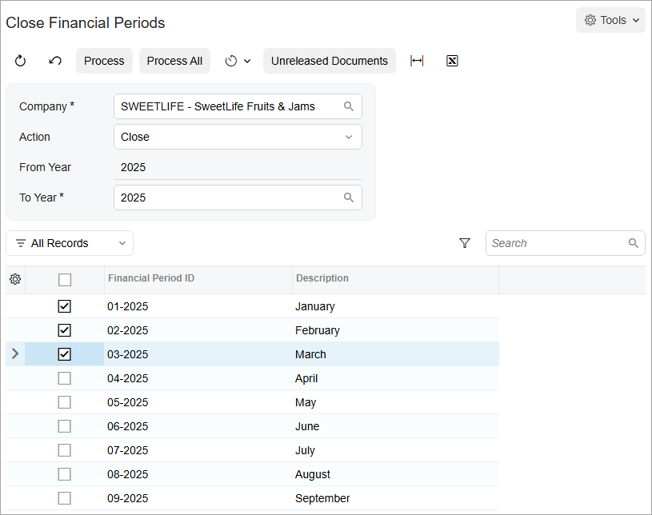

# Closing Financial Periods: To Close a Period in a Subledger {#_9e8ee4a2-3dc7-4339-a9fd-c1b37eed7087 .task}

The following activity will walk you through the process of closing a period in the accounts receivable subledger.

**Attention:** This activity is based on the *U100* dataset. If you are using another dataset or if any system settings have been changed in *U100*, these changes can affect the workflow of the activity and the results of the processing. To avoid issues, restore the *U100* dataset to its initial state.

## Story {#section_l4j_mjv_vxb .section}

Suppose that as an accountant of the SweetLife Fruits &amp; Jams company, you have to close the *03-2025* financial period and the preceding periods in the accounts receivable subledger for the SweetLife Head Office and Wholesale Center branch to prevent users from posting to these periods.

## Process Overview {#section_n4j_mjv_vxb .section}

In this activity, you will close financial periods in the accounts receivable subledger on the [Close Financial Periods](AR_50_90_00.md) \(AR509000\) form.

**Tip:** In a production environment, before you get started, you would make sure the following conditions are met:

-   There are no batches with a status of *On Hold*, *Balanced*, or *Unposted* in the period or periods.
-   If you use auto-reversing entries, at least one financial period will remain open after you close the needed period or periods.

## System Preparation {#section_q4j_mjv_vxb .section}

To prepare the system, do the following:

1.  Launch the Acumatica ERP website with the *U100* dataset. Sign in as an accountant by using the following credentials:
    -   Username: *johnson*
    -   Password: *123*
2.  On the Company and Branch Selection menu, also on the top pane of the Acumatica ERP screen, make sure that the *SweetLife Head Office and Wholesale Center* branch is selected. If it is not selected, click the Company and Branch Selection menu button to view the list of branches that you have access to, and then click *SweetLife Head Office and Wholesale Center*.

## Step 1: Preparing to Close the Financial Periods {#section_s4j_mjv_vxb .section}

Perform the following instructions to prepare to close the financial periods:

1.  Open the [Close Financial Periods](AR_50_90_00.md) \(AR509000\) form.
2.  In the Selection area, specify the following settings:
    -   **Company**: *SWEETLIFE* \(inserted by default\)
    -   **Action**: *Close* \(selected by default\)
    -   **To Year**: *2025*
3.  Select the unlabeled check box for the *03-2025* period. Notice that the check boxes corresponding to all the preceding periods are selected automatically, as shown in the following screenshot.

    

4.  On the form toolbar, click **Unreleased Documents** to verify that no unreleased documents exist for these periods.
5.  In the dialog box with an informational message that is displayed, click **OK**.

## Step 2: Closing the Financial Periods {#section_u4j_mjv_vxb .section}

To close the financial periods, do the following:

1.  On the form toolbar of the [Close Financial Periods](AR_50_90_00.md) \(AR509000\) form, click **Process**.
2.  Close the **Processing** dialog box.
3.  Open the [Manage Financial Periods](GL_50_30_00.md) \(GL503000\) form to review the statuses of financial periods.
4.  In the Selection area, specify the following settings:
    -   **Company**: *SWEETLIFE* \(inserted by default\)
    -   **Action**: *Close*
    -   **To Year**: *2025*
5.  In the table, review the statuses of the financial periods that you closed earlier.

    The periods have retained the *Open* status \(because they are still open in the subledgers and in the general ledger\), but the **Closed in AR** check box is selected for all the periods, meaning that these periods have been closed in the accounts receivable subledger.

**Parent topic:**[Closing Financial Periods in Subledgers and GL](../UserGuide/Finance_ClosingPeriods_Mapref.md)

