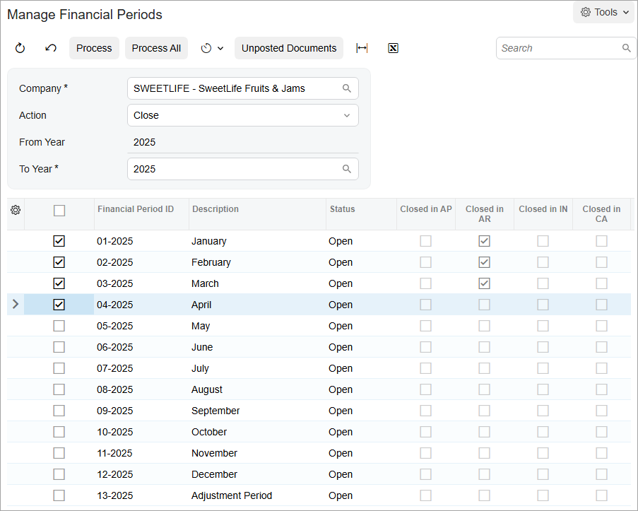

# Closing Financial Periods: To Close a Period in Subledgers and GL {#_2b0a8418-173c-44cf-9993-210576e5f5f8 .task}

The following activity will walk you through the process of closing periods in all the subledgers and in the general ledger at the same time.

## Story {#section_npj_mjv_vxb .section}

Suppose that as an accountant of the SweetLife Fruits &amp; Jams company, you have to close the *04-2025* financial period \(and all previous periods that are not already closed\) in all the subledgers and in the general ledger at the same time. The periods should be closed for the SweetLife Head Office and Wholesale Center branch to prevent users from posting to these periods.

## Process Overview {#section_ppj_mjv_vxb .section}

In this activity, you will review the statuses of financial periods on the [Company Financial Calendar](GL_20_11_00.md) \(GL201100\) form and close the financial periods on the [Manage Financial Periods](GL_50_30_00.md) \(GL503000\) form.

**Tip:** In a production environment, before you get started, you would make sure the following conditions are met:

-   There are no batches with a status of *On Hold*, *Balanced*, or *Unposted* in the period or periods.
-   If you use auto-reversing entries, at least one financial period will remain open after you close the needed period or periods.

## System Preparation {#section_spj_mjv_vxb .section}

To prepare the system, do the following:

1.  Launch the Acumatica ERP website with the *U100* dataset. Sign in as an accountant by using the following credentials:
    -   Username: *johnson*
    -   Password: *123*
2.  On the Company and Branch Selection menu, also on the top pane of the Acumatica ERP screen, make sure that the *SweetLife Head Office and Wholesale Center* branch is selected. If it is not selected, click the Company and Branch Selection menu button to view the list of branches that you have access to, and then click *SweetLife Head Office and Wholesale Center*.

## Step 1: Reviewing the Statuses of Financial Periods {#section_upj_mjv_vxb .section}

To review the statuses of the financial periods of 2025, do the following:

1.  Open the [Company Financial Calendar](GL_20_11_00.md) \(GL201100\) form.
2.  In the Selection area, specify the following settings:
    -   **Company**: *SWEETLIFE* \(inserted by default\)
    -   **Financial Year**: *2025*

## Step 2: Closing the Financial Periods {#section_xpj_mjv_vxb .section}

To close the financial periods, do the following:

1.  On the More menu of the [Company Financial Calendar](GL_20_11_00.md) \(GL201100\) form, click **Close Periods**.
2.  On the [Manage Financial Periods](GL_50_30_00.md) \(GL503000\) form, which opens, notice that the system has selected the *Close* action in the Summary area. In the table, select the unlabeled check box for the *04-2025* period. The check boxes for the preceding periods are automatically selected, as shown in the following screenshot.

    

3.  On the form toolbar, click **Unposted Documents** to verify that no unposted documents exist for these periods.
4.  In the dialog box with an informational message, which is displayed, click **OK**.
5.  On the form toolbar, click **Process**.
6.  In the dialog box with an informational message \(which informs you that the selected periods will be closed in the subledgers and in the general ledger\), click **OK**.
7.  Close the **Processing** pop-up window.

**Parent topic:**[Closing Financial Periods in Subledgers and GL](../UserGuide/Finance_ClosingPeriods_Mapref.md)

