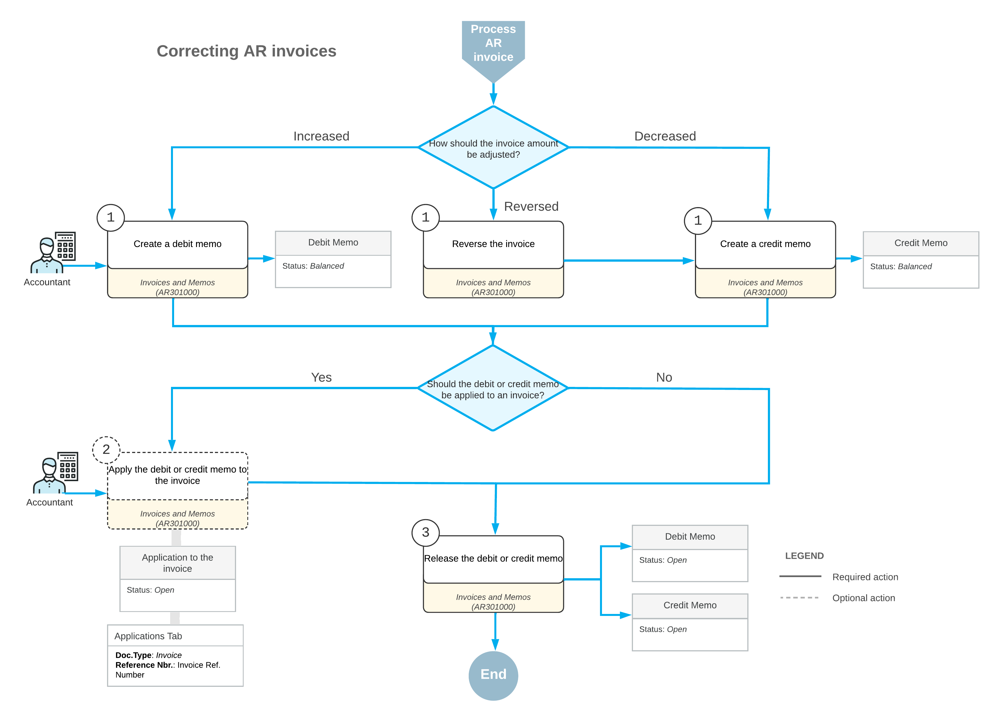

# AR Invoice Correction: General Information {#_1da8f906-8674-4a1a-b6a1-b92d573e60e8 .concept}

In Acumatica ERP, the amount of a released invoice, which increases a customer’s debt, cannot be changed directly in the released document. In an open \(released\) invoice, you can edit only the cash discount date and the due date until the document is settled. A closed invoice can’t be edited at all.

You may need to decrease the outstanding amount of an invoice when the invoice has overcharged the customer or the customer has reported receiving damaged goods. On the other hand, you may need to increase the amount of an invoice because additional expenses are incurred during the delivery of the goods or services listed in the original invoice. Also, you may need to reverse an invoice.

The correction of an invoice can be performed only by issuing an additional document \(credit or debit memo\) that affects the customer’s balance \(credit or debit\).

## Learning Objectives {#section_npn_4jv_vxb .section}

In this chapter, you will learn how to do the following:

-   Create and release a credit memo
-   Apply the credit memo to an open invoice
-   Create and release a debit memo
-   Apply a payment to the debit memo
-   Create a credit memo and apply a refund to it

## Applicable Scenarios {#section_rpn_4jv_vxb .section}

You create a credit or debit memo in the following cases:

-   You need to adjust the balance of a particular invoice.
-   You need to decrease the amount owed to you by a particular customer \(credit memo\) or to increase the amount owed to you by a particular customer \(debit memo\).

## Decreasing of the Amount of an Invoice {#section_tpn_4jv_vxb .section}

You issue a credit memo, which will be used to decrease a customer’s debt, by using the [Invoices and Memos](../Shared/../UserGuide/AR_30_10_00.md) \(AR301000\) form—the same form you use to create an invoice. The credit memo is independent of the original invoice, with no direct reference to it. The processing of a credit memo includes the application of this credit memo to the applicable invoice, which establishes a link between these two documents. A credit memo may have multiple lines or one summary line. Credit memos do not have due dates and may be numbered differently from invoices, depending on the standards in place in your organization.

The release of a credit memo decreases the customer's balance. The application of a released credit memo against invoices, debit memos, and overdue charges decreases the outstanding amount of these documents by the amount of the credit memo. For details, see [AR Invoice Correction: To Create a Credit Memo](Finance_CorrectingARInvoices_Process_Activity.md).

## Increasing of the Amount of an Invoice {#section_wpn_4jv_vxb .section}

It’s not possible to increase the outstanding amount of an open invoice \(which has been released\) or the paid amount of a closed one. You instead issue a debit memo by using the [Invoices and Memos](AR_30_10_00.md) \(AR301000\) form. When you release this document, it increases the debt of the customer; the debit memo does not change the balance of any invoice and should be paid as a separate document. The debit memo doesn’t contain a direct reference to any original invoice. The processing of a debit memo includes the application of this debit memo to an invoice, which establishes a link between these two documents, or to a payment. For details, see [AR Invoice Correction: To Create a Debit Memo and Apply a Payment to It](Finance_CorrectingARInvoices_Process_Activity2.md).

**Tip:** When creating a debit memo on the [Invoices and Memos](AR_30_10_00.md) form, you can apply a payment to it while the debit memo has not been released—that is, if the debit memo has the *On Hold* or *Balanced* status. You perform the following steps to apply a payment to an unreleased debit memo:

1.  On the [Invoices and Memos](AR_30_10_00.md) form, you create a debit memo with the *On Hold* status.
2.  On the **Applications** tab, you click the **Add Row** button on the table toolbar and select the needed payment.
3.  You then click **Remove Hold** and **Release** on the form toolbar to release the debit memo and its application to the payment.

Debit memos may be numbered differently from invoices. For details on the recording and release of a debit memo, see [AR Invoices: Invoice and Memo Processing Flow](AR__CON_Invoice_Life.md).

## Application of a Refund to a Credit Memo {#section_bqn_4jv_vxb .section}

With an unreleased credit memo selected on the [Invoices and Memos](AR_30_10_00.md) \(AR301000\) form, on the **Applications** tab, you select *Refund* in the **Doc. Type** column to apply a refund to the credit memo. In the **Reference Nbr.** column, you select the number of the refund; the numbers of only released and open customer refunds are available for selection. For details about refund processing, see [Refunds: General Information](Finance_ProcessingCustomerRefunds_GeneralInfo.md).

For a credit memo selected on the [Invoices and Memos](AR_30_10_00.md) form, a refund with the *Open* status can be applied to the credit memo if the credit memo hasn’t been released—that is, if the credit memo's status is *On Hold* or *Balanced*. Regardless of the status of the credit memo and the customer refunds applied to it, all documents applied to this credit memo are displayed on the **Applications** tab.

For a refund listed on the **Applications** tab of the form, you can edit the application amount in the **Amount Paid \(Payment currency\)** column to partially apply the refund to the credit memo.

For details, see [AR Invoice Correction: To Create a Credit Memo and Apply a Refund to It](Finance_CorrectingARInvoices_Process_Activity3.md).

## Reversal of an Invoice {#section_gqn_4jv_vxb .section}

When you reverse a released invoice, its status and outstanding amount don’t change. You can reverse an invoice on the [Invoices and Memos](AR_30_10_00.md) \(AR301000\) form in one of the following ways:

-   By clicking **Reverse** \(under **Corrections**\) on the More menu. The system automatically generates a credit memo with details similar to those of the invoice; you then need to release and apply the credit memo to the original invoice. You can change the document amount, if needed, before releasing the credit memo.
-   By clicking **Reverse and Apply to Memo** \(under **Corrections**\) on the More menu. The system automatically generates a credit memo with details similar to those of the invoice and creates a respective application; you then need to release the credit memo. You can change the document amount and application amount, if needed, before releasing the credit memo.

    **Tip:** If you don’t release the credit memo immediately and instead only save it, you cannot apply any other document to the reversed invoice \(for example, in the case of partial reversal\) until you release the credit memo and its application.

-   By manually creating a credit memo for the full balance of the invoice and then applying the credit memo to the invoice.

**Attention:** If you are reversing a closed invoice, before applying a credit memo, you need to reverse the application of the document used to close this invoice, thus causing the invoice to again be assigned the *Open* status.

If you use a command on the [Invoices and Memos](AR_30_10_00.md) form to automatically reverse an invoice, the system will display the invoice number for the created credit memo in the **Original Document** box on the **Financial** tab of the form.

## Reserving of a Credit Memo for Future Application {#section_lqn_4jv_vxb .section}

You can reserve an open credit memo for future application. To mark an open credit memo as reserved, on the [Payments and Applications](AR_30_20_00.md) \(AR302000\) form, you click **Hold** on the form toolbar for the credit memo with the *Open* status. The system changes the document status from *Open* to *Reserved*.

Reserved credit memos cannot be applied to outstanding documents and are excluded from the automatic application process. To release the credit memo from hold, click **Remove Hold** on the form toolbar.

## Process Diagram {#section_oqn_4jv_vxb .section}

The following diagram illustrates the invoice correction workflow, which is a part of the invoice processing workflow.

**Parent topic:**[Correcting AR Invoices](../UserGuide/Finance_CorrectingARInvoices_Mapref.md)

