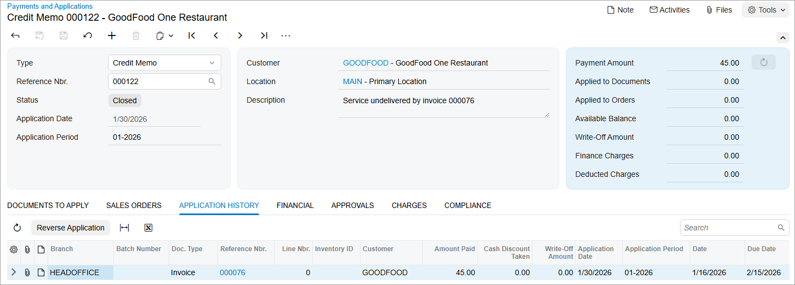

# AR Invoice Correction: To Create a Credit Memo {#_6018887a-76b9-4ff1-8bd4-20d95da075a8 .task}

The following activity will walk you through the process of creating a credit memo and applying it to an invoice.

**Attention:** This activity is based on the *U100* dataset. If you are using another dataset or if any system settings have been changed in *U100*, these changes can affect the workflow of the activity and the results of the processing. To avoid issues, restore the *U100* dataset to its initial state.

## Story {#section_hwn_4jv_vxb .section}

Suppose that on January 16, 2026, the SweetLife Fruits &amp; Jams company sold five days of online training to one of its customers, GoodFood One Restaurant, in the amount of $225. An AR clerk created an invoice for five days of training for GoodFood One Restaurant. The actual number of training days turned out to be four, and now SweetLife needs to reduce the customer balance of GoodFood One Restaurant by $45.

Acting as a SweetLife accountant, you have to create a credit memo and apply it to the open invoice to reduce the customer balance by $45.

## Configuration Overview {#section_kwn_4jv_vxb .section}

For the purposes of this activity, the following features have been enabled on the [Enable/Disable Features](CS_10_00_00.md) \(CS100000\) form:

-   *Standard Financials*, which provides the standard financial functionality
-   *Multibranch Support*, which supports multiple branches in your instance of Acumatica ERP
-   *Multicompany Support*, which supports multiple companies within one tenant

On the [Accounts Receivable Preferences](AR_10_10_00.md) \(AR101000\) form, the **Hold Documents on Entry** check box has been selected in the **Data Entry Settings** section.

On the [Customers](AR_30_30_00.md) \(AR303000\) form, the *GOODFOOD \(GoodFood One Restaurant\)* customer has been configured.

## Process Overview {#section_own_4jv_vxb .section}

You will create and release a credit memo on the [Invoices and Memos](AR_30_10_00.md) \(AR301000\) form and apply it to an open invoice on the [Payments and Applications](AR_30_20_00.md) \(AR302000\) form.

## System Preparation {#section_qwn_4jv_vxb .section}

To prepare the system, do the following:

1.  Launch the Acumatica ERP website, and sign in to a company with the *U100* dataset preloaded. To sign in as an accountant, use the following credentials:
    -   Username: *johnson*
    -   Password: *123*
2.  In the info area, in the upper-right corner of the top pane of the Acumatica ERP screen, make sure that the business date in your system is set to *1/30/2026*. If a different date is displayed, click the Business Date menu button and select *1/30/2026*. For simplicity, in this activity, you will create and process all documents in the system on this business date.
3.  On the Company and Branch Selection menu, also on the top pane of the Acumatica ERP screen, make sure that the *SweetLife Head Office and Wholesale Center* branch is selected. If it is not selected, click the Company and Branch Selection menu to view the list of branches that you have access to, and then click *SweetLife Head Office and Wholesale Center*.

## Step 1: Creating and Releasing a Credit Memo {#section_swn_4jv_vxb .section}

To create and release a credit memo, do the following:

1.  Open the [Invoices and Memos](AR_30_10_00.md) \(AR301000\) form.

    **Tip:** To open the form for creating a new record, type the form ID in the Search box, and on the Search form, point at the form title and click **New** right of the title.

2.  Click **Add New Record** on the form toolbar, and specify the following settings in the Summary area:
    -   **Type**: *Credit Memo*
    -   **Customer**: *GOODFOOD*
    -   **Date**: *1/30/2026* \(the current business date, which is inserted by default\)
    -   **Post Period**: *01-2026*
    -   **Description**: `Service undelivered by invoice 000076`
3.  On the **Details** tab, click **Add Row** and specify the following settings for the added row:
    -   **Branch**: *HEADOFFICE* \(inserted by default\)
    -   **Transaction Descr.**: `Service undelivered by invoice 000076`
    -   **Ext. Price**: `45`
4.  Click **Remove Hold** on the form toolbar.
5.  Click **Release** on the form toolbar to release the credit memo.

## Step 2: Applying the Credit Memo to the Invoice {#section_vwn_4jv_vxb .section}

To apply the credit memo to the invoice, do the following:

1.  While you are still on the [Invoices and Memos](AR_30_10_00.md) \(AR301000\) form, on the form toolbar click **Apply**.

    The system opens the [Payments and Applications](AR_30_20_00.md) \(AR302000\) form, with a document of the *Credit Memo* type.

2.  In the **Application Date** box, make sure that *1/30/2026* is displayed, and in the **Application Period** box, make sure that *01-2026* is selected.
3.  On the **Documents to Apply** tab, click **Add Row**, and in the **Reference Nbr.** column of the row, select *000076*.
4.  In the **Amount Paid \(USD\)** column, leave the value of *45*.
5.  On the form toolbar, click **Release** to release the credit memo's application to the invoice.
6.  On the **Application History** tab, make sure that a row containing the invoice has appeared, as shown in the following screenshot.

**Parent topic:**[Correcting AR Invoices](../UserGuide/Finance_CorrectingARInvoices_Mapref.md)

