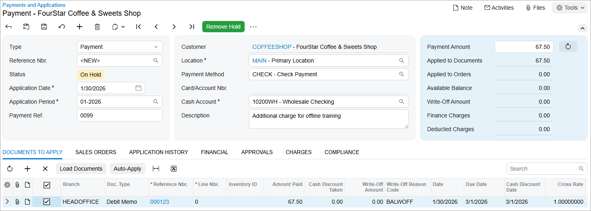

# AR Invoice Correction: To Create a Debit Memo and Apply a Payment to It {#_ae03deb1-c096-40f2-a542-4a39f8016653 .task}

The following activity will walk you through the process of creating a debit memo and applying a payment to it.

**Attention:** This activity is based on the *U100* dataset. If you are using another dataset or if any system settings have been changed in *U100*, these changes can affect the workflow of the activity and the results of the processing. To avoid issues, restore the *U100* dataset to its initial state.

## Story {#section_cyn_4jv_vxb .section}

Suppose that an invoice sent by SweetLife Fruits &amp; Jams company to FourStar Coffee &amp; Sweets Shop for a three-day training in the amount of $135 undercharged the customer, because the number of trainees was higher than the agreed-on number. The amount to be additionally charged from the customer for this training is $67.50.

Acting as a SweetLife accountant, you need to create a debit memo in the amount of $67.50 and process the customer's payment of the debit memo.

## Configuration Overview {#section_fyn_4jv_vxb .section}

For the purposes of this activity, the following features have been enabled on the [Enable/Disable Features](CS_10_00_00.md) \(CS100000\) form:

-   *Standard Financials*, which provides the standard financial functionality
-   *Multibranch Support*, which supports multiple branches in your instance of Acumatica ERP
-   *Multicompany Support*, which supports multiple companies within one tenant

On the [Accounts Receivable Preferences](AR_10_10_00.md) \(AR101000\) form, the **Hold Documents on Entry** check box has been selected in the **Data Entry Settings** section.

On the [Customers](AR_30_30_00.md) \(AR303000\) form, the *COFFEESHOP \(FourStar Coffee &amp; Sweets Shop\)* customer has been configured.

## Process Overview {#section_jyn_4jv_vxb .section}

In this activity, you will create and release a debit memo on the [Invoices and Memos](AR_30_10_00.md) \(AR301000\) form and apply a payment to it on the [Payments and Applications](AR_30_20_00.md) \(AR302000\) form.

## System Preparation {#section_lyn_4jv_vxb .section}

To prepare the system, do the following:

1.  Launch the Acumatica ERP website, and sign in to a company with the *U100* dataset preloaded. To sign in as an accountant, use the following credentials:
    -   Username: *johnson*
    -   Password: *123*
2.  In the info area, in the upper-right corner of the top pane of the Acumatica ERP screen, make sure that the business date in your system is set to *1/30/2026*. If a different date is displayed, click the Business Date menu button and select *1/30/2026*. For simplicity, in this activity, you will create and process all documents in the system on this business date.
3.  On the Company and Branch Selection menu, also on the top pane of the Acumatica ERP screen, make sure that the *SweetLife Head Office and Wholesale Center* branch is selected. If it is not selected, click the Company and Branch Selection menu to view the list of branches that you have access to, and then click *SweetLife Head Office and Wholesale Center*.

## Step 1: Creating and Releasing a Debit Memo {#section_nyn_4jv_vxb .section}

To create and release a debit memo, do the following:

1.  Open the [Invoices and Memos](AR_30_10_00.md) \(AR301000\) form.

    **Tip:** To open the form for creating a new record, type the form ID in the Search box, and on the Search form, point at the form title and click **New** right of the title.

2.  Click **Add New Record** on the form toolbar, and specify the following settings in the Summary area:
    -   **Type**: *Debit Memo*
    -   **Customer**: *COFFEESHOP*
    -   **Date**: *1/30/2026* \(the current business date, which is inserted by default\)
    -   **Post Period**: *01-2026*
    -   **Description**: `Additional charge for offline training`
3.  On the **Details** tab, click **Add Row**, and specify the following settings in the added row:
    -   **Branch**: *HEADOFFICE* \(inserted by default\)
    -   **Transaction Descr.**: `Additional charge for offline training`
    -   **Ext. Price**: `67.50`
4.  Click **Remove Hold** on the form toolbar.
5.  Click **Release** on the form toolbar to release the debit memo.

## Step 2: Applying a Payment to the Debit Memo {#section_qyn_4jv_vxb .section}

To apply a payment to the debit memo, do the following:

1.  While you are still on the [Invoices and Memos](AR_30_10_00.md) \(AR301000\) form, on the form toolbar, click **Pay**.

    The system opens the [Payments and Applications](AR_30_20_00.md) \(AR302000\) form, where you create a new payment and apply it to the debit memo.

2.  In the **Application Date** box, make sure that *1/30/2026* is displayed, and in the **Application Period** box, make sure that *01-2026* is selected.
3.  In the Summary area, review the value in the **Payment Method** box and make sure that the **Payment Amount** is *67.50*.
4.  On the **Documents to Apply** tab, make sure that the debit memo you have created is shown. The payment with the debit memo applied to it is shown in the following screenshot.

    

5.  On the form toolbar, click **Remove Hold**.
6.  On the form toolbar, click **Release** to release the payment.
7.  On the **Financial** tab, click the **Batch Nbr.** link to review the transaction that the system has posted when the payment was released.

**Parent topic:**[Correcting AR Invoices](../UserGuide/Finance_CorrectingARInvoices_Mapref.md)

