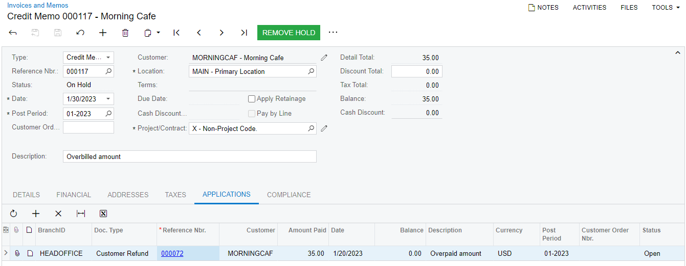

# AR Invoice Correction: To Create a Credit Memo and Apply a Refund to It {#_ec91bd1c-55c0-401e-be8d-6b640f0c5d01 .task}

The following activity will walk you through the process of creating a credit memo and applying an open refund to it.

**Attention:** This activity is based on the *U100* dataset. If you are using another dataset or if any system settings have been changed in *U100*, these changes can affect the workflow of the activity and the results of the processing. To avoid issues, restore the *U100* dataset to its initial state.

## Story {#section_g14_4jv_vxb .section}

Suppose that SweetLife Fruits &amp; Jams overbilled one of the customers, Morning Cafe, and received a payment in the amount of $35. An AR clerk has already created a refund for the needed amount. Acting as a SweetLife accountant, you need to decrease the customer's balance by creating a credit memo and applying the $35 refund to it.

## Configuration Overview {#section_tz4_djx_cnb .section}

For the purposes of this activity, on the [Accounts Receivable Preferences](AR_10_10_00.md) \(AR101000\) form, the **Hold Documents on Entry** check box has been selected in the **Data Entry Settings** section.

On the [Customers](AR_30_30_00.md) \(AR303000\) form, the *MORNINGCAF \(Morning Cafe\)* customer has been defined.

On the [Payments and Applications](AR_30_20_00.md) \(AR302000\) form, a $35 refund for the Morning Cafe customer has been created.

## Process Overview {#section_l14_4jv_vxb .section}

In this activity, on the [Invoices and Memos](AR_30_10_00.md) \(AR301000\) form, you will create a credit memo and apply a refund to it on the **Applications** tab. You will then release the credit memo and its application.

## System Preparation {#section_n14_4jv_vxb .section}

To prepare the system, do the following:

1.  Launch the Acumatica ERP website, and sign in to a company with the *U100* dataset preloaded. You should sign in as an accountant by using the *johnson* username and the *123* password.
2.  In the info area at the upper-right corner of the top pane of the Acumatica ERP screen, make sure that the business date is set to *1/30/2026*. If a different date is displayed, click the Business Date menu button and select *1/30/2026* from the calendar. For simplicity, you'll create and process all documents in this activity using this business date.
3.  On the Company and Branch Selection menu, on the top pane of the Acumatica ERP screen, select the *SweetLife Head Office and Wholesale Center* branch.

## Step 1: Creating a Credit Memo {#section_p14_4jv_vxb .section}

To create a credit memo, do the following:

1.  On the [Invoices and Memos](AR_30_10_00.md) \(AR301000\) form, add a new record.

    **Tip:** To open the form for creating a new record, type the form ID in the Search box, and on the Search form, point at the form title and click **New** right of the title.

2.  In the Summary area, specify the following settings:
    -   **Type**: *Credit Memo*
    -   **Customer**: *MORNINGCAF*
    -   **Date**: *1/30/2026* \(the current business date, which is inserted by default\)
    -   **Post Period**: *01-2026*
    -   **Description**: `Overbilled amount`
3.  On the **Details** tab, click **Add Row**, and specify the following settings for the added row:
    -   **Branch**: *HEADOFFICE* \(inserted by default\)
    -   **Transaction Descr.**: `Overbilled amount`
    -   **Ext. Price**: `35`
4.  On the form toolbar, click **Save**.

## Step 2: Applying a Refund to the Credit Memo {#section_s14_4jv_vxb .section}

To apply a refund to the credit memo you created in the previous step, do the following:

1.  While you are still on the [Invoices and Memos](AR_30_10_00.md) \(AR301000\) form with the credit memo opened, open the **Applications** tab.
2.  On the table toolbar, click **Add Row**, and specify the following settings for the added row:
    -   **Doc. Type**: *Refund*
    -   **Reference Nbr.**: The number of the refund for Morning Cafe in the amount of $35
    -   **Amount Paid \(USD\)**: `35.00`

        **Tip:** If you are working in a production environment, you can specify any amount less than the amount of the refund to partially apply the selected refund to the credit memo.

3.  On the form toolbar, click **Save**.

The following screenshot illustrates an unreleased credit memo to which a refund has been applied in full.

## Step 3: Releasing the Credit Memo and Its Application {#section_w14_4jv_vxb .section}

To release the credit memo and its application, do the following:

1.  While you are still on the [Invoices and Memos](AR_30_10_00.md) \(AR301000\) form with the credit memo opened, on the form toolbar, click **Remove Hold**.
2.  On the form toolbar, click **Release**.

    On the **Applications** tab, notice that the status of the refund has changed to *Closed* because its amount has been applied to the credit memo in full.

**Parent topic:**[Correcting AR Invoices](../UserGuide/Finance_CorrectingARInvoices_Mapref.md)

