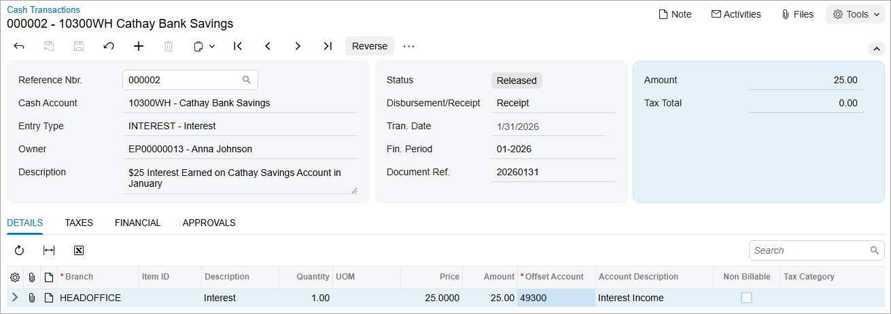

# Cash Entries: To Create a Receipt Cash Entry {#_e9f5bc12-e916-432a-8624-408b5ff3739a .task}

In this activity, you will learn how to create a cash entry of the *Receipt* type.

**Attention:** This activity is based on the *U100* dataset. If you are using another dataset or if any system settings have been changed in *U100*, these changes can affect the workflow of the activity and the results of the processing. To avoid issues, restore the *U100* dataset to its initial state.

## Story {#section_ynb_kjv_vxb .section}

On January 31, 2026, SweetLife earned $25 in bank interest on the *10300WH \(Cathay Bank Savings\)* account. As a SweetLife accountant, on January 31, you need to create a cash entry of the *Receipt* type to account for this amount.

## Process Overview {#section_a4b_kjv_vxb .section}

In this activity, you will first create the *Receipt* cash entry for interest earned on the [Cash Transactions](CA_30_40_00.md) \(CA304000\) form. Then you will post the created document to the general ledger and review the generated GL transaction on the [Journal Transactions](GL_30_10_00.md) \(GL301000\) form.

## System Preparation {#section_c4b_kjv_vxb .section}

To prepare the system, do the following:

1.  Launch the Acumatica ERP website, and sign in to a company with the *U100* dataset preloaded. To sign in as an accountant, use the following credentials:
    -   Username: *johnson*
    -   Password: *123*
2.  In the info area, in the upper-right corner of the top pane of the Acumatica ERP screen, make sure that the business date in your system is set to *1/31/2026*. If a different date is displayed, click the Business Date menu button and select *1/31/2026*. For simplicity, in this activity, you will create and process all documents in the system on this business date.
3.  On the Company and Branch Selection menu, also on the top pane of the Acumatica ERP screen, make sure that the *SweetLife Head Office and Wholesale Center* branch is selected. If it is not selected, click the Company and Branch Selection menu button to view the list of branches that you have access to, and then click *SweetLife Head Office and Wholesale Center*.
4.  On the [Cash Management Preferences](CA_10_10_00.md) \(CA101000\) form, in the **Posting and Release Settings** section, select the **Automatically Post to GL on Release** check box. On the form toolbar, click **Save** to save your changes.

## Step 1: Creating and Releasing a Receipt Cash Entry {#section_e4b_kjv_vxb .section}

To create a receipt cash entry for $25 interest earned on the *Cathay Bank Savings* account on January 31, 2026, do the following:

1.  Open the [Cash Transactions](CA_30_40_00.md) \(CA304000\) form.
2.  On the form toolbar, click **Add New Record**, and in the Summary area, specify the following settings:
    -   **Cash Account**: *10300WH* \(*Cathay Bank Savings*\)
    -   **Tran. Date**: *1/31/2026*
    -   **Fin. Period**: *01-2026*
    -   **Entry Type**: *INTEREST*

        Notice that the value in the **Disbursement/Receipt** box is *Receipt*. This is because you have selected a receipt entry type.

    -   **Document Ref.**: `20260131`
    -   **Description**: `$25 Interest Earned on Cathay Savings Account in January`
3.  On the **Details** tab, click **Add Row** on the table toolbar, and specify the following settings for the added row:
    -   **Branch**: *HEADOFFICE* \(inserted by default\)
    -   **Amount**: `25.00`
    -   **Offset Account**: *49300 \(Interest Income\)*

        The offset account specifies the account to be credited on release of the cash transaction. The default value is automatically inserted from the *INTEREST* cash entry type. You can override the default offset account for the cash account, if needed.

4.  On the form toolbar, click **Remove Hold**.
5.  On the form toolbar, click **Release** to release the cash entry. The system creates a batch to be posted to the general ledger. The released cash entry is shown in the following screenshot.

    

## Step 2: Reviewing the Generated GL Transaction {#section_i4b_kjv_vxb .section}

To review the GL transaction generated by posting the cash entry you have created in Step 1, do the following:

1.  While you are still on the [Cash Transactions](CA_30_40_00.md) \(CA304000\) form, open the **Financial** tab, and click the batch number to open the GL transaction for review.
2.  On the [Journal Transactions](GL_30_10_00.md) \(GL301000\) form, which opens, review the batch that the system has generated in the general ledger.

    The batch contains two journal entries that update GL accounts: *Company Savings Account* is debited for $25, and *Interest Income* is credited for the same amount. The batch was posted immediately on release of the cash entry document and now has the *Posted* status. You can navigate to the cash entry document from which the batch was generated by clicking **View Source Document** on the table toolbar.

**Parent topic:**[Processing Cash Entries](../UserGuide/Finance_Creating_Cash_Entry_Mapref.md)

