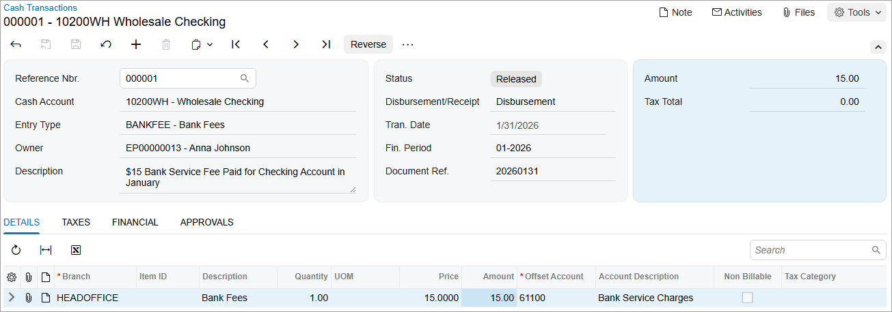

# Cash Entries: To Create a Disbursement Cash Entry {#_3dfdf2a0-df63-4df4-b044-bad499c64e90 .task}

In this activity, you will learn how to create a cash entry of the *Disbursement* type.

**Attention:** This activity is based on the *U100* dataset. If you are using another dataset or if any system settings have been changed in *U100*, these changes can affect the workflow of the activity and the results of the processing. To avoid issues, restore the *U100* dataset to its initial state.

## Story {#section_smb_kjv_vxb .section}

As a SweetLife accountant, you need to register a $15 service fee charged by your bank for a particular checking account, *Wholesale Checking*, on January 31, 2026.

## Process Overview {#section_umb_kjv_vxb .section}

In this activity, you will create a disbursement cash entry for the bank service fee on the [Cash Transactions](CA_30_40_00.md) \(CA304000\) form. Then you will release the cash entry and review the generated GL transactions on the [Journal Transactions](GL_30_10_00.md) \(GL301000\) form.

## System Preparation {#section_wmb_kjv_vxb .section}

To prepare the system, do the following:

1.  Launch the Acumatica ERP website, and sign in to a company with the *U100* dataset preloaded. To sign in as an accountant, use the following credentials:
    -   Username: *johnson*
    -   Password: *123*
2.  In the info area, in the upper-right corner of the top pane of the Acumatica ERP screen, click the Business Date menu button and select *1/31/2026*. For simplicity, in this activity, you will create and process all documents in the system on this business date.
3.  On the Company and Branch Selection menu, also on the top pane of the Acumatica ERP screen, make sure that the *SweetLife Head Office and Wholesale Center* branch is selected. If it is not selected, click the Company and Branch Selection menu button to view the list of branches that you have access to, and then click *SweetLife Head Office and Wholesale Center*.
4.  On the [Cash Management Preferences](CA_10_10_00.md) \(CA101000\) form, in the **Posting and Release Settings** section, clear the **Automatically Post to GL on Release** check box. On the form toolbar, click **Save** to save your changes.

## Step 1: Creating and Releasing a Disbursement Cash Entry {#section_ymb_kjv_vxb .section}

To create a disbursement cash entry for the $15 bank service fee charged to the *Wholesale Checking* account on January 31, 2026, do the following:

1.  Open the [Cash Transactions](CA_30_40_00.md) \(CA304000\) form.
2.  On the form toolbar, click **Add New Record**, and in the Summary area, specify the following settings:
    -   **Cash Account**: *10200WH \(Wholesale Checking\)*
    -   **Tran. Date**: *1/31/2026*
    -   **Fin. Period**: *01-2026*
    -   **Entry Type**: *BANKFEE \(Bank Fees\)*

        Notice that the value in the **Disbursement/Receipt** box is *Disbursement*. This is because you have selected a disbursement entry type.

    -   **Document Ref.**: `20260131`
    -   **Description**: `$15 Bank Service Fee Paid for Checking Account in January`
3.  On the form toolbar, click **Remove Hold**.
4.  On the **Details** tab, click **Add Row** on the table toolbar, and specify the following settings in the added row:
    -   **Branch**: *HEADOFFICE* \(inserted by default\)
    -   **Amount**: `15.00`
    -   **Offset Account**: *61100 \(Bank Service Charges\)*
5.  On the form toolbar, click **Save** to save your changes.
6.  On the form toolbar, click **Release** to release the cash entry. The system creates a batch to be posted to the general ledger. The released cash entry is shown in the following screenshot.

    

## Step 2: Reviewing the Generated GL Batch {#section_bnb_kjv_vxb .section}

To review the GL transaction generated when you released the cash entry created in Step 1, do the following:

1.  While you are still on the [Cash Transactions](CA_30_40_00.md) \(CA304000\) form, go to the **Financial** tab, and click the batch number to open the batch for review.
2.  On the [Journal Transactions](GL_30_10_00.md) \(GL301000\) form, which opens, review the batch that the system has generated.

    Notice that the batch contains two journal entries that update GL accounts: a credit entry for the *10200 \(Company Checking Account\)* GL account, and the debit entry for the *61100 \(Bank Service Charges\)* GL account.

    Because the **Automatically Post to GL on Release** check box is cleared in the **Posting and Release Settings** section of the [Cash Management Preferences](CA_10_10_00.md) \(CA101000\) form, the GL batch was released but not posted, and now has the *Unposted* status. In this activity, you will not post this batch to the general ledger so as not to update the balances of the accounts that might be used in other activities. However, in a production environment, you will post it by selecting the generated batch on the [Post Transactions](GL_50_20_00.md) \(GL502000\) form and clicking **Post** on the form toolbar.

**Parent topic:**[Processing Cash Entries](../UserGuide/Finance_Creating_Cash_Entry_Mapref.md)

