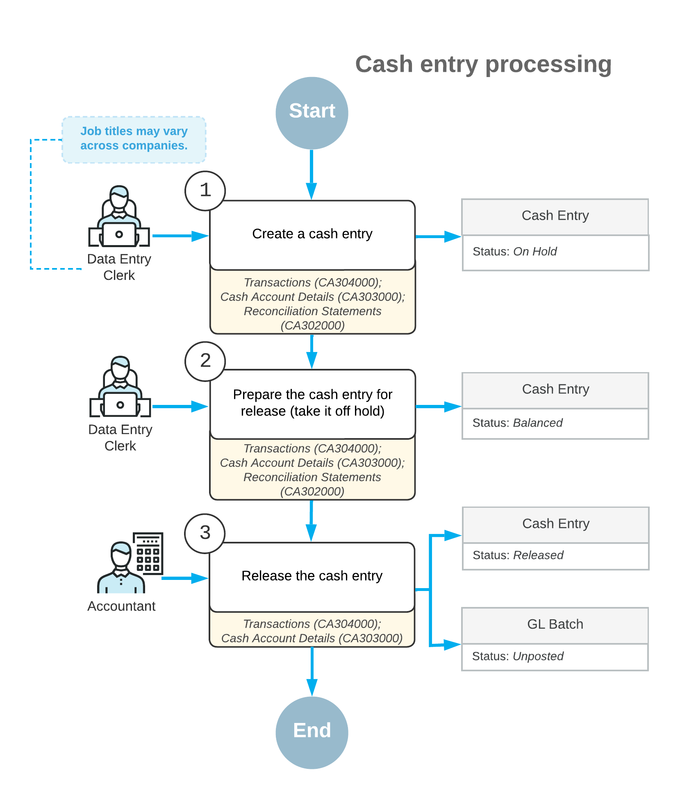

# Cash Entries: General Information {#_8f6c7380-ba58-4dbf-b149-6829213aaf03 .concept}

In Acumatica ERP, you can record cash entries—that is, transactions that affect cash but do not involve customers or vendors. Transactions of this type affect the balances of only general ledger accounts.

## Learning Objectives {#section_pjb_kjv_vxb .section}

You will learn how to create a cash entry in Acumatica ERP.

## Applicable Scenarios {#section_rjb_kjv_vxb .section}

You create a transaction of the *Cash Entry* type when you need to record a cash operation, such as a bank charge, income from interest, or an unknown payment.

## Types of Cash Entries {#section_tjb_kjv_vxb .section}

Cash entries are used to record cash transactions, such as charges for transfers, bank service charges, or amounts earned on interest-bearing bank accounts or other investments. On the [Cash Transactions](CA_30_40_00.md) \(CA304000\) form, you specify the type of the cash entry, which is one of the following:

-   *Receipt*: Increases the balance of the selected cash account. Entries of this type can include recording amounts earned on interest-bearing bank accounts or other investments.
-   *Disbursement*: Decreases the balance of the selected cash account. This entry type includes transfer charges and bank service charges.

## Processing of a Cash Entry {#section_vjb_kjv_vxb .section}

Cash entries are tracked in the system and available for viewing, editing, and releasing on the [Cash Transactions](CA_30_40_00.md) \(CA304000\) form. You can use any of the following forms as a starting point to enter the cash entry:

-   The [Cash Transactions](CA_30_40_00.md) form itself: On this form, you select a cash account and an entry type, and you make any needed changes to the transaction date and financial period. Then you add the transaction details. For each transaction detail, you can change the offset account if any default values are provided by the selected entry type, or select an offset account from the list of accounts if no default values are provided.

    When you are ready to release this transaction, you make sure that the cash entry is balanced \(remove it from hold, if necessary, by clicking **Remove Hold** on the form toolbar\), and click **Release**.

-   [Cash Account Details](CA_30_30_00.md) \(CA303000\): On this form, which lists transactions for the selected cash account, you select a cash account and click **Create Transaction** on the table toolbar. In the **Quick Transaction** dialog box, which opens, you enter the transaction details. When you click **Save**, the system closes the dialog box and creates a transaction with the specified details on the [Cash Transactions](CA_30_40_00.md) form.

    To release balanced cash entries \(that is, those that are not on hold\) on this form, you select the unlabeled check box for each needed cash entry and then click **Release** on the form toolbar. \(Alternatively, you can release the cash entry at a later time on the [Cash Transactions](CA_30_40_00.md) form.\)

    If any listed cash entry has the *On Hold* status, you can click the link in the **Orig. Doc. Number** column for this cash entry. The system opens the [Cash Transactions](CA_30_40_00.md) form in a pop-up window, where you can click **Remove Hold** on the form toolbar to take the cash entry off hold and then click **Release** on the form toolbar.

-   [Reconciliation Statements](CA_30_20_00.md) \(CA302000\): While you are using this form to work with a reconciliation statement, you can quickly record a cash transaction. To do this, you click **Create Adjustment** on the table toolbar, which invokes the **Quick Transaction** dialog box, where you specify the transaction details. When you click **Save**, the system closes the dialog box and creates a transaction with the specified details on the [Cash Transactions](CA_30_40_00.md) form.

During processing, a cash entry can have the statuses listed in the following table.

|Status|Description|
|------|-----------|
|*On Hold*|The cash entry is being edited and cannot be released.|
|*Pending Approval*|The cash entry requires approval. This status is used only if the *Approval Workflow* feature is enabled and approvals have been configured for cash transactions.|
|*Balanced*|The cash entry is balanced and ready to be released.|
|*Released*|The cash entry has been released and the respective general ledger batch has been generated.|

## Process Diagram {#section_bkb_kjv_vxb .section}

The following diagram illustrates the workflow of cash entry processing.

**Parent topic:**[Processing Cash Entries](../UserGuide/Finance_Creating_Cash_Entry_Mapref.md)

