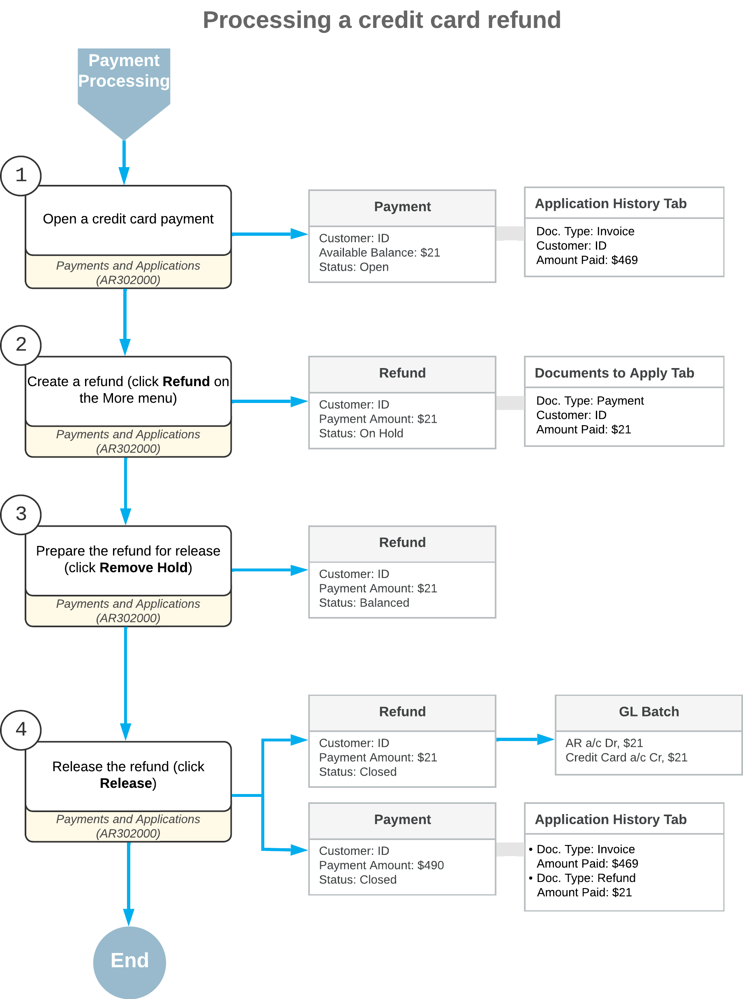

# Credit Card Refunds: General Information {#_91fd2c89-ec0c-4960-9880-02b58b6133d5 .concept}

On the [Payments and Applications](AR_30_20_00.md) \(AR302000\) form, you can quickly create customer refunds for documents of the *Payment*, *Prepayment*, and *Credit Memo* types. The system automatically populates settings based on the information from the payment, prepayment, or credit memo to which the refund will be applied.

## Learning Objectives {#section_lxp_4jv_vxb .section}

In this chapter, you will learn how to process a refund for a payment paid by a credit card.

## Applicable Scenarios {#section_oxp_4jv_vxb .section}

You process a refund of a credit card payment if the payment amount is greater than its applied amount and the payment retains its *Open* status.

For details of applying customer refunds to credit memos and prepayments, see [Refunds: General Information](Finance_ProcessingCustomerRefunds_GeneralInfo.md).

## Refunding of a Payment {#section_rxp_4jv_vxb .section}

If a payment with the *Open* status is opened on the [Payments and Applications](AR_30_20_00.md) \(AR302000\) form, when you click **Refund** on the More menu, the system performs the following actions:

1.  Verifies that the payment does not have unreleased applications or unreleased documents of the *Voided Payment* type.

    If at least one unreleased application or voided payment is found, the system displays an error, and the processing is terminated.

2.  Creates a document of the *Refund* type.
3.  Fills in the details of the refund with the default data and the copied information from the original payment.

    **Attention:** If the *Integrated Card Processing* feature is enabled on the [Enable/Disable Features](CS_10_00_00.md) \(CS100000\) form, the **Application Date** of the refund must be at least one day later than the **Application Date** of the original payment, otherwise the transaction will not be processed by the processing center and the system will display an error.

4.  Applies the refund to the original payment.

## Data Automatically Populated for a Refund {#section_vxp_4jv_vxb .section}

The following tables list the data that is automatically populated when a refund is created from a payment on the [Payments and Applications](AR_30_20_00.md) \(AR302000\) form.

|UI element|Description|
|----------|-----------|
|**Type**|*Refund*.|
|**Application Date**|The current business date.|
|**Customer**|The customer of the original payment.|
|**Location**|The location of the original payment.|
|**Payment Method**|The payment method of the original payment.|
|**Use Orig. Transaction for Refund**|A check box that appears in the refund if unlinked refunds are allowed for the processing center. The check box is selected for card-based payment methods if the original payment has an active card transaction.|
|**Orig. Transaction**|The number of the original transaction, which is inserted if the original payment has an active card transaction.|
|**Card/Account Nbr.**|The customer payment method, which can be either of the following:-   The customer payment method of the original card transaction if this transaction is active.
-   The customer payment method of the original payment if there is a value in the **Card/Account Nbr.** box in the original payment and there are no active card transactions associated with the payment.

|
|**Proc. Center ID**|The identifier of the processing center, which can be either of the following: -   The ID of the processing center of the customer payment method if the customer payment method was identified and inserted in the **Card/Account Nbr.** box.
-   The ID of the processing center of the original card transaction, if the **Card/Account Nbr.** box is empty.

|
|**Cash Account**|The cash account of the original payment.|
|**Currency**|The currency of the original payment.|
|**Payment Amount**|The available balance of the original payment.|

|UI element|Description|
|----------|-----------|
|**Branch**|The customer's branch.|
|**AR Account**|The customer's AR account.|
|**AR Subaccount**|The customer's AR subaccount.|

|UI element|Description|
|----------|-----------|
|**Branch**|The customer's branch.|
|**Doc. Type**|The type of the original document \(*Payment* or *Prepayment*\).|
|**Reference Nbr.**|The reference number of the original payment.|
|**Customer**|The customer of the original payment.|
|**Amount Paid \(Payment currency\)**|The amount of the refund.|
|**Date**|The current business date.|

## Workflow of Processing a Credit Card Refund {#section_vv2_1y4_y4b .section}

For a refund created for a credit card payment, the typical process involves the actions and generated documents shown in the following diagram.

**Parent topic:**[Processing Credit Card Refunds](../UserGuide/Finance_Credit_Card_Refunds_Mapref.md)

