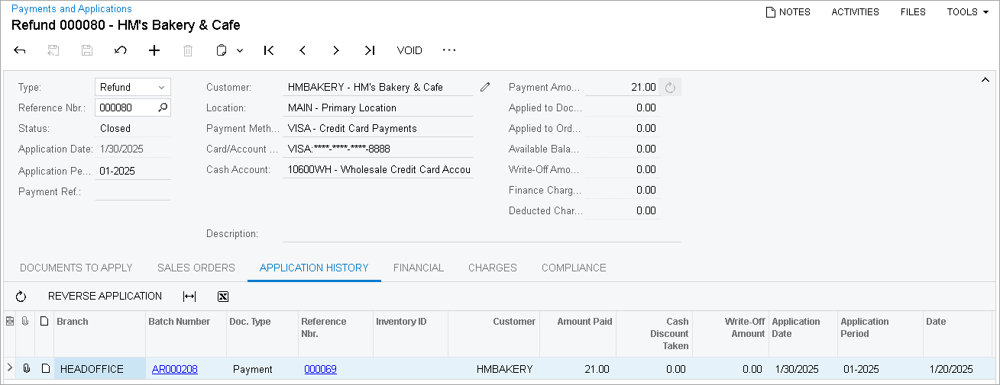
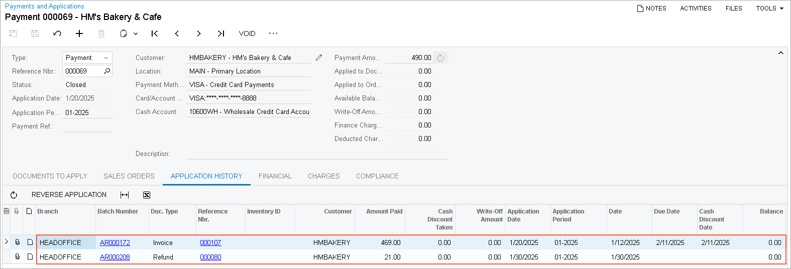

# Credit Card Refunds: Process Activity {#_59e32c08-44be-4122-bccd-b65028584175 .task}

The following activity will walk you through the process of processing a refund for a credit card payment.

**Attention:** This activity is based on the *U100* dataset. If you are using another dataset or if any system settings have been changed in *U100*, these changes can affect the workflow of the activity and the results of the processing. To avoid issues, restore the *U100* dataset to its initial state.

## Story {#section_wzp_4jv_vxb .section}

Suppose that on January 30, while reviewing customer payments, the accountant of SweetLife Fruits &amp; Jams found that *HMBAKERY* overpaid $21 for one of the invoices. Acting as the SweetLife accountant, you need to process a refund of $21 to close the payment.

## Configuration Overview {#section_tz4_djx_cnb .section}

In the *U100* dataset, the following configuration tasks have been performed to prepare the system for this activity to be performed:

-   On the [Accounts Receivable Preferences](AR_10_10_00.md) \(AR101000\) form, the **Hold Documents on Entry** check box has been selected in the **Data Entry Settings** section.
-   On the [Customers](AR_30_30_00.md) \(AR303000\) form, the *HMBAKERY \(HM's Bakery &amp; Cafe\)* customer has been defined.
-   On the [Payments and Applications](AR_30_20_00.md) \(AR302000\) form, a $490 payment with the available balance of $21 has been created.

## Process Overview {#section_zzp_4jv_vxb .section}

In this activity, you will disable the *Integrated Card Processing* feature on the [Enable/Disable Features](CS_10_00_00.md) \(CS100000\) form. On the [Payments and Applications](AR_30_20_00.md) \(AR302000\) form, you will open a customer payment and create a *Refund* document for it by clicking **Refund** on the More menu. You will then release the refund and review the original payment with the invoice and the refund applied to it.

## System Preparation {#section_b1q_4jv_vxb .section}

To prepare the system, do the following:

1.  Launch the Acumatica ERP website, and sign in to a company with the *U100* dataset preloaded. You should sign in as Anna Johnson by using the *johnson* username and the *123* password.
2.  In the info area at the upper-right corner of the top pane of the Acumatica ERP screen, make sure that the business date is set to *1/30/2026*. If a different date is displayed, click the Business Date menu button and select *1/30/2026* from the calendar. For simplicity, you'll create and process all documents in this activity using this business date.
3.  On the Company and Branch Selection menu, on the top pane of the Acumatica ERP screen, select the *SweetLife Head Office and Wholesale Center* branch.

## Step 1: Disabling the *Integrated Card Processing* Feature {#section_d1q_4jv_vxb .section}

For the purposes of this activity, you need to disable the *Integrated Card Processing* feature to avoid the processing of credit card transaction by the processing center. To disable the feature, do the following:

1.  Open the [Enable/Disable Features](CS_10_00_00.md) \(CS100000\) form.
2.  On the form toolbar, click **Modify**.
3.  In the *Third-Party Integrations* group of features, clear the **Integrated Card Processing** check box.
4.  On the form toolbar, click **Enable**.

## Step 2: Creating a Refund {#section_f1q_4jv_vxb .section}

To create a refund for the credit card payment, do the following:

1.  Open the [Payments and Applications](AR_30_20_00.md) \(AR302000\) form.
2.  In the **Reference Nbr.** box, select a payment of the *HMBAKERY* customer dated *1/20/2026* in the amount of $490.

    Notice that the payment has the **Available Balance** of $21.

3.  On the **Application History** tab, review the document applied to this payment. An invoice in the amount of $469 has been applied to the payment.
4.  On the More menu \(under **Processing**\), click **Refund**.

    The system creates a document with the *Refund* type and the **Payment Amount** of $21, which is the available balance of the original payment. The boxes in the Summary area and on the **Financial** tab have been populated automatically with the settings of the original payment and the payment has been automatically applied to the refund.

5.  On the form toolbar, click **Remove Hold** to give the refund the *Balanced* status.
6.  On the form toolbar, click **Release** to release the refund.

    The following screenshot illustrates the released refund with the payment applied to it.

    

7.  Click the link in the **Reference Nbr.** column to open the original payment. On the [Payments and Applications](AR_30_20_00.md) form with the payment opened, notice that the payment status has changed to *Closed*, because the $469 invoice and the $21 refund have been applied to the payment, as shown in the following screenshot.

    

**Parent topic:**[Processing Credit Card Refunds](../UserGuide/Finance_Credit_Card_Refunds_Mapref.md)

