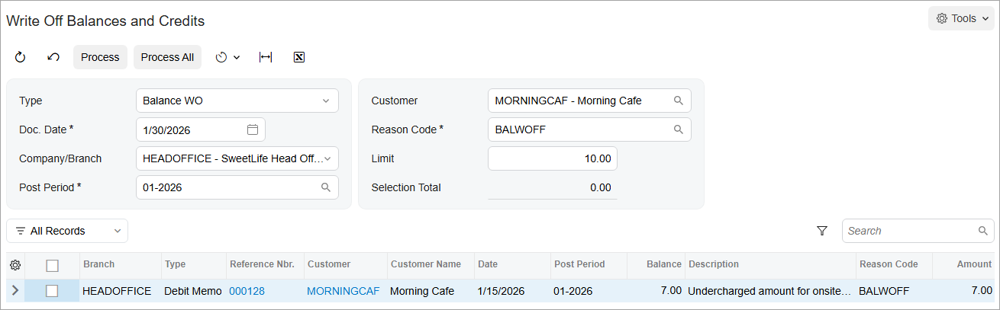

# Direct Write-Offs: To Process a Balance Write-Off {#_55b19a30-4e3f-460a-9801-18e4f56ffae4 .task}

The following activity will walk you through the processing of a balance write-off.

## Story { .section}

Suppose that in January 2026, SweetLife Fruits &amp; Jams undercharged one of its customers, Morning Cafe, in the amount of $7 for onsite training courses. However, on January 30, the chief accountant of SweetLife decided to write off this small amount.

Acting as the chief accountant, you need to create a $7 debit memo, update to customer's settings to enable write-offs, and create a balance write off for the $7.

## Configuration Overview {#section_tz4_djx_cnb .section}

In the *U100* dataset, the following tasks have been performed to support this activity:

-   On the [Customers](AR_30_30_00.md) \(AR303000\) form, the *MORNINGCAF* customer has been created.

## Process Overview { .section}

In this activity, you will create a debit memo on the [Invoices and Memos](AR_30_10_00.md) \(AR301000\) form. On the [Customers](AR_30_30_00.md) \(AR303000\) form, you will update the settings of the customer. On the [Write Off Balances and Credits](AR_50_50_00.md) \(AR505000\) form, you will process a balance write-off to write off the amount of the debit memo. Finally, on the [Payments and Applications](AR_30_20_00.md) \(AR302000\) form, you will review the *Balance WO* document automatically generated by the system.

## System Preparation { .section}

Before you begin processing a direct write-off, do the following:

1.  Launch the Acumatica ERP website with the *U100* dataset preloaded, and sign in as Anna Johnson by using the *johnson* username and the *123* password.
2.  In the info area at the upper-right corner of the top pane of the Acumatica ERP screen, make sure that the business date is set to *1/30/2026*. If a different date is displayed, click the Business Date menu button and select *1/30/2026* from the calendar. For simplicity, you'll create and process all documents in this activity using this business date.
3.  As a prerequisite activity, in the company to which you are signed in, be sure you have set up the write-off functionality, as described in [Direct Write-Offs: Implementation Activity](Finance_Direct_Write-Offs_Implem_Activity.md).
4.  On the Company and Branch Selection menu on the top pane of the Acumatica ERP screen, select the *SweetLife Head Office and Wholesale Center* branch.

## Step 1: Creating a Debit Memo { .section}

To create a debit memo, do the following:

1.  On the [Invoices and Memos](AR_30_10_00.md) \(AR301000\) form, add a new record.
2.  In the Summary area, specify the following settings:
    -   **Type**: *Debit Memo*
    -   **Date**: *1/15/2026*
    -   **Post Period**: *01-2026* \(inserted automatically\)
    -   **Customer**: *MORNINGCAF*
    -   **Description**: `Undercharged amount for onsite training`
3.  On the **Details** tab, click **Add Row** on the table toolbar, and specify the following settings in the added row:
    -   **Branch**: *HEADOFFICE*
    -   **Transaction Descr.**: `Undercharged amount for onsite training`
    -   **Ext. Price**: `7`
4.  On the form toolbar, click **Save**.
5.  On the form toolbar, click **Remove Hold**, and then click **Release** to release the debit memo.

## Step 2: Updating the Customer's Settings { .section}

To update the customer's settings, do the following:

1.  On the [Customers](AR_30_30_00.md) \(AR303000\) form, open the *MORNINGCAF* customer.
2.  On the **Financial** tab \(**Financial Settings** section\), specify the following settings:
    -   **Enable Write-Offs**: Selected
    -   **Write-Off Limit**: `10`
3.  On the form toolbar, click **Save**.

## Step 3: Processing a Balance Write-Off { .section}

To create and release a balance write-off for the customer, do the following:

1.  Open the [Write Off Balances and Credits](AR_50_50_00.md) \(AR505000\) form.
2.  In the Selection area, specify the following settings:

    -   **Type**: *Balance WO*
    -   **Doc. Date**: *1/30/2026*
    -   **Company/Branch**: *HEADOFFICE*
    -   **Post Period**: *01-2026*
    -   **Customer**: *MORNINGCAF*
    -   **Reason Code**: *BALWOFF* \(inserted automatically\)
    The debit memo that has the $7 balance appears in table \(see the screenshot below\), because the form shows the documents of this customer that have a balance no greater than the amount specified in the **Limit** box, which by default contains the **Write-Off Limit** amount specified for the customer.

    

3.  In the table, select the unlabeled check box in the row of the debit memo.

    The **Selection Total** box in the Summary area shows the total amount of the selected documents that will be written off during the process, which in this case is $7 for the debit memo.

4.  On the form toolbar, click **Process** to write off the customer balance and generate the write-off transaction to be posted to the specified date and period. The system generates and releases a *Balance WO* type of document for each document selected in the table.

## Step 4: Reviewing the *Balance WO* Document { .section}

To review the generated *Balance WO* document, do the following:

1.  Open the [Payments and Applications](AR_30_20_00.md) \(AR302000\) form.
2.  In the **Type** box, select *Balance WO* and open the document that the system created and released in Step 3.

    Notice that the system has inserted the amount, the document date, and the post period into the *Balance WO* document, based on the settings you have specified on the [Write Off Balances and Credits](AR_50_50_00.md) \(AR505000\) form. The system has automatically released and closed the *Balance WO* document. The debit memo whose amount has been written off is displayed on the **Application History** tab. In the **Amount Paid** column, you can see the written-off amount.

3.  On the **Financial** tab, click the number of the batch that has been generated on release of the *Balance WO* document; the system displays the GL transaction on the [Journal Transactions](GL_30_10_00.md) \(GL301000\) form.

    On release of the *Balance WO* document, the system decreases the customer's current balance by the written-off amount, closes the document that has been processed, and generates the batch to debit the account specified for the reason code and credit the AR account of the document.

**Parent topic:**[Processing Direct Write-Offs](../UserGuide/Finance_Direct_Write-Offs_Mapref.md)

