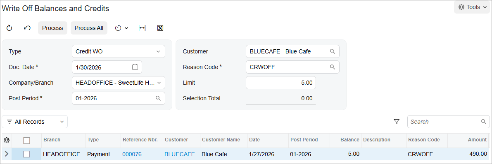

# Direct Write-Offs: To Process a Credit Write-Off {#_7ea77da9-16f5-4e4e-be57-ada6c6e37989 .task}

The following activity will walk you through the processing of a credit write-off.

## Story { .section}

Suppose that while looking through customer accounts, the chief accountant of SweetLife Fruits &amp; Jams noticed that the *BLUECAFE* customer had a small credit balance of $5. The accountant decided to write it off. Previously, write-offs were made allowed for this customer and the write-off functionality has been set up.

Acting as the SweetLife accountant, you need to process a direct credit write-off in the system.

## Configuration Overview {#section_tz4_djx_cnb .section}

In the *U100* dataset, the following tasks have been performed to support this activity:

-   On the [Customers](AR_30_30_00.md) \(AR303000\) form, the *BLUECAFE* customer has been created.
-   On the [Invoices and Memos](AR_30_10_00.md) \(AR301000\) form, a $500 invoice for the *BLUECAFE* customer has been created and released. The invoice has the *310N30* terms specified for it, making it subject to a cash discount.
-   On the [Payments and Applications](AR_30_20_00.md) \(AR302000\) form, a $490 early payment for the $500 invoice has been created, applied to the $500 invoice, and released. After release, the payment's balance is $5.

## Process Overview { .section}

In this activity, on the [Write Off Balances and Credits](AR_50_50_00.md) \(AR505000\) form, you will specify write-off criteria and process a credit write-off. On the [Invoices and Memos](AR_30_10_00.md) \(AR301000\) form, you will review the *Credit WO* document automatically generated and released by the system. Finally, on the [Customer Details](AR_40_20_00.md) \(AR402000\) form, you will review the customer's balance to make sure it is $0.

## System Preparation { .section}

Before you begin processing a direct write-off, do the following:

1.  Launch the Acumatica ERP website with the *U100* dataset preloaded, and sign in as Anna Johnson by using the *johnson* username and the *123* password.
2.  In the info area at the upper-right corner of the top pane of the Acumatica ERP screen, make sure that the business date is set to *1/30/2026*. If a different date is displayed, click the Business Date menu button and select *1/30/2026* from the calendar. For simplicity, you'll create and process all documents in this activity using this business date.
3.  As a prerequisite activity, in the company to which you are signed in, be sure you have set up the write-off functionality, as described in [Direct Write-Offs: Implementation Activity](Finance_Direct_Write-Offs_Implem_Activity.md).
4.  On the Company and Branch Selection menu on the top pane of the Acumatica ERP screen, select the *SweetLife Head Office and Wholesale Center* branch.

## Step 1: Processing a Credit Write-Off { .section}

To create and release a credit write-off, do the following:

1.  Open the [Write Off Balances and Credits](AR_50_50_00.md) \(AR505000\) form.
2.  In the Selection area, specify the following settings:

    -   **Type**: *Credit WO*
    -   **Doc. Date**: *1/30/2026*
    -   **Company/Branch**: *HEADOFFICE*
    -   **Post Period**: *01-2026*
    -   **Customer**: *BLUECAFE*
    -   **Reason Code**: *CRWOFF* \(inserted automatically\)
    The payment that has the $5 balance appears in table \(see the screenshot below\), because the form shows the documents of this customer that have a balance no greater than the amount specified in the **Limit** box, which by default contains the **Write-Off Limit** amount specified for the customer.

    

    **Tip:** To write off credits for multiple customers at once, you could clear the **Customer** box and specify the needed **Limit** to see the document balances of all customers, which do not exceed the limit and therefore can be written off.

3.  In the table, select the unlabeled check box for the payment.

    The **Selection Total** box in the Summary area shows the total amount of the selected documents that will be written off during the process, which in this case is $5 for the only payment that you have selected.

4.  On the form toolbar, click **Process** to write off the customer's credit and generate a write-off transaction to be posted to the specified date and period.

    The system generates and releases a *Credit WO* type of document for each document selected in the table.

## Step 2: Reviewing the *Credit WO* Document { .section}

To review the generated *Credit WO* document, do the following:

1.  Open the [Invoices and Memos](AR_30_10_00.md) \(AR301000\) form.
2.  In the **Type** box, select *Credit WO* and open the document that the system created and released in Step 1.

    Notice that the system has inserted the amount, the document date, and the post period into the *Credit WO* document, based on the settings you have specified on the [Write Off Balances and Credits](AR_50_50_00.md) \(AR505000\) form. The system has automatically released and closed the *Credit WO* document. The payment whose amount has been written off is displayed on the **Applications** tab. In the **Amount Paid** column, you can see the written-off amount of the payment.

3.  On the **Financial** tab, click the number of the batch that has been generated on release of the *Credit WO* document; the system displays the batch on the [Journal Transactions](GL_30_10_00.md) \(GL301000\) form.

    On release of the *Credit WO* document, the system increases the customer's current balance by the written-off amount, closes the document that has been processed, and generates a GL transaction to credit the account specified for the reason code and to debit the AR account of the document.

    **Attention:** If you write off a balance of a prepayment, the prepayment account will be debited.

## Step 3: Reviewing the Customer's Balance { .section}

To review the customer's balance, do the following:

1.  Open the [Customer Details](AR_40_20_00.md) \(AR402000\) form.
2.  In the **Customer** box, select *BLUECAFE*.
3.  Make sure that the customer's current balance after the $5 credit write-off has been processed is $0.
4.  Select the **Show All Documents** check box to view the closed *Credit WO* document.

**Parent topic:**[Processing Direct Write-Offs](../UserGuide/Finance_Direct_Write-Offs_Mapref.md)

