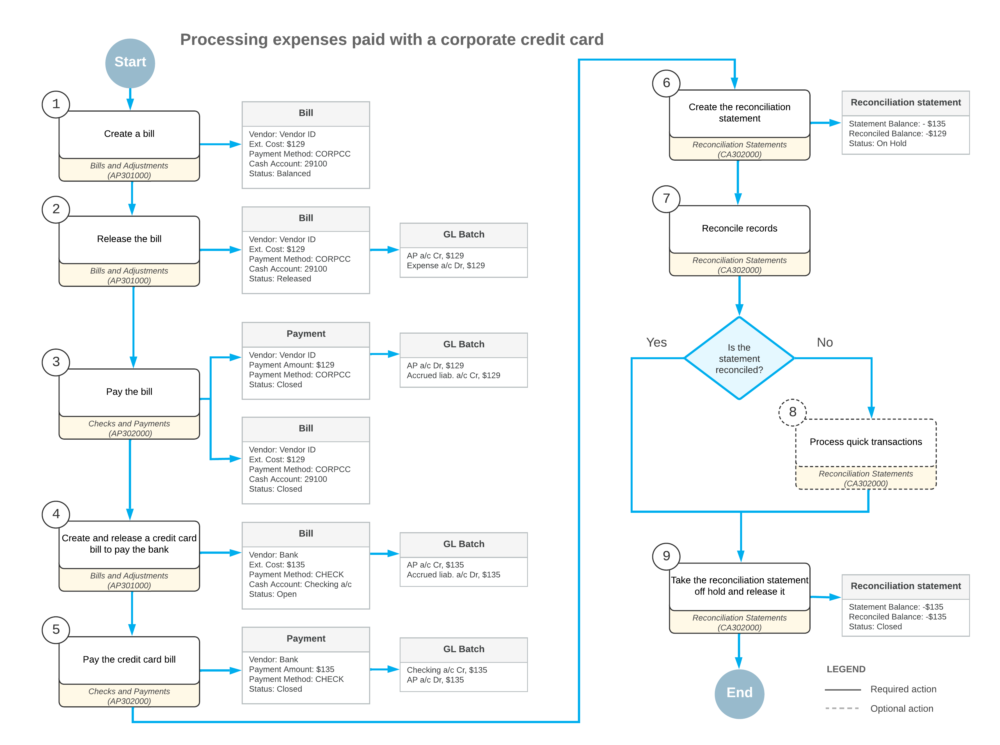

# Payments with a Corporate Card: General Information {#_d232358c-d2c4-4fbd-9e62-4dcc37319ad8 .concept}

By using Acumatica ERP, you can track payments to vendors, which your company made by using a corporate credit card.

## Learning Objectives {#section_p1l_njv_vxb .section}

In this chapter, you will learn how to do the following:

-   Process a bill paid with the credit card
-   Pay the credit card bill
-   Reconcile the balance of the corporate credit card in the system

## Applicable Scenarios {#section_r1l_njv_vxb .section}

You process expenses paid by a corporate credit card if you want to track payments to vendors.

## Payments with Corporate Cards {#section_y1l_njv_vxb .section}

To process a payment by using a corporate credit card for a bill, on the [Bills and Adjustments](AP_30_10_00.md) \(AP301000\) form, you process a bill for the vendor that represents the card issuer, and then enter a payment for this bill on the [Checks and Payments](AP_30_20_00.md) \(AP302000\) form, specifying the credit card cash account for the payment.

At the end of the financial period, you receive a statement for the corporate credit card from the bank. On the [Bills and Adjustments](AP_30_10_00.md) form, you create an AP bill in the amount of the statement and specify the accrued liability account as the expense account of the bill.

You pay the credit card bill by processing an AP payment for the credit card bill from the cash account your company uses to pay for the credit card, such as a checking account.

You can reconcile the balance of the credit card \(that is, the balance of the accrued liability cash account\) with the credit card statement in the same way as you reconcile balanced for regular cash accounts. For more details on bank account reconciliation, see [Bank Reconciliation: General Information](Finance_Bank_Reconciliation_GenInfo.md).

## Workflow of the Processing of Payments with a Corporate Credit Card {#section_vv2_1y4_y4b .section}

For processing of expenses paid with a corporate credit card, the typical process involves the actions and generated documents shown in the following diagram.

**Parent topic:**[Processing Payments with a Corporate Card](../UserGuide/Finance_Expenses_with_CorporateCC_Mapref.md)

