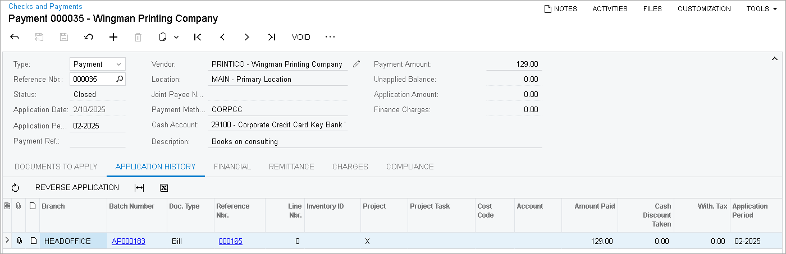

# Payments with a Corporate Card: To Process a Credit Card Bill {#_2f9a045a-f3e1-4b21-a942-08f01585e4d3 .task}

The following activity will walk you through the process of processing a bill paid with the corporate credit card.

## Story {#section_vfl_njv_vxb .section}

Suppose that on February 10, an employee of SweetLife Fruits &amp; Jams purchased books on consulting for the office library and paid $129.00 with the corporate credit card issued by Key Bank. Further suppose that on February 28, SweetLife received a statement for the corporate credit card. The statement balance was $135.

The accountant decided to pay the credit card payment to the bank by issuing a payment from the *10200WH* checking account.

Acting as the SweetLife accountant, you need to create and release a bill for the purchase of books, pay the bill, and issue a payment for the bank.

## Configuration Overview {#section_tz4_djx_cnb .section}

In the *U100* dataset, the following tasks have been performed to support this activity:

-   On the [Chart of Accounts](GL_20_25_00.md#) \(GL202500\) form, the *29100* GL account for the corporate credit card has been created.
-   On the [Payment Methods](CA_20_40_00.md) \(CA204000\) form, the *CORPCC* payment method for corporate credit cards has been configured.
-   On the [Cash Accounts](CA_20_20_00.md#) \(CA202000\) form, the *29100 \(Corporate Credit Card Key Bank Visa\)* cash account for the corporate credit card has been created and the *CORPCC* payment method has been specified for it.
-   On the [Vendors](AP_30_30_00.md) \(AP303000\) form, the *PRINTICO* and *KEYBANK* vendors have been created.

## Process Overview {#section_agl_njv_vxb .section}

In this activity, on the [Bills and Adjustments](AP_30_10_00.md) \(AP301000\) form, you will create and release a bill paid by the credit card. On the [Checks and Payments](AP_30_20_00.md) \(AP302000\) form, you will pay this bill and review the generated GL transaction on the [Journal Transactions](GL_30_10_00.md) \(GL301000\) form.

On the [Bills and Adjustments](AP_30_10_00.md) form, you will create a bill for the month's credit card use and pay it on the [Checks and Payments](AP_30_20_00.md) form by issuing a payment.

## System Preparation {#section_dgl_njv_vxb .section}

To prepare the system, do the following:

1.  As a prerequisite activity, in the company to which you are signed in, be sure you have configured the card issuer as a vendor, as described in [Corporate Cards: To Configure a Vendor for a Corporate Card](../ImplementationGuide/Corporate_Card_Implem_Activity_CardIssuer.md).
2.  Launch the Acumatica ERP website, and sign in to a company with the *U100* dataset preloaded. You should sign in Anna Johnson by using the *johnson* username and the *123* password.
3.  In the info area, in the upper-right corner of the top pane of the Acumatica ERP screen, make sure that the business date in your system is set to *2/10/2026*. If a different date is displayed, click the Business Date menu button, and select *2/10/2026* on the calendar. For simplicity, in this activity, you will create and process all documents in the system on this business date.
4.  On the Company and Branch Selection menu, on the top pane of the Acumatica ERP screen, select the *SweetLife Head Office and Wholesale Center* branch.

## Step 1: Creating a Bill Paid with the Corporate Credit Card {#section_fgl_njv_vxb .section}

To create and release a bill paid by the credit card, do the following:

1.  Open the [Bills and Adjustments](AP_30_10_00.md) \(AP301000\) form.
2.  On the form toolbar, click **Add New Record**.
3.  In the Summary area, specify the following settings for the new bill:
    -   **Type**: *Bill*
    -   **Vendor**: *PRINTICO*
    -   **Date**: *2/10/2026* \(inserted automatically based on the selected business date\)
    -   **Post Period**: *02-2026* \(inserted automatically\)
    -   **Description**: `Books on consulting`
4.  On the **Details** tab, click **Add Row** on the table toolbar and specify the following settings for the added row:
    -   **Branch**: *HEADOFFICE* \(inserted by default\)
    -   **Ext. Cost**: `129.00`
    -   **Account**: *81000 \(Other Expenses\)*
5.  On the **Financial** tab, in the **Default Payment Info** section, specify the following settings:
    -   **Payment Method**: *CORPCC - Corporate Credit Card*
    -   **Cash Account**: *29100 - Corporate Credit Card Key Bank*
6.  On the form toolbar, click **Save**.
7.  On the form toolbar, click **Remove Hold** to give the bill the *Balanced* status.
8.  On the form toolbar, click **Release** to release the bill.

## Step 2: Paying the Bill {#section_igl_njv_vxb .section}

To pay the bill, do the following:

1.  While you are still on the [Bills and Adjustments](AP_30_10_00.md) \(AP301000\) form with the bill opened, click **Pay** on the form toolbar.
2.  On the [Checks and Payments](AP_30_20_00.md) \(AP302000\) form, which opens, review the payment settings in the Summary area.
3.  On the form toolbar, click **Remove Hold**.
4.  On the form toolbar, click **Release** to release the payment.

    The following screenshot illustrates a released payment with the bill paid with a corporate credit card applied to it.

    

5.  On the **Financial** tab, click the link in the **Batch Nbr.** box and on the [Journal Transactions](GL_30_10_00.md) \(GL301000\) form, review the GL transaction generated by the system.

    The amount of the AP payment made through the corporate credit card has been credited to the accrued liability account \(*29100*\).

## Step 3: Paying the Credit Card Bill {#section_mgl_njv_vxb .section}

To process the payment for the month's credit card use, do the following:

1.  Open the [Bills and Adjustments](AP_30_10_00.md) \(AP301000\) form.
2.  On the form toolbar, click **Add New Record**.
3.  In the Summary area, specify the following settings:
    -   **Type**: *Bill*
    -   **Vendor**: *KEYBANK*
    -   **Date**: *2/28/2026*
    -   **Post Period**: *02-2026*
    -   **Description**: `Payment for the corp. credit card as of 2/28 statement`
4.  On the **Details** tab, click **Add Row** and specify the following settings for the added row:
    -   **Branch**: *HEADOFFICE* \(inserted by default\)
    -   **Transaction Descr.**: `Payment for the corp. credit card as of 2/28 statement`
    -   **Ext. Cost**: `135`
    -   **Account**: *29100 \(Corporate Credit Card\)* \(inserted automatically\)
5.  On the form toolbar, click **Remove Hold**.
6.  On the form toolbar, click **Release**.
7.  On the **Financial** tab, click the link in the **Batch Nbr.** box and on the [Journal Transactions](GL_30_10_00.md) \(GL301000\) form, review the GL transaction generated by the system.

    The amount to be paid for the corporate credit card to the bank has been debited to the accrued liability account \(*29100*\).

8.  On the **Financial** tab, make sure that the following settings have been specified for the bill:
    -   **Payment Method**: *CHECK*
    -   **Cash Account**: *10200WH - Wholesale Checking*
9.  On the form toolbar, click **Pay**.
10. On the [Checks and Payments](AP_30_20_00.md) \(AP302000\) form, which opens, click **Remove Hold** to give the payment the *Pending Print* status.
11. On the form toolbar, click **Print/Process**.
12. On the [Process Payments / Print Checks](AP_50_50_00.md) \(AP505000\) form, which opens, review the payment details and click **Process** on the form toolbar to print the payment.

    A separate browser tab is opened showing the printable version of the payment.

13. Review the printable version of the payment and close the browser tab. \(For the purposes of this activity, you do not need to actually print the check.\)

    **Tip:** In a production setting, you would click **Print** on the form toolbar to print the check before closing the browser tab.

14. On the [Release Payments](AP_50_52_00.md) \(AP505200\) form, which opens, review the payment details and click **Process** to release the payment.

You have processed the payment for the corporate credit card in the system.

**Parent topic:**[Processing Payments with a Corporate Card](../UserGuide/Finance_Expenses_with_CorporateCC_Mapref.md)

