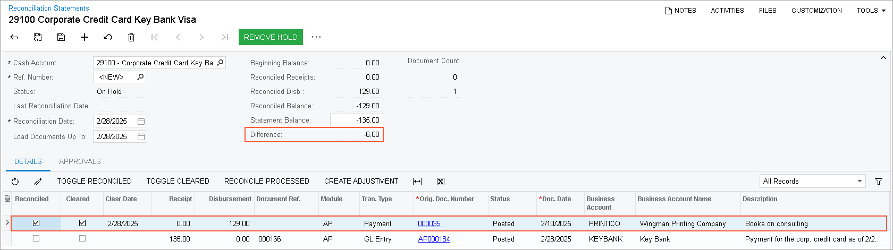
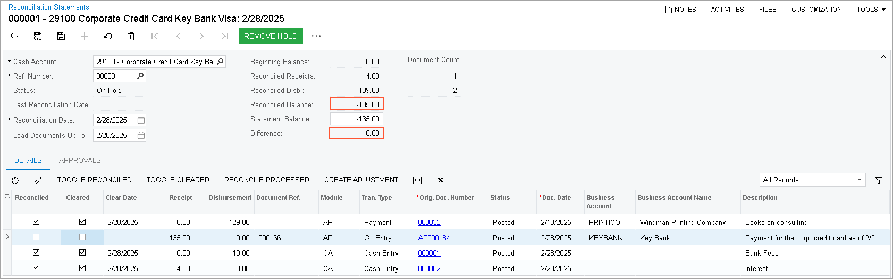

# Payments with a Corporate Card: To Reconcile a Bank Statement {#_00cf0ef9-55b4-47b0-9084-0b62b62f16d9 .task}

The following activity will walk you through the process of reconciling the balance of the credit card issuer in the system with the balance of a bank statement.

## Story {#section_uhl_njv_vxb .section}

Suppose that on February 28, SweetLife received a statement for the corporate credit card. The statement balance was $135, which the company owed to the bank, and the statement included the following transactions.

|Card Number|Transaction Date|Transaction Description|Amount|
|-----------|----------------|-----------------------|------|
|VISA XXXX|2/10/2026|Wingman Printing Company|–$129.00|
|2/28/2026|Key Bank service charges February 2026|–$10.00|
|2/28/2026|Key Bank cash back February 2026|$4.00|
| |**Statement Balance**:|**–$135.00**|

Acting as the SweetLife accountant, you need to perform the reconciliation of the corporate credit card balance with the bank statement balance.

## Configuration Overview {#section_tz4_djx_cnb .section}

In the *U100* dataset, the following tasks have been performed to support this activity:

-   On the [Chart of Accounts](GL_20_25_00.md#) \(GL202500\) form, the *29100* GL account for the corporate credit card has been created.
-   On the [Payment Methods](CA_20_40_00.md) \(CA204000\) form, the *CORPCC* payment method for corporate credit cards has been configured.
-   On the [Cash Accounts](CA_20_20_00.md#) \(CA202000\) form, the *29100 \(Corporate Credit Card Key Bank Visa\)* cash account for the corporate credit card has been created and the *CORPCC* payment method has been specified for it.
-   On the [Entry Types](CA_20_30_00.md) \(CA203000\) form, the *BANKFEE* and *INTEREST* entry types have been created.
-   On the [Vendors](AP_30_30_00.md) \(AP303000\) form, the *KEYBANK* vendor that represents the issuer of a corporate card has been created.

## Process Overview {#section_yhl_njv_vxb .section}

In this activity, on the [Reconciliation Statements](CA_30_20_00.md) \(CA302000\) form, you will create a reconciliation statement for the 29100 cash account. You will then create two quick transactions on the same form and reconcile them too. Finally, you will release the reconciliation statement.

## System Preparation {#section_a3l_njv_vxb .section}

To prepare the system, do the following:

1.  As a prerequisite activity, in the company to which you are signed in, be sure you have processed a bill paid with the credit card and issued a payment to the bank as described in [Payments with a Corporate Card: To Process a Credit Card Bill](Finance_Expenses_with_CorporateCC_ProcessActivity1.md).
2.  Launch the Acumatica ERP website, and sign in to a company with the *U100* dataset preloaded. You should sign in as Anna Johnson by using the *johnson* username and the *123* password.
3.  In the info area, in the upper-right corner of the top pane of the Acumatica ERP screen, make sure that the business date in your system is set to *2/28/2026*. If a different date is displayed, click the Business Date menu button, and select *2/28/2026* on the calendar. For simplicity, in this activity, you will create and process all documents in the system on this business date.
4.  On the Company and Branch Selection menu, on the top pane of the Acumatica ERP screen, select the *SweetLife Head Office and Wholesale Center* branch.

## Step 1: Creating a Reconciliation Statement {#section_c3l_njv_vxb .section}

To create a reconciliation statement to reconcile the balance of the corporate credit card with the bank statement balance, do the following:

1.  Open the [Reconciliation Statements](CA_30_20_00.md) \(CA302000\) form.

    **Tip:** To open the form for creating a new record, type the form ID in the Search box, and on the Search form, point at the form title and click **New** right of the title.

2.  On the form toolbar, click **Add New Record**.
3.  In the **Cash Account** box, select *29100 - Corporate Credit Card Key Bank Visa*.
4.  In the Summary area, specify the following settings:
    -   **Reconciliation Date**: *2/28/2026* \(inserted automatically based on the selected business date\)
    -   **Statement Balance**: `–135`
5.  In the table, select the **Reconciled** check box for the row with the $129 payment, as shown in the screenshot below.

    The credit card cash account still has a shortfall of $6, which is displayed in the **Difference** box \(also shown in the following screenshot\). This is the total amount of transactions that have appeared in the bank statement but have not yet been processed in the system.

    

    The credit card statement includes two more transactions: one for the $10 bank charge, and one for the $4 cash back on the credit card cash account. You can process them as quick transactions.

6.  On the form toolbar, click **Save**.

## Step 2: Processing Quick Transactions {#section_h3l_njv_vxb .section}

To process quick transactions in the system, do the following:

1.  While you are still on the [Reconciliation Statements](CA_30_20_00.md) \(CA302000\) form with the reconciliation statement opened, click **Create Adjustment** on the table toolbar.
2.  In the **Quick Transaction** dialog box, which opens, specify the following settings to create a transaction for the $10 bank charge:
    -   **Entry Type**: *BANKFEE*
    -   **Doc. Date**: *2/28/2026* \(inserted automatically\)
    -   **Fin. Period**: *02-2026* \(inserted automatically\)
    -   **Amount**: `10`
    -   **Hold**: Cleared
3.  Click the **Release** button to release the transaction.
4.  On the [Reconciliation Statements](CA_30_20_00.md) form, click **Create Adjustment** on the table toolbar.
5.  In the **Quick Transaction** dialog box, which opens, specify the following settings to create a transaction for the $4 cash back:
    -   **Entry Type**: *INTEREST*
    -   **Doc. Date**: *2/28/2026* \(inserted automatically\)
    -   **Fin. Period**: *02-2026* \(inserted automatically\)
    -   **Amount**: `4`
    -   **Hold**: Cleared
6.  Click the **Release** button to release the transaction.

    Both transactions have appeared in the table on the [Reconciliation Statements](CA_30_20_00.md) form.

7.  In the table, click the **Reconciled** check box for each transaction and click **Save**.

    Notice that the **Reconciled Balance** is –$135.00 and the **Difference** is $0.00, as shown in the screenshot below. The reconciliation is complete. In the reconciliation statement, you have selected all transactions that have appeared in the credit card statement. For the selected transactions, the **Reconciled Balance** is equal to the **Statement Balance**. Therefore, the credit card balance has been reconciled with the bank statement.

    **Tip:** You do not select the $135 payment that you made to the bank in the reconciliation statement. It will appear in the next bank statement for the credit card and you will reconcile the payment next time.

    

## Step 3: Releasing the Reconciliation Statement {#section_m3l_njv_vxb .section}

To release the reconciliation statement, do the following:

1.  While you are still on the [Reconciliation Statements](CA_30_20_00.md) \(CA302000\) form with the reconciliation statement opened, click **Remove Hold** on the form toolbar.
2.  On the form toolbar, click **Release**.

You have reconciled the balance of the card issuer with the balance of the statement received from Key Bank.

**Parent topic:**[Processing Payments with a Corporate Card](../UserGuide/Finance_Expenses_with_CorporateCC_Mapref.md)

