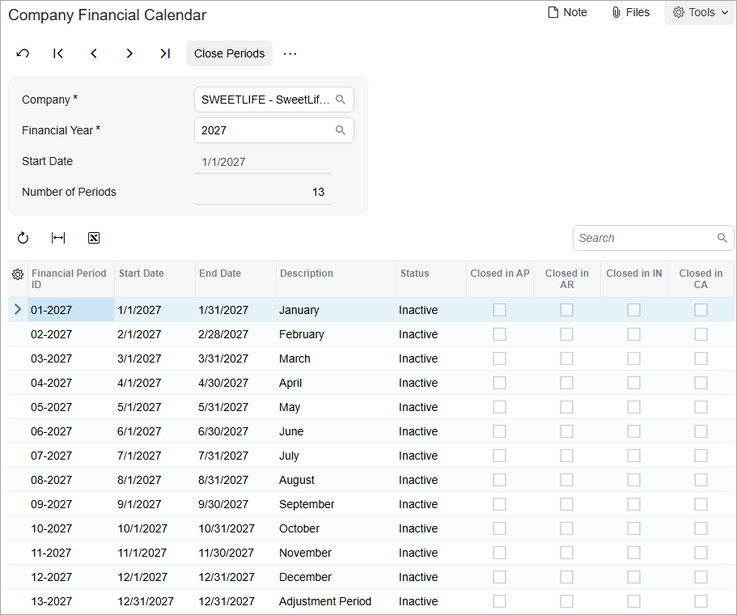

# Financial Calendar Generation: Process Activity {#_ab2769be-8513-40ad-a0cc-955cdb91896b .task}

In this activity, you will learn how to perform operations required to generate a financial calendar for a new month-based financial year.

## Story {#section_s3g_mjv_vxb .section}

Suppose that at the end of 2026, acting as the accountant of the SweetLife Fruits &amp; Jams company, you must generate a financial calendar for the 2027 year in the system.

## Process Overview {#section_u3g_mjv_vxb .section}

In this activity, you will generate periods for a new year on the [Master Financial Calendar](GL_20_10_00.md) \(GL201000\) form. You will then review and change the period statuses for this year on the [Company Financial Calendar](GL_20_11_00.md) \(GL201100\) form.

## System Preparation {#section_w3g_mjv_vxb .section}

To prepare the system, do the following:

1.  Launch the Acumatica ERP website with the *U100* dataset. Sign in as an accountant by using the following credentials:
    -   Username: *johnson*
    -   Password: *123*
2.  On the Company and Branch Selection menu, also on the top pane of the Acumatica ERP screen, make sure that the *SweetLife Head Office and Wholesale Center* branch is selected. If it is not selected, click the Company and Branch Selection menu to view the list of branches that you have access to, and then click *SweetLife Head Office and Wholesale Center*.

## Step 1: Generating a Calendar for a New Financial Year {#section_y3g_mjv_vxb .section}

To generate a calendar for a new financial year, do the following:

1.  Open the [Master Financial Calendar](GL_20_10_00.md) \(GL201000\) form.
2.  On the form toolbar, click **Generate Calendar**.
3.  In the **Generate GL Calendar** dialog box, which opens, verify that *2027* is displayed in the **From Year** and **To Year** boxes and click **Generate**.
4.  In the Summary area, select *2027* in the **Financial Year** box and review the generated periods displayed in the table.

## Step 2: Reviewing the Periods for 2027 {#section_ajg_mjv_vxb .section}

To review the financial periods generated for 2027 in the *SWEETLIFE* company, do the following:

1.  Open the [Company Financial Calendar](GL_20_11_00.md) \(GL201100\) form.
2.  In the Selection area, specify the following settings:
    -   **Company**: *SWEETLIFE* \(inserted by default\)
    -   **Financial Year**: *2027*
3.  In the table, review the periods generated for 2027.

    Note that all the periods in the new 2027 financial year have the *Inactive* status, as shown in the following screenshot.

    

**Parent topic:**[Generating a Financial Calendar](../UserGuide/Finance_Fin_Clanedar_for_New_FinYear_Mapref.md)

