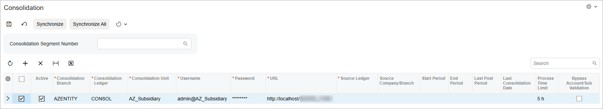
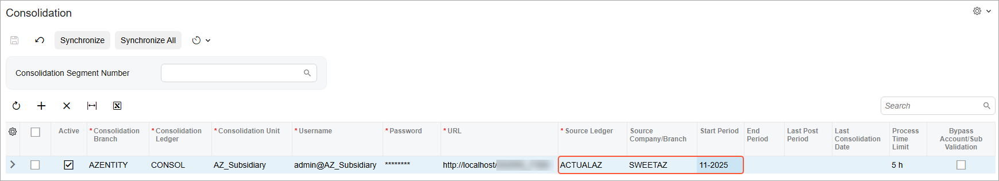

# GL Consolidation Configuration: To Configure the Parent Company {#_5c30449f-88cb-4a38-81a4-235d4a9f318a .task}

In the following implementation activity, you will learn how to configure the parent company to prepare it for GL consolidation.

## Story {#section_kyl_mjv_vxb .section}

Suppose that the SweetLife Fruits &amp; Jams company has established a subsidiary in Arizona that has been implemented in a separate tenant of Acumatica ERP as a company without branches. The parent company, SweetLife, has to consolidate data from this company with its own data for reporting purposes.

Acting as a system administrator, you need to perform the needed configuration in SweetLife to prepare it for GL consolidation.

## Process Overview {#section_nyl_mjv_vxb .section}

In this activity, you will enable the *General Ledger Consolidation* feature on the [Enable/Disable Features](CS_10_00_00.md) \(CS100000\) form.

On the [Companies](CS_10_15_00.md) \(CS101500\) form, you will create a subsidiary entity that represents the subsidiary company in the parent company. On the [Company Financial Calendar](GL_20_11_00.md) \(GL201100\) form, you will open the financial periods up to 13-2025 for the new company.

On the [Ledgers](GL_20_15_00.md) \(GL201500\) form, you will create a consolidation ledger. You will then update the chart of accounts on the [Chart of Accounts](GL_20_25_00.md) \(GL202500\) form, and set up the consolidation on the [Consolidation](GL_10_30_00.md) \(GL103000\) form.

## System Preparation {#section_ryl_mjv_vxb .section}

Before you start configuring the parent company, launch the Acumatica ERP website, and sign in to a company with the *U100* dataset preloaded.

You should sign in as a system administrator Kimberly Gibbs by using the *gibbs* username and the *123* password.

## Step 1: Enabling the Needed Feature {#section_wyl_mjv_vxb .section}

To enable the *General Ledger Consolidation* feature, do the following:

1.  Open the [Enable/Disable Features](CS_10_00_00.md) \(CS100000\) form.
2.  On the form toolbar, click **Modify** to make it possible to change the set of selected features.
3.  Select the **General Ledger Consolidation** check box in the **Advanced Financials** group.
4.  On the form toolbar, click **Enable** to enable the selected feature.

## Step 2: Creating an Access Role for Subsidiaries {#section_yyl_mjv_vxb .section}

To create an access role that you will use for the subsidiary entity, do the following:

1.  Open the [User Roles](SM_20_10_05.md) \(SM201005\) form.

    **Tip:** To open the form for creating a new record, type the form ID in the Search box, and on the Search form, point at the form title and click **New** right of the title.

2.  Click **Add New Record** on the form toolbar, and specify the following settings in the Summary area:
    -   **Role Name**: `Subsidiaries`
    -   **Role Description**: `Subsidiaries`
3.  On the **Membership** tab, click **Add Row** on the table toolbar, and select *gibbs* in the **Username** column of the row.
4.  Click **Add Row** again, and select *pasic* in the **Username** column. This is the username of the accountant who will import consolidation data to the parent tenant.
5.  On the form toolbar, click **Save** to save your changes.

## Step 3: Creating the Subsidiary Entity {#section_bzl_mjv_vxb .section}

To create the subsidiary entity that represents SweetLife AZ, do the following:

1.  Open the [Companies](CS_10_15_00.md) \(CS101500\) form.
2.  Click **Add New Record** on the form toolbar, and specify the following settings in the Summary area:
    -   **Company ID**: `AZENTITY`
    -   **Company Name**: `AZ Subsidiary`
    -   **Company Type**: *Without Branches*
3.  In the **Main Address** section of the **Company Details** tab, make sure that *US - United States of America* is selected in the **Country** box.
4.  In the **State** box, select *AZ - ARIZONA*.
5.  In the **Access Role** box \(**Configuration Settings** section\), select *Subsidiaries*.
6.  On the form toolbar, click **Save** to save your changes.

## Step 4: Creating the Consolidation Ledger {#section_dzl_mjv_vxb .section}

To create the consolidation ledger to which the data from SweetLife AZ should be collected, do the following:

1.  Open the [Ledgers](GL_20_15_00.md) \(GL201500\) form.
2.  On the form toolbar, click **Add New Record**, and specify the following settings in the Summary area:
    -   **Ledger ID**: `CONSOL`
    -   **Description**: `Consolidation Ledger`
    -   **Type**: *Reporting*
3.  On the **Companies** tab, click **Add Row** on the table toolbar, and in the **Company** column, select *AZENTITY* \(the company you created in the previous step\).
4.  On the form toolbar, click **Save** to save your changes.

## Step 5: Opening Financial Periods in the Subsidiary Entity {#section_fzl_mjv_vxb .section}

To open the periods of the 2025 financial year in the subsidiary entity that you created in Step 3, do the following:

1.  Make sure that you are signed in as the *gibbs* user.
2.  Open the [Company Financial Calendar](GL_20_11_00.md) \(GL201100\) form.
3.  In the **Company** box, select *AZENTITY*.
4.  In the **Financial Year** box, select *2025*.
5.  On the More menu, click **Open Periods**.

    The [Manage Financial Periods](GL_50_30_00.md) \(GL503000\) form opens with the *Open* option selected in the **Action** box of the Summary area.

6.  In the table, select the unlabeled check box for the row of the *13-2025* period.
7.  On the form toolbar, click **Process**. The system displays the **Processing** dialog box.
8.  Close the **Processing** dialog box when the processing is completed.

## Step 6: Updating the Chart of Accounts {#section_izl_mjv_vxb .section}

To add a GL account that will consolidate the balances of all cash accounts from the subsidiary company, do the following:

1.  Open the [Chart of Accounts](GL_20_25_00.md) \(GL202500\) form.
2.  Click **Add Row** on the form toolbar, and specify the following settings in the added row:
    -   **Account**: `10000`
    -   **Account Class**: *CASHASSET*
    -   **Type**: *Asset* \(inserted automatically\)
    -   **Description**: `Cash Account`
    -   **Post Option**: *Summary*
3.  On the form toolbar, click **Save**.

## Step 7: Setting up the Consolidation {#section_kzl_mjv_vxb .section}

To set up GL consolidation in the parent company, do the following:

1.  Open the [Consolidation](GL_10_30_00.md) \(GL103000\) form.
2.  In the Summary area, leave the **Consolidation Segment Number** box empty.
3.  On the toolbar of the table listing the consolidation rules, click **Add Row**, and specify the following settings in the row you have added:
    -   **Consolidation Branch**: *AZENTITY*
    -   **Consolidation Ledger**: *CONSOL*
    -   **Consolidation Unit**: `AZ_Subsidiary`
    -   **Username**: `admin@AZ_Subsidiary`
    -   **Password**: `123`
4.  In the **URL** column, enter the address of the consolidation unit website.

    **Tip:** For example, if you are performing this activity on the tenant installed on your local computer, your URL could be the following: `http://localhost/F300/`.

5.  On the form toolbar, click **Save**.
6.  Make sure that the check box in the **Active** column of the added row is selected.
7.  Select the unlabeled check box for the row in the table, as shown in the following screenshot.

    

8.  On the form toolbar, click **Synchronize**.

    When the synchronization is complete, the boxes related to the subsidiary company become available for selection.

9.  In the row with the consolidation setup for *AZ\_Subsidiary*, specify the following settings:
    -   **Source Ledger**: *ACTUALAZ*
    -   **Source Company/Branch**: *SWEETAZ*
    -   **Start Period**: *11-2025*
10. On the form toolbar, click **Save**. The consolidation-related data in the parent and child tenants has been synchronized. As a result of the synchronization, the parent company has received information about the subsidiary consolidation ledger and the branches that use the ledger, while the child tenant has received the list of the consolidated accounts for mapping. The consolidation result is shown in the following screenshot.

    

**Parent topic:**[Configuring GL Consolidation](../UserGuide/Finance_GL_Consolidation_Configuration_Mapref.md)

