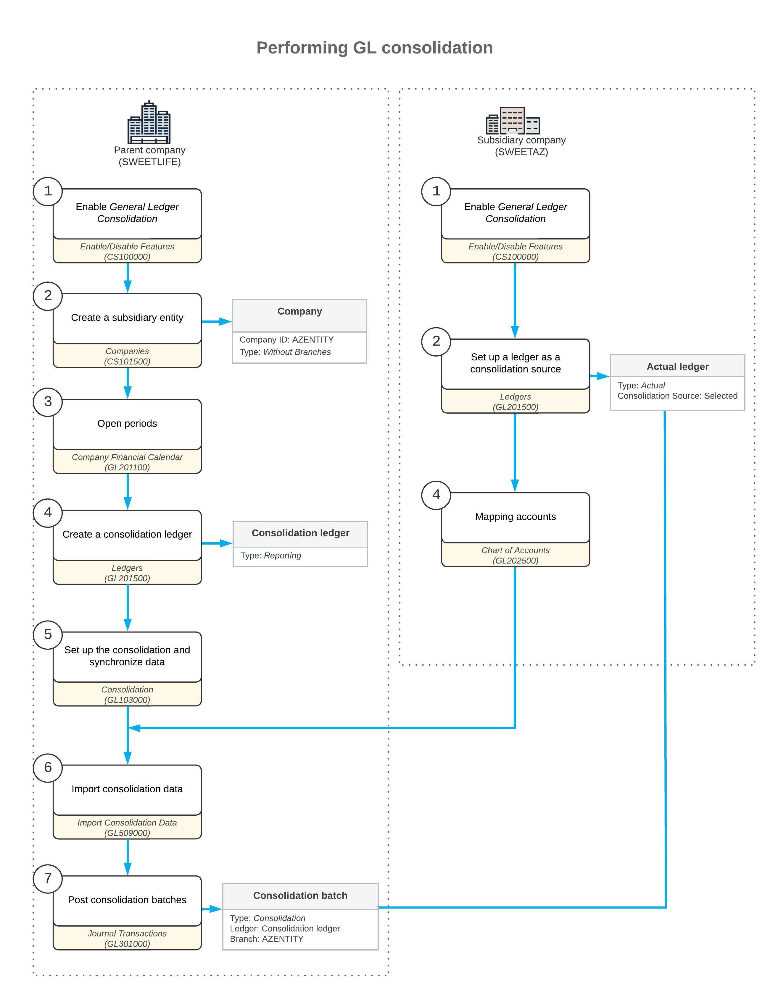

# GL Consolidation: General Information {#_97089c09-c4d1-46d0-bfe6-2b74b5b72469 .concept}

The way the consolidation data should be prepared in a consolidation unit depends on whether the base currency of the consolidation unit is the same as the base currency of the parent tenant.

## Learning Objectives {#section_bcm_mjv_vxb .section}

In this lesson, you will learn how to do the following:

-   Prepare the consolidation data in the consolidation unit
-   Perform GL consolidation

## Applicable Scenarios {#section_dcm_mjv_vxb .section}

You perform GL consolidation if you need to regularly collect data from one or multiple subsidiaries into the parent company for reporting purposes.

## Preparation of Consolidation Data in a Consolidation Unit {#section_fcm_mjv_vxb .section}

The way the consolidation data should be prepared in a consolidation unit depends on whether the base currency of the consolidation unit is the same as the base currency of the parent tenant. The following system configuration is possible:

-   A consolidation unit uses the same base currency as the parent tenant does. In this case, no special data preparation is required.
-   A consolidation unit uses a different base currency than the parent tenant does. In this case, the consolidation unit should translate the data into the base currency of the parent company before the parent company imports the data. If you want to consolidate the translated data, you specify the reporting ledger as the unit's source ledger. To consolidate the original untranslated data, specify the reporting ledger as the source ledger of the unit. If the base currency of the parent tenant is the same as the base currency of the consolidation ledger, any ledger can be used as the source ledger.

    **Tip:** Depending on your company's policy, the balances can be translated to the base currency of the parent tenant after the consolidation. If an accountant of the parent company is more skilled with the consolidation or the *Multicurrency Accounting* feature is disabled in the consolidation unit, the translation can be prepared in the parent tenant.

In each consolidation unit, you perform the following steps to prepare data for consolidation:

1.  You prepare the trial balance for the consolidation period and make sure that it is correct.

    **Attention:** This is a periodic activity that should be done every month.

2.  \(Optional\): You close the financial period for which consolidation will be performed. For details on closing periods, see [Closing Financial Periods: To Close a Period in a Subledger](Finance_ClosingPeriods_Process_Activity.md) and [Closing Financial Periods: To Close a Period in Subledgers and GL](Finance_ClosingPeriods_Process_Activity_2.md).

In each consolidation unit that has the *Multicurrency Accounting* feature enabled on the [Enable/Disable Features](CS_10_00_00.md) \(CS100000\) form and has the base currency different from the base currency of the parent tenant, you perform the following steps to prepare data for consolidation:

1.  You update the exchange rates to be used for the translation of balances to the base currency of the parent company as described in [Currency Rate Types and Current Rates](../ImplementationGuide/config_Multicurrency_Configuring_Rates_Mapref.md).

    **Attention:** This is a periodic activity that should be done every month.

2.  You review the accounts and subaccount segment values \(if subaccounts are used in the system\) to make sure that all of them have been mapped. For details, see [GL Consolidation: To Prepare the Consolidation Unit](Finance_GL_Consolidation_To_Prepare_Consol_Unit.md).
3.  You translate the balances to the parent company's base currency, and record the translated balances to the ledger that has been specified as the consolidation source. For details, see [Translation of Financial Statements: General Information](Multicurrency_TranslatingFinStatements_GeneralInfo.md).

    **Attention:** This is a periodic activity that should be done every month.

## Import of Consolidation Data {#section_ncm_mjv_vxb .section}

The consolidation data is imported to the selected branch of the parent company as GL batches with system-generated descriptions. Before the system starts to import the consolidation data, the system transforms the unit's subaccounts into the parent's subaccounts by using the segment value mapping and other related settings. Consolidation data being imported to the parent company is available by using the REST gateway as a set of `GLConsolRead` instances. Every `GLConsolRead` instance consists of four data fields:

-   `AccountCD` \(GL account\)
-   `MappedValue` \(parent company subaccount\)
-   `ConsolAmtCredit` \(total credit value for period\)
-   `ConsolAmtDebit` \(total debit value for period\)

To import the consolidation data from the consolidation units to the parent company, you use the [Import Consolidation Data](GL_50_90_00.md) \(GL509000\) form. You select the unit and the source ledger, and then click **Process**. The financial data is imported from the database of the consolidation unit to the specified branch of the parent company. To consolidate data of different types \(such as actual data and budget data\), use separate ledgers in the parent company.

## Workflow of Performing GL Consolidation {#section_qcm_mjv_vxb .section}

The following diagram illustrates the process of performing GL consolidation between the parent company and a subsidiary company implemented in a separate tenant.

**Parent topic:**[Performing GL Consolidation](../UserGuide/Finance_GL_Consolidation_Mapref.md)

