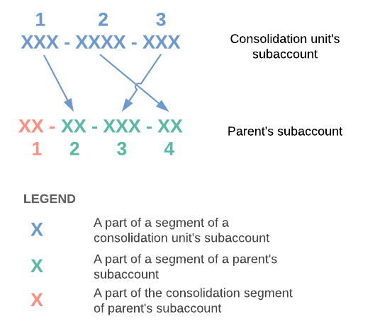
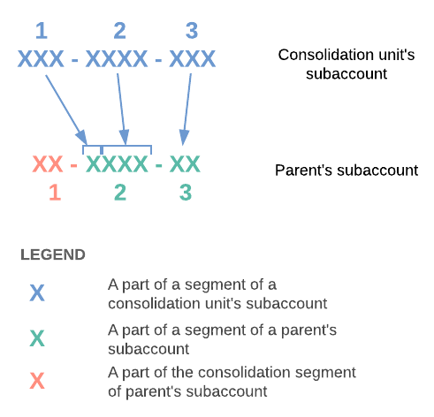

# GL Consolidation: Subaccount Mapping {#_eb19dece-80fd-4a3d-8749-628ccb1a1625 .concept}

In Acumatica ERP, subaccounts can be used to carry additional information about the organizational structure of each company. To match the subaccounts of the consolidation unit to the subaccounts of the parent tenant, you map the consolidation unit's segments to segments or part of a segment of the parent's subaccounts. For details on subaccounts, see the [Subaccounts](../ImplementationGuide/config_Subaccounts_Mapref.md) chapter.

**Note:** To use subaccounts in the system, the *Subaccounts* feature has to be enabled on the [Enable/Disable Features](CS_10_00_00.md#) \(CS100000\) form.

In this topic, you will read about how to map subaccounts in a consolidation unit and define the consolidation segment in the parent tenant. You will also find examples of subaccount mapping.

## Subaccount Mapping {#section_t2m_mjv_vxb .section}

You perform mapping of segments of the *SUBACCOUNT* segmented key in each consolidation unit as follows:

1.  On the [Segmented Keys](CS_20_20_00.md) \(CS202000\) form of the consolidation unit, you define the following settings for consolidation mapping for each segment:

    -   The length of the string \(segment or part of the segment\) in the parent's subaccount to which the segment value is mapped in the **Number of Characters** column.
    -   The number that represents the place of this segment or part of the segment in the parent's subaccount in the **Consol. Order** column.
    If a segment in a unit's subaccount does not match any string \(segment or part of the segment\) in the parent subaccount, set both of these settings to 0. This means the amounts associated with the segment will be aggregated. During data collection, the subaccounts of the unit are mapped to temporary subaccounts that may differ from the parent's subaccounts by the absence of the consolidation segment.

2.  If validation of segment values is turned on \(that is, the **Validate** check box is selected on the [Segmented Keys](CS_20_20_00.md) form for segments\), you have to map segment values of the consolidation unit with the segment values of the parent tenant. You map the segment values on the [Segment Values](CS_20_30_00.md) \(CS203000\) form of the consolidation unit by specifying related segment values of the parent tenant in the **Mapped Values** column.

Below you can read examples of mapping subaccounts in the system. For instructions on subaccount mapping, see [GL Consolidation \(Optional\): To Configure Consolidation in a Consolidation Unit with Subaccounts](GL__how_Configuring_Consolidation_in_a_Subsidiary.md).

## Consolidation Segment {#section_x2m_mjv_vxb .section}

One segment in the subaccounts of the parent tenant should be designated for consolidation units. This segment should be specified as a consolidation segment in the **Consolidation Segment Number** box on the [Consolidation](GL_10_30_00.md) \(GL103000\) form in the parent tenant. The values of this segment are associated with the consolidation units. As a rule, the consolidation segment is not involved in mapping because the subsidiary does not contain such a segment in its subaccounts. In this case, the segment value can be added to the temporary subaccount during the import of the data performed by the parent company \(if the **Paste Segment Value** check box on this form is selected on the [Consolidation](GL_10_30_00.md) form\). For instructions, see [GL Consolidation Configuration \(Optional\): To Configure Consolidation in a Parent Company with Subaccounts](GL__how_Configuring_Consolidation_in_a_Parent_Company.md).

## Example of Mapping Subaccounts with the Same Number of Segments {#section_z2m_mjv_vxb .section}

Consider an example when the parent company subaccount has four segments, the first of which is a consolidation segment not involved in mapping \(as shown in the illustration below\). The subaccount of the consolidation unit consists of three segments. Each segment of the consolidation unit can be mapped to a same-meaning segment of the parent even though the lengths of the segments are different. The first segment of the parents subaccount is a consolidation segment.

On the [Segmented Keys](CS_20_20_00.md) \(CS202000\) form, the consolidation mapping settings for the consolidation unit's subaccounts will have the following values.

|Segment ID|Description|Length|Consol. Order|Number of Characters|
|----------|-----------|------|-------------|--------------------|
|*1*|*Project*|*3*|*2*|*2*|
|*2*|*Department*|*4*|*4*|*2*|
|*3*|*Brand*|*3*|*3*|*3*|

The three-character values of the first segment \(*Project*\) of the unit's subaccount will be mapped to the two-character values of the second segment of the parent's subaccount, and other segments will be mapped similarly. Particular strings are specified on the [Segment Values](CS_20_30_00.md) \(CS203000\) form in the **Mapped Values** column.

## Example of Mapping Subaccounts with Different Number of Segments {#section_dfm_mjv_vxb .section}

A segment of a consolidation unit can be mapped to a part of the segment in the parent's subaccount, as shown in the illustration below. The subaccount of the consolidation unit consists of three segments as well as the parent's subaccount. Two segments of the consolidation unit are mapped to parts of one segment of the parent's subaccount. The first segment of the parents subaccount is a consolidation segment.

In this case, on the [Segmented Keys](CS_20_20_00.md) form, the consolidation mapping parameters for the consolidation unit's subaccounts will have the following values.

|Segment|Description|Length|Consol. Order|Number of Characters|
|-------|-----------|------|-------------|--------------------|
|*1*|*Project*|*3*|*2*|*1*|
|*2*|*Department*|*4*|*3*|*3*|
|*3*|*Brand*|*3*|*4*|*2*|

**Parent topic:**[Performing GL Consolidation](../UserGuide/Finance_GL_Consolidation_Mapref.md)

