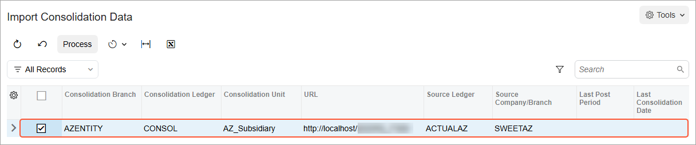

# GL Consolidation: To Import Consolidation Data from a Subsidiary {#_802fc1d6-a754-42e4-a9d5-8b6e20971f56 .task}

The following activity will walk you through the process of importing the balances of GL accounts from a subsidiary to the parent company.

## Story {#section_g3m_mjv_vxb .section}

Suppose that the management of SweetLife Fruits &amp; Jams needs the data from its subsidiary to be imported in the system so that consolidation data should be available in all financial reports. Acting as a SweetLife accountant, you need to import the consolidation data from SweetLife AZ to SweetLife Fruits &amp; Jams, post the consolidation batches, and make sure that the balances have been updated.

## Configuration Overview {#section_tz4_djx_cnb .section}

In the parent company with the *U100* dataset, on the [Enable/Disable Features](CS_10_00_00.md) \(CS100000\) form, the *General Ledger Consolidation* feature has been enabled.

## Process Overview {#section_n3m_mjv_vxb .section}

In this activity, you will import the consolidation data to the parent company on the [Import Consolidation Data](GL_50_90_00.md) \(GL509000\) form. You will then review and post the generated batches on the [Journal Transactions](GL_30_10_00.md) \(GL301000\) form. Finally, you will review the account balances of the *AZENTITY* company for 11-2025 and 12-2025 on the [Account Summary](GL_40_10_00.md) \(GL401000\) form.

## System Preparation {#section_p3m_mjv_vxb .section}

Before you begin performing the steps of this activity, do the following:

1.  Launch the Acumatica ERP website, and sign in to the parent company with the *U100* dataset preloaded. You should sign in as an accountant Nenad Pasic by using the *pasic* username and the *123* password.
2.  On the Company and Branch Selection menu on the top pane of the Acumatica ERP screen, make sure that the *SweetLife Head Office and Wholesale Center* branch is selected. If it is not selected, click the Company and Branch Selection menu button to view the list of branches that you have access to, and then click *SweetLife Head Office and Wholesale Center*.
3.  Make sure you the parent company has been prepared, as described in [GL Consolidation Configuration: To Configure the Parent Company](Finance_GL_Consolidation_Config_To_Configure_Parent_Company.md).
4.  Make sure the *AZ\_Subsidiary* company \(the consolidation unit\) has been created and configured as described in [GL Consolidation Configuration: To Configure a Consolidation Unit](Finance_GL_Consolidation_Config_To_Configure_Consol_Unit.md). It has also been prepared for consolidation as described in [GL Consolidation: To Prepare the Consolidation Unit](Finance_GL_Consolidation_To_Prepare_Consol_Unit.md).

## Step 1: Importing the Consolidation Data {#section_r3m_mjv_vxb .section}

To import the consolidation data from the consolidation unit to the parent company, do the following:

1.  Open the [Import Consolidation Data](GL_50_90_00.md) \(GL509000\) form.

    The consolidation rule that you set up earlier is displayed in the table.

2.  In the table, select the unlabeled check box for the only row, and click **Process** on the form toolbar, as shown in the following screenshot. The system opens the **Processing** dialog box.

    

3.  Close the **Processing** dialog box.

    **Tip:** You can schedule this process by using the [Automation Schedules](SM_20_50_20.md) \(SM205020\) form.

## Step 2: Reviewing and Posting the Consolidation Batches {#section_v3m_mjv_vxb .section}

To review and post the consolidation batches generated by the system, do the following:

1.  Open the Journal Transactions \(GL3010PL\) list of records.
2.  In the table, find a batch with the following settings:

    -   **Module**: *GL*
    -   **Status**: *Balanced*
    -   **Ledger**: *CONSOL*
    -   **Transaction Date**: *11/30/2025*
    This is the consolidation batch for 11-2025, which was generated as a result of the import process.

3.  Click the link in the **Batch Number** column to open the batch on the [Journal Transactions](GL_30_10_00.md) \(GL301000\) form.

    The batch has a description indicating that this is a consolidation batch and *AZENTITY* specified in the **Branch** column for each entry.

4.  In the table, review the amount in the **Debit Amount** column for *10000 - Cash Account*. This amount consolidates the amounts of all cash accounts in the *AZ\_Subsidiary* company.
5.  On the form toolbar, click **Release** to release the consolidation batch.
6.  Return to the Journal Transactions \(GL3010PL\) list of records, and find a batch with the following setting:

    -   **Module**: *GL*
    -   **Status**: *Balanced*
    -   **Ledger**: *CONSOL*
    -   **Transaction Date**: *12/31/2025*
    This is the consolidation batch for 12-2025, which was generated as a result of the import process.

7.  Click the link in the **Batch Number** column to open the batch on the [Journal Transactions](GL_30_10_00.md) form.
8.  In the table, review the entries and the amount in the **Debit Amount** column for *10000 - Cash Account*.
9.  On the form toolbar, click **Release** to release the batch.

## Step 3: Reviewing the Account Balances of the *AZENTITY* Company {#section_ajm_mjv_vxb .section}

To review the account balances of the *AZENTITY* company, do the following:

1.  Open the [Account Summary](GL_40_10_00.md) \(GL401000\) form.
2.  In the Selection area, specify the following settings:
    -   **Company/Branch**: *AZENTITY - AZ Subsidiary*
    -   **Ledger**: *CONSOL*
    -   **Period**: *11-2025*
3.  In the table, review the balances shown for the *11-2025* period.
4.  In the **Period** box, select *12-2025*.
5.  In the table, review the balances shown for the *12-2025* period.

    **Tip:** This data can be used for preparing ARM reports and is available in all GL reports and inquiries.

**Parent topic:**[Performing GL Consolidation](../UserGuide/Finance_GL_Consolidation_Mapref.md)

