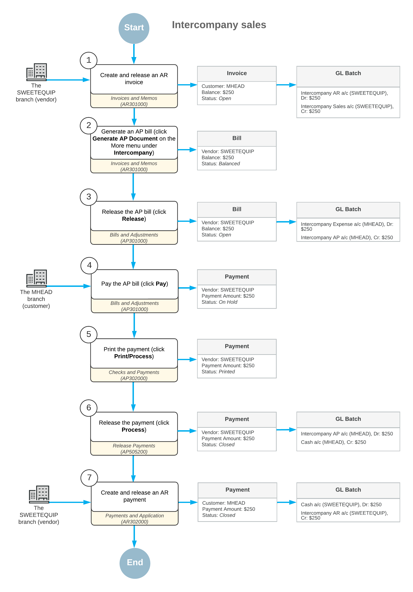

# Intercompany Sales: General Information {#_44795c99-30f0-4720-a8ed-2ea8766aa6ec .concept}

Once you have configured the intercompany sales functionality, the system can automatically create AP documents \(bills, debit adjustments, and credit adjustments\) in the purchasing company based on the AR documents \(invoices, credit memos, and debit memos\) that users create in the selling company.

## Learning Objectives {#section_fyr_4jv_vxb .section}

In this chapter, you will learn how to do the following:

-   Process an intercompany invoice and create an intercompany bill based on this invoice.
-   Pay the intercompany bill.
-   Process a payment for the intercompany invoice.

## Applicable Scenarios {#section_hyr_4jv_vxb .section}

You use the intercompany sales functionality if there are multiple companies defined in the same tenant and one of the companies \(the selling company\) has rendered a service or sold goods to another company \(the purchasing company\). Each of these companies can consist of multiple branches. The selling company creates an AR document \(invoice, debit memo, or credit memo\) where the purchasing company is a customer. In the created AP document \(bill, debit adjustment, or credit adjustment\), the selling company should be specified as a vendor.

## Automatic Creation of AP Documents {#section_jyr_4jv_vxb .section}

Once the intercompany sales functionality has been configured, as described in [Intercompany Sales Setup: Implementation Activity](../ImplementationGuide/Finance_Intercompany_SalesSetup_Implem_Activity.md), you can start processing sales documents between the selling and purchasing companies.

You can use the [Generate Intercompany Documents](AP_50_35_00.md) \(AP503500\) form to mass-generate AP documents based on AR documents from the selling company or branch. The form lists the AR documents in the related company for which new AP documents can be generated. When you generate AP documents either by clicking **Process** or **Process All** on the form toolbar of this form or by clicking **Generate AP Document** on the More menu \(under **Intercompany**\) for an individual AR document on the [Invoices and Memos](AR_30_10_00.md) \(AR301000\) form, the system generates an AP document that corresponds to each AR document. For details, see [Intercompany Sales Setup: Mapping Rules](../ImplementationGuide/Finance_Intercompany_SalesSetup_Mapping_Rules.md).

**Attention:** Taxes are not copied to an AP document; instead, they are calculated based on the tax zone of the vendor \(the originating branch of the AR document\). If the total amount or the tax total amount of the AR document differs from the total amount and the tax total amount in the AP document, the system will display a warning message, but you will be able to release the AP document.

The system generates an AP document if the original AR document meets the following criteria:

-   The document's customer has been extended from a company or branch.
-   The document's type is *Invoice*, *Credit Memo*, or *Debit Memo*.
-   The document is released.
-   The **Exclude from Intercompany Processing** check box has been cleared for the document on the **Financial** tab \(**Intercompany Invoicing** section\) of the [Invoices and Memos](AR_30_10_00.md) form.
-   The document has no related AP document. That is, the **Related AP Document** box is empty on the **Financial** tab \(**Intercompany Invoicing** section\) of the [Invoices and Memos](AR_30_10_00.md) form.
-   The document has not been migrated.
-   The document is not a retainage document and is not a document with retainage.
-   The document is not a child document of an AR document with the *Multiple* installment credit terms.

For details of the mapping rules between AR and AP documents, see [Intercompany Sales Setup: Mapping Rules](../ImplementationGuide/Finance_Intercompany_SalesSetup_Mapping_Rules.md).

## Workflow of the Intercompany Sales {#section_vv2_1y4_y4b .section}

For intercompany sales of non-stock items between the branches of two different companies, the typical process involves the actions and generated documents shown in the following diagram.

**Parent topic:**[Processing Intercompany Sales](../UserGuide/Finance_Intercompany_Sales_Mapref.md)

