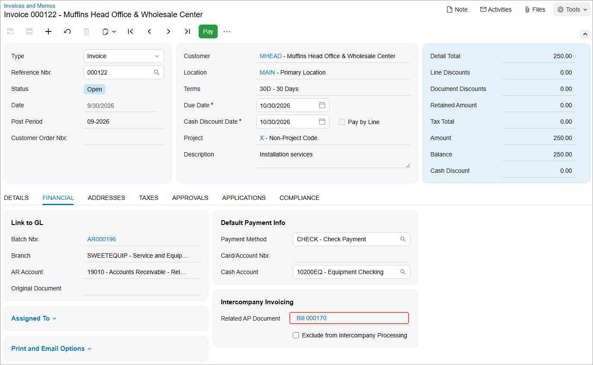

# Intercompany Sales: To Process an Intercompany Invoice {#_0db4c77c-f877-471a-b025-db9fc303cb15 .task}

The following activity will walk you through the processing of intercompany invoice between branches of two companies within the same tenant.

## Story {#section_xbs_4jv_vxb .section}

Suppose that the Head Office of the Muffins &amp; Cakes company has to purchase juicer installation services from the Service and Equipment Sales Center of SweetLife Fruits &amp; Jams. The system administrator has set up the intercompany sales functionality to generate AP bills based on AR invoices.

Acting as an accountant of SweetLife, you need to create an AR invoice with the *MHEAD* branch as a customer, and automatically generate an AP bill based on this invoice.

## Configuration Overview {#section_acs_4jv_vxb .section}

In the *U100* dataset, the following tasks have been performed to support this activity:

-   On the [Enable/Disable Features](CS_10_00_00.md#) \(CS100000\) form, the following features have been enabled:
    -   *Standard Financials*
    -   *Multibranch Support*
    -   *Multicompany Support*
    -   *Advanced Financials*
    -   *Inter-Branch Transactions*
-   On the [Companies](CS_10_15_00.md) \(CS101500\) form, the *MUFFINS* and *SWEETLIFE* companies have been defined.
-   On the [Branches](CS_10_20_00.md) \(CS102000\) form, the *SWEETEQUIP* and *MHEAD* branches have been defined.
-   On the [Non-Stock Items](IN_20_20_00.md) \(IN202000\) form, the *INSTALL* non-stock item has been configured.

## Process Overview {#section_fcs_4jv_vxb .section}

In this activity, on the [Invoices and Memos](AR_30_10_00.md) \(AR301000\) form, you will create an AR invoice, specifying *MHEAD* as the customer, and release the invoice. You will then cause the system to automatically create an AP bill based on the AR invoice by clicking **Generate AP Document** on the More menu. On the [Bills and Adjustments](AP_30_10_00.md) \(AP301000\) form, you will review the settings of the created bill and release it.

## System Preparation {#section_hcs_4jv_vxb .section}

Before you begin performing the steps of this activity, do the following:

1.  Launch the Acumatica ERP website with the *U100* dataset preloaded, and sign in as an accountant Nenad Pasic by using the *pasic* username and the *123* password.
2.  In the info area at the upper-right corner of the top pane of the Acumatica ERP screen, make sure that the business date is set to *1/30/2026*. If a different date is displayed, click the Business Date menu button and select *1/30/2026* from the calendar. For simplicity, you'll create and process all documents in this activity using this business date.
3.  On the Company and Branch Selection menu on the top pane of the Acumatica ERP screen, select the *SWEETEQUIP - Service and Equipment Sales Center* branch.
4.  Make sure the *SWEETEQUIP* branch has been extended as a vendor and the *MHEAD* branch has been extended as a customer, as described in [Intercompany Sales Setup: Implementation Activity](../ImplementationGuide/Finance_Intercompany_SalesSetup_Implem_Activity.md).

## Step 1: Processing an AR Invoice from the Selling Branch to the Purchasing Branch {#section_jcs_4jv_vxb .section}

To process an AR invoice from *SWEETEQIP* to *MHEAD*, do the following:

1.  Open the [Invoices and Memos](AR_30_10_00.md) \(AR301000\) form.

    **Tip:** To open the form for creating a new record, type the form ID in the Search box, and on the Search form, point at the form title and click **New** right of the title.

2.  On the form toolbar, click **Add New Record**, and in the Summary area, specify the following settings:
    -   **Type**: *Invoice*
    -   **Date**: *1/30/2026* \(inserted by default\)
    -   **Customer**: *MHEAD*

        This is the *MHEAD* branch of Muffins &amp; Cakes that has been extended as a customer and to which *SWEETEQUIP*—the current branch, which has been extended as a vendor—provides services.

    -   **Location**: *MAIN* \(inserted by default\)
    -   **Description**: `Installation services`
3.  On the **Details** tab, click **Add Row** on the table toolbar, and specify the following settings for the added row:
    -   **Branch**: *SWEETEQUIP* \(inserted by default\)
    -   **Inventory ID**: *INSTALL*
    -   **Quantity**: `2.5`
    -   **Ext. Price**: *250* \(inserted automatically\)
    -   **Account**: *43000 - Related Company Sales* \(inserted automatically\)

        Because on the [Accounts Receivable Preferences](AR_10_10_00.md) \(AR101000\) form, the **Use Intercompany Sales Account From** box is set to *Customer Location*, the system has inserted the sales account specified on the **GL Accounts** tab of the [Customer Locations](AR_30_30_20.md) \(AR303020\) form for the *MAIN* location of the selected customer.

4.  On the form toolbar, click **Save**.
5.  On the form toolbar, click **Remove Hold** to give the invoice the *Balanced* status.
6.  On the form toolbar, click **Release** to release the AR invoice.

## Step 2: Automatically Creating an AP Bill Based on the AR Invoice {#section_ocs_4jv_vxb .section}

To create an AP bill based on the AR invoice from *SWEETEQIP* to *MHEAD*, do the following:

1.  While you are still on the [Invoices and Memos](AR_30_10_00.md) \(AR301000\) form with the invoice open, on the More menu \(under **Intercompany**\), click **Generate AP Document**. The system opens the [Bills and Adjustments](AP_30_10_00.md) \(AP301000\) form with an automatically created AP bill.

    Notice that in the **Vendor** box of the Summary area, *SWEETEQUIP* is specified as the vendor.

2.  On the **Details** tab, review the account specified in the **Account** column.

    Because on the [Accounts Payable Preferences](AP_10_10_00.md) \(AP101000\) form, the **Use Intercompany Expense Account From** box is set to *Vendor Location*, the system has inserted the expense account specified on the **GL Accounts** tab of the [Vendor Locations](AP_30_30_10.md) \(AP303010\) form for the *MAIN* location of the selected vendor.

3.  Open the **Financial** tab. In the **Related AR Document** box \(**Intercompany Invoicing** section\), notice that the system has inserted an invoice number. This is the document you created in Step 1, based on which the AP bill has been created.
4.  On the form toolbar, click **Remove Hold**.
5.  On the form toolbar, click **Release** to release the AP bill.
6.  On the **Financial** tab, click link in the **Related AR Document** box \(**Intercompany Invoicing** section\), and review the invoice that opens on the [Invoices and Memos](AR_30_10_00.md) form.
7.  On the **Financial** tab, review the link to the AP bill that the system has inserted in the **Related AP Document** box \(**Intercompany Invoicing** section\), as shown in the following screenshot.

    

**Parent topic:**[Processing Intercompany Sales](../UserGuide/Finance_Intercompany_Sales_Mapref.md)

