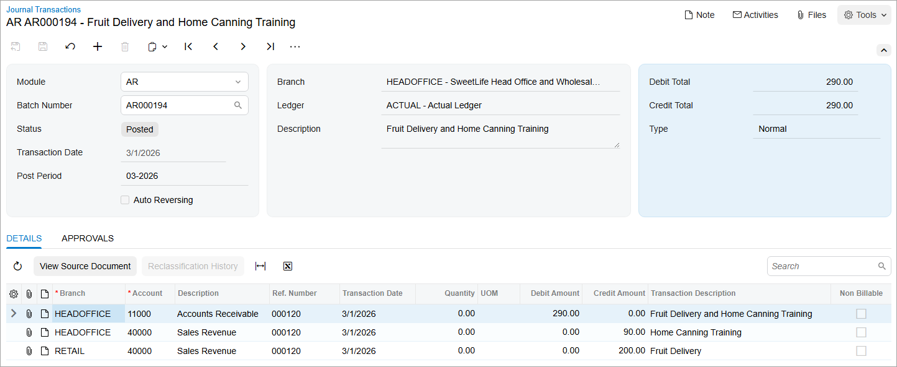
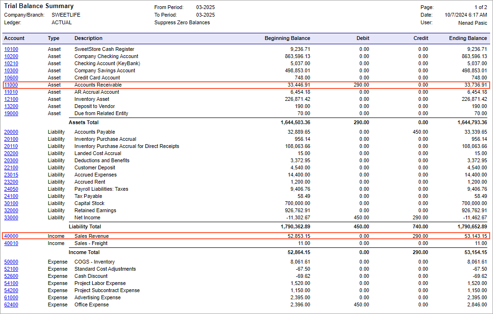

# Interbranch Invoices Without Balancing: Process Activity {#_20e64f54-43ea-46de-992a-e9ea2b62e54e .task}

In this activity, you will learn how to create and process an invoice for items provided by multiple branches not requiring balancing and review account balances.

**Attention:** This activity is based on the *U100* dataset. If you are using another dataset or if any system settings have been changed in *U100*, these changes can affect the workflow of the activity and the results of the processing. To avoid issues, restore the *U100* dataset to its initial state.

## Story {#section_adr_4jv_vxb .section}

On March 1, 2026, the SweetLife Fruits &amp; Jams company issued an invoice to the FourStar Coffee &amp; Sweets Shop customer in the amount of $290 for goods and services delivered to the customer by two branches that do not require balancing. The SweetLife Head Office and Wholesale Center branch has provided home canning training in the amount of $90, and the SweetLife Store branch has provided fruits and berries in the amount of $200.

Acting as a SweetLife accountant, you need to create an invoice in the system and then release it, which causes a batch to be generated for it.

## Configuration Overview {#section_tz4_djx_cnb .section}

In the *U100* dataset, the following tasks have been performed to support this activity:

-   On the [Companies](CS_10_15_00.md) \(CS101500\) form, the SweetLife company has been defined.
-   On the [Branches](CS_10_20_00.md) \(CS102000\) form, the *HEADOFFICE* and *RETAIL* branches of the SweetLife company have been created.
-   On the [Chart of Accounts](GL_20_25_00.md) \(GL202500\) form, multiple accounts have been created.
-   On the [Ledgers](GL_20_15_00.md) \(GL201500\) form, the *ACTUAL* ledger has been created.
-   On the [Customers](AR_30_30_00.md) \(AR303000\) form, the *COFFEESHOP* customer has been created.

## Process Overview {#section_edr_4jv_vxb .section}

To process an interbranch invoice between branches that do not need to be balanced, you will create and release the invoice on the [Invoices and Memos](AR_30_10_00.md) \(AR301000\) form. You will then review the generated batch on the [Journal Transactions](GL_30_10_00.md) \(GL301000\) form and check the account balances on the [Account Summary](GL_40_10_00.md) \(GL401000\) form.

Optionally, you will generate the trial balance report by using the [Trial Balance Summary](GL_63_20_00.md) \(GL632000\) report form.

## System Preparation {#section_hdr_4jv_vxb .section}

Before you begin performing the steps of this activity, do the following:

1.  Launch the Acumatica ERP website with the *U100* dataset preloaded, and sign in as an accountant Nenad Pasic by using the *pasic* username and the *123* password.
2.  In the info area, in the upper-right corner of the top pane of the Acumatica ERP screen, make sure that the business date in your system is set to *3/1/2026*. If a different date is displayed, click the Business Date menu button and select *3/1/2026*.
3.  On the Company and Branch Selection menu on the top pane of the Acumatica ERP screen, make sure that the *SweetLife Head Office and Wholesale Center* branch is selected. If it is not selected, click the Company and Branch Selection menu to view the list of branches that you have access to, and then click *SweetLife Head Office and Wholesale Center*.

## Step 1: Creating and Processing an Invoice for Branches Not Requiring Balancing {#section_jdr_4jv_vxb .section}

To create and process an AR invoice for goods and services provided by multiple branches \(*HEADOFFICE* and *RETAIL*\) that do not require balancing, do the following:

1.  Open the [Invoices and Memos](AR_30_10_00.md) \(AR301000\) form.

    **Tip:** To open the form for creating a new record, type the form ID in the Search box, and on the Search form, point at the form title and click **New** right of the title.

2.  Click **Add New Record** on the form toolbar, and specify the following settings in the Summary area:
    -   **Type**: *Invoice*
    -   **Customer**: *COFFEESHOP*
    -   **Date**: *3/1/2026* \(inserted by default\)
    -   **Description**: `Fruit Delivery and Home Canning Training`
3.  On the **Details** tab, click **Add Row**, and specify the following settings in the row you have added:
    -   **Branch**: *HEADOFFICE*
    -   **Transaction Descr.**: `Home Canning Training`
    -   **Ext. Price**: `90`
4.  Add another row with the following settings:

    -   **Branch**: *RETAIL*
    -   **Transaction Descr.**: `Fruit Delivery`
    -   **Ext. Price**: `200`
    Notice the *40000 - Sales Revenue* account has been specified in the **Account** column for both lines, because it is a sales account associated with the customer by default.

5.  On the form toolbar, click **Save** to save the invoice.
6.  On the form toolbar, click **Remove Hold** and then click **Release** to release the invoice.
7.  On the **Financial** tab, notice that the originating branch of the invoice is *HEADOFFICE*, which is specified in the **Branch** box. The system has filled in the **Branch** box automatically with the branch to which you are signed in. Also, notice *11000 - Accounts Receivable* is specified in the **AR Account** box.
8.  Click the link in the **Batch Nbr.** box, and review the GL batch, which is opened on the [Journal Transactions](GL_30_10_00.md) \(GL301000\) form.

    When you released the invoice, the system generated and posted the related GL transaction. The AR account of the originating branch of the invoice has been debited and accounts from each document line are credited in the destination branch specified in detail lines \(see the following screenshot\).

    

In the next step, you will check the balances of these accounts.

## Step 2: Reviewing the Account Balances {#section_pdr_4jv_vxb .section}

To review the account balances for the branches in the *03-2026* financial period, do the following:

1.  Open the [Account Summary](GL_40_10_00.md) \(GL401000\) form.
2.  To review the account balances in the *HEADOFFICE* branch, in the Summary area, specify the following settings:
    -   **Company/Branch**: *HEADOFFICE*
    -   **Ledger**: *ACTUAL*
    -   **Period**: *03-2026*
3.  In the table, review the account balances. Notice the amount in the **Credit Total** column for the *40000 - Sales Revenue* account is $90.00.
4.  In the **Company/Branch** box of the Summary area, select *RETAIL* to review the account balances in the *RETAIL* branch.
5.  In the table, review the account balances. Notice the amount in the **Credit Total** column for the *40000 - Sales Revenue* account is $200.00.

Now you will review the balances for the financial period for the company as a whole.

## Step 3 \(Optional\): Reviewing the Balances for the Financial Period {#section_upy_b1c_jpb .section}

To review the balances for the *03-2026* financial period, do the following:

1.  Open the [Trial Balance Summary](GL_63_20_00.md) \(GL632000\) report form.
2.  On the **Report Parameters** tab, specify the following parameters:
    -   **Company/Branch**: *SWEETLIFE*
    -   **Ledger**: *ACTUAL*
    -   **From Period**: *03-2026*
    -   **To Period**: *03-2026*
    -   **Suppress Zero Balances**: Selected
3.  On the report form toolbar, click **Run Report**.
4.  In the generated report, review the account balances. As you can see in the following screenshot, the amount in the **Debit** column for the *11000 - Accounts Receivable* account equals the amount in the **Credit** column for the *40000 - Sales Revenue* account.

In this activity, you have created and processed an invoice between branches that do not require balancing, and you have learned how to review the relevant account balances.

**Parent topic:**[Processing Interbranch Invoices Without Balancing](../UserGuide/Finance_Invoice_Between_Branches_Not_Requiring_Balancing_Mapref.md)

