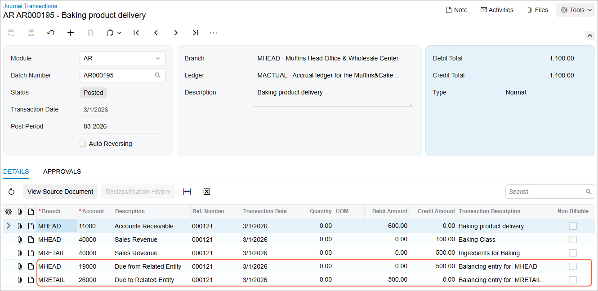
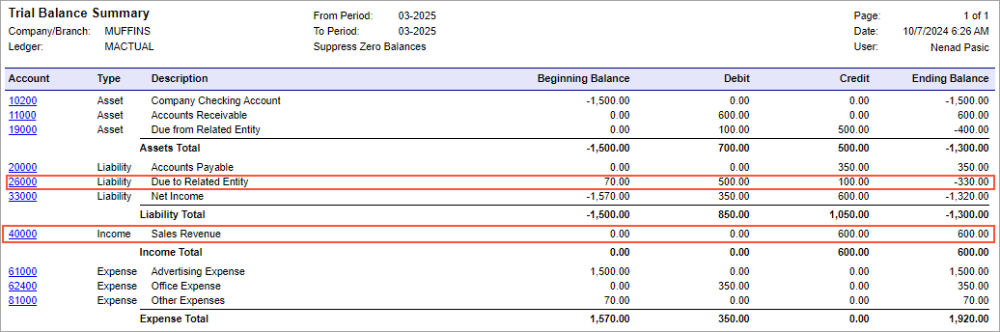

# Interbranch Invoices with Balancing: Process Activity {#_05644160-8d16-424b-8d58-4d8b54133143 .task}

In this activity, you will learn how to process an invoice for items provided by multiple branches that require balancing; you will then review account balances.

**Attention:** This activity is based on the *U100* dataset. If you are using another dataset or if any system settings have been changed in *U100*, these changes can affect the workflow of the activity and the results of the processing. To avoid issues, restore the *U100* dataset to its initial state.

## Story {#section_klr_4jv_vxb .section}

On March 1, 2026, the Muffins &amp; Cakes company issued an invoice to the GoodFood One Restaurant customer in the amount of $600 for baking-related goods and services delivered to the customer by both branches. \(Transactions for these branches require balancing.\) The Muffins Head Office &amp; Wholesale Center branch has provided baking classes in the amount of $100, and the Muffins Retail Shop branch has provided ingredients for baking in the amount of $500.

Acting as a Muffins accountant, you need to create an invoice in the system and then release the invoice, which causes a batch to be generated for it.

## Configuration Overview {#section_mcf_jyv_3pb .section}

In the *U100* dataset, the following tasks have been performed to support this activity:

-   On the [Companies](CS_10_15_00.md) \(CS101500\) form, the *MUFFINS* company has been defined.
-   On the [Branches](CS_10_20_00.md) \(CS102000\) form, the *MHEAD* and *MRETAIL* branches of the *MUFFINS* company have been created.
-   On the [Chart of Accounts](GL_20_25_00.md) \(GL202500\) form, multiple accounts have been created.
-   On the [Ledgers](GL_20_15_00.md) \(GL201500\) form, the *MACTUAL* ledger has been created.
-   On the [Customers](AR_30_30_00.md) \(AR303000\) form, the *GOODFOOD* customer has been created.
-   On the [Inter-Branch Account Mapping](GL_10_10_10.md) \(GL101010\) form, the account mapping rules between the Muffins &amp; Cakes head office branch \(*MHEAD*\) and the Muffins &amp; Cakes retail store branch \(*MRETAIL*\) have been defined.

## Process Overview {#section_plr_4jv_vxb .section}

To process an interbranch invoice for branches that need to be balanced, you will create and release the invoice on the [Invoices and Memos](AR_30_10_00.md) \(AR301000\) form. You will then review the generated batch on the [Journal Transactions](GL_30_10_00.md) \(GL301000\) form and check the account balances on the [Account Summary](GL_40_10_00.md) \(GL401000\) form.

Optionally, you will generate the trial balance report by using the [Trial Balance Summary](GL_63_20_00.md) \(GL632000\) report form.

## System Preparation {#section_slr_4jv_vxb .section}

Before you begin performing the steps of this activity, do the following:

1.  Launch the Acumatica ERP website with the *U100* dataset preloaded, and sign in as an accountant Nenad Pasic by using the *pasic* username and the *123* password.
2.  In the info area, in the upper-right corner of the top pane of the Acumatica ERP screen, make sure that the business date in your system is set to *3/1/2026*. If a different date is displayed, click the Business Date menu button and select *3/1/2026*.
3.  On the Company and Branch Selection menu on the top pane of the Acumatica ERP screen, select the *MHEAD - Muffins Head Office &amp; Wholesale Center* branch.

## Step 1: Creating and Processing an Invoice Between Branches Requiring Balancing {#section_ulr_4jv_vxb .section}

To create and process an AR invoice for goods and services provided by multiple branches \(*MHEAD* and *MRETAIL*\) that require balancing, do the following:

1.  Open the [Invoices and Memos](AR_30_10_00.md) \(AR301000\) form.

    **Tip:** To open the form for creating a new record, type the form ID in the Search box, and on the Search form, point at the form title and click **New** right of the title.

2.  Click **Add New Record** on the form toolbar, and specify the following settings in the Summary area:
    -   **Type**: *Invoice*
    -   **Customer**: *GOODFOOD*
    -   **Date**: *3/1/2026* \(inserted by default\)
    -   **Description**: `Baking product delivery`
3.  On the **Details** tab, click **Add Row**, and specify the following settings in the row you have added:
    -   **Branch**: *MHEAD*
    -   **Transaction Descr.**: `Baking Class`
    -   **Ext. Price**: `100`
4.  Add another row with the following settings:

    -   **Branch**: *MRETAIL*
    -   **Transaction Descr.**: `Ingredients for Baking`
    -   **Ext. Price**: `500`
    Notice that the *40000 - Sales Revenue* account has been specified in the **Account** column for both lines, because it is the sales account associated with the customer.

5.  On the form toolbar, click **Save** to save the invoice.
6.  On the form toolbar, click **Remove Hold** and then click **Release** to release the invoice.
7.  On the **Financial** tab, notice the originating branch of the invoice is *MHEAD*, which is specified in the **Branch** box. The system has filled in the **Branch** box automatically with the branch to which you are signed in. Also, notice *11000 - Accounts Receivable* is specified in the **AR Account** box.
8.  Click the link in the **Batch Nbr.** box, and review the GL batch, which the system has opened on the [Journal Transactions](GL_30_10_00.md) \(GL301000\) form.

    When you released the invoice, the system generated and posted the related GL transaction. The AR account of the originating branch of the invoice has been debited and accounts from each document line are credited in the destination branch specified in the related line. Notice that the system added the balancing entries to the batch during the posting process \(see the following screenshot\). The balancing entries have been created based on the mapping rule that has been configured on the [Inter-Branch Account Mapping](GL_10_10_10.md) \(GL101010\) form.

    

In the next step, you will check the balances of these accounts.

## Step 2: Reviewing the Account Balances {#section_amr_4jv_vxb .section}

To review the account balances for the branches in the *03-2026* financial period, do the following:

1.  Open the [Account Summary](GL_40_10_00.md) \(GL401000\) form.
2.  To review the account balances in the *MHEAD* branch, in the Summary area, specify the following settings:
    -   **Company/Branch**: *MHEAD*
    -   **Ledger**: *MACTUAL*
    -   **Period**: *03-2026*
3.  In the table, review the account balances. Notice the amount in the **Debit Total** column for the *11000 - Accounts Receivable* account \($600\). Notice the amount in the **Credit Total** column for the *19000 - Due from Related Entity* account \($500\) and the *40000 - Sales Revenue* account \($100\).
4.  In the **Company/Branch** box of the Summary area, select *MRETAIL* to review the account balances in the *MRETAIL* branch.
5.  In the table, review the account balances. Notice the amount in the **Credit Total** column for the *40000 - Sales Revenue* account \($500\) and the amount in the **Debit Total** column for the *26000 - Due to Related Entity* account \($500\).

Now you will review the balances for the financial period for the company as a whole.

## Step 3 \(Optional\): Reviewing the Balances for the Financial Period {#section_ezh_m1c_jpb .section}

To review the balances for the *03-2026* financial period, do the following:

1.  Open the [Trial Balance Summary](GL_63_20_00.md) \(GL632000\) report form.
2.  To prepare this report for the *MHEAD* branch, on the **Report Parameters** tab, specify the following parameters:
    -   **Company/Branch**: *MHEAD*
    -   **Ledger**: *MACTUAL*
    -   **From Period**: *03-2026*
    -   **To Period**: *03-2026*
    -   **Suppress Zero Balances**: Selected
3.  On the report form toolbar, click **Run Report**.
4.  In the generated report, review the account balances. Notice the amount in the **Debit** column for the *11000 - Accounts Receivable* account. Notice the amount in the **Credit** column for the *19000 - Due from Related Entity* account and the *40000 - Sales Revenue* account.
5.  Run the same report for the whole company. To do so, in the **Company/Branch** box of the **Report Parameters** tab, select *MUFFINS*.
6.  Review the account balances. Notice the amount in the **Credit** column for the *40000 - Sales Revenue* account and the amount in the **Debit** column for the *26000 - Due to Related Entity* account, which are shown in the following screenshot.

In this activity, you have created and processed an invoice between branches that require balancing, and you have learned how to review the relevant account balances.

**Parent topic:**[Processing Interbranch Invoices with Balancing](../UserGuide/Finance_Invoice_Between_Branches_Requiring_Balancing_Mapref.md)

