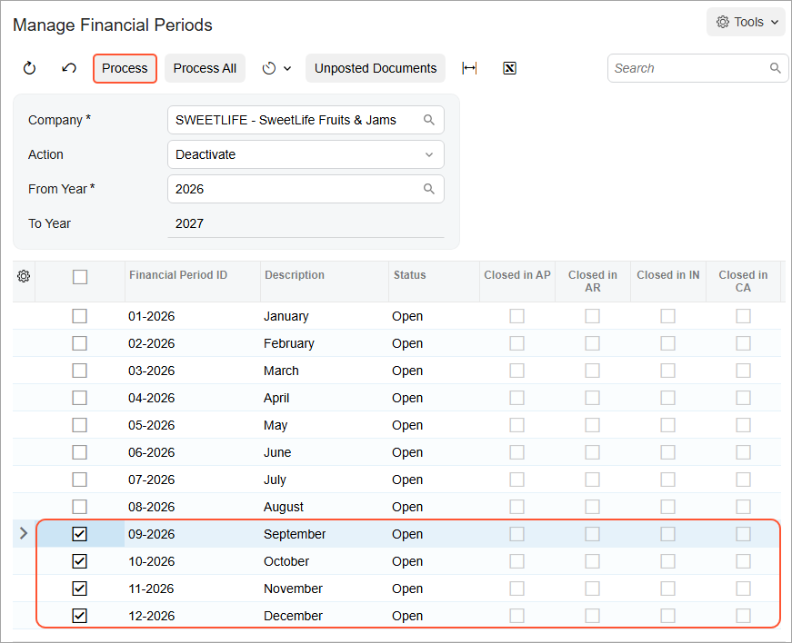

# Financial Periods: To Deactivate a Period {#_9a5fdac6-cb7d-46a9-a736-2615f894acef .task}

In this activity, you will learn how to deactivate a period for a particular company.

## Story {#section_sbk_mjv_vxb .section}

Suppose that as an accountant of the SweetLife Fruits &amp; Jams company, you have to deactivate the open *09-2026* financial period to prevent data entry clerks from posting transactions to it.

## Process Overview {#section_ubk_mjv_vxb .section}

In this activity, you will review the status of the financial period on the [Company Financial Calendar](GL_20_11_00.md) \(GL201100\) form and deactivate the period on the [Manage Financial Periods](GL_50_30_00.md) \(GL503000\) form.

## System Preparation {#section_wbk_mjv_vxb .section}

To prepare the system, do the following:

1.  Launch the Acumatica ERP website with the *U100* dataset. Sign in as an accountant by using the following credentials:
    -   Username: *johnson*
    -   Password: *123*
2.  On the Company and Branch Selection menu, also on the top pane of the Acumatica ERP screen, make sure that the *SweetLife Head Office and Wholesale Center* branch is selected. If it is not selected, click the Company and Branch Selection menu button to view the list of branches that you have access to, and then click *SweetLife Head Office and Wholesale Center*.

## Step: Deactivating the Financial Period {#section_ybk_mjv_vxb .section}

To deactivate the open *09-2026* financial period, do the following:

1.  Open the [Company Financial Calendar](GL_20_11_00.md) \(GL201100\) form.
2.  In the Selection area, specify the following settings:

    -   **Company**: *SWEETLIFE* \(inserted by default\)
    -   **Financial Year**: *2026*
    Notice that some periods including *October* have the *Open* status.

3.  On the More menu, click **Deactivate Periods**.
4.  On the [Manage Financial Periods](GL_50_30_00.md) \(GL503000\) form, which opens, notice that the system has selected the *Deactivate* action in the Summary area.
5.  In the table, select the unlabeled check box for the *09-2026* period. Notice that the later periods have been selected automatically.
6.  On the form toolbar, click **Process**, as shown on the following screenshot.

    

7.  In the **Processing** pop-up window, which is opened, click **Close**.

    The statuses of the periods have changed from *Open* to *Inactive*.

**Parent topic:**[Managing Financial Periods](../UserGuide/Finance_ManagingPeriods_Mapref.md)

