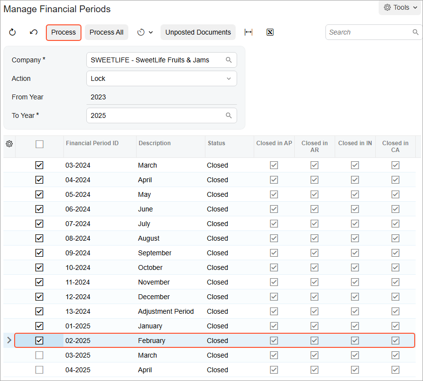

# Financial Periods: To Lock a Period {#_1a8a4c68-7c24-4360-9821-0ed79637d573 .task}

In this activity, you will learn how to lock a period in a particular company.

## Story {#section_fyj_mjv_vxb .section}

Suppose that now that the accounting department of the SweetLife Fruits &amp; Jams company has finished verifying all the figures disclosed in reports, users should be prevented from posting transactions to the appropriate periods.

Acting as SweetLife's chief accountant, you have to lock these periods in the system.

## Process Overview {#section_iyj_mjv_vxb .section}

In this activity, you will review period statuses on the [Company Financial Calendar](GL_20_11_00.md) \(GL201100\) form, and then lock a particular financial period on the [Manage Financial Periods](GL_50_30_00.md) \(GL503000\) form.

## System Preparation {#section_kyj_mjv_vxb .section}

To prepare the system, do the following:

1.  Launch the Acumatica ERP website with the *U100* dataset. Sign in as an accountant by using the following credentials:
    -   Username: *johnson*
    -   Password: *123*
2.  On the Company and Branch Selection menu, also on the top pane of the Acumatica ERP screen, make sure that the *SweetLife Head Office and Wholesale Center* branch is selected. If it is not selected, click the Company and Branch Selection menu button to view the list of branches that you have access to, and then click *SweetLife Head Office and Wholesale Center*.
3.  Make sure that some of the periods of 2025 have been closed as described in [Closing Financial Periods: To Close a Period in Subledgers and GL](Finance_ClosingPeriods_Process_Activity_2.md).

## Step: Locking a Financial Period {#section_myj_mjv_vxb .section}

To lock the *02-2025* financial period, do the following:

1.  Open the [Company Financial Calendar](GL_20_11_00.md) \(GL201100\) form.
2.  In the Selection area, specify the following settings:

    -   **Company**: *SWEETLIFE* \(inserted by default\)
    -   **Financial Year**: *2025*
    In the table, notice that some of the periods have the *Closed* status. These periods can be locked.

3.  On the More menu, click **Lock Periods**.
4.  On the [Manage Financial Periods](GL_50_30_00.md) \(GL503000\) form, which opens, notice that the system has selected the *Lock* action in the Summary area. In the table, select the unlabeled check box for the *02-2025* period. The preceding periods are selected automatically.
5.  On the form toolbar, click **Process**, as shown in the following screenshot.

    

6.  In the **Processing** pop-up window, which is opened, click the **Processed** tab, and review the list of periods that have been locked. Click **Close**.

**Parent topic:**[Managing Financial Periods](../UserGuide/Finance_ManagingPeriods_Mapref.md)

