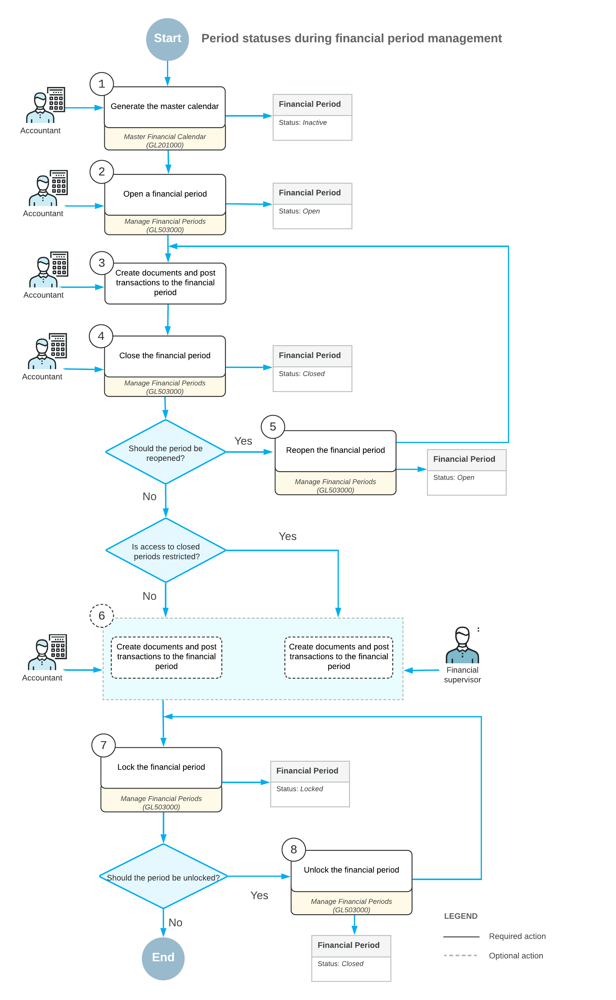

# Financial Periods: Posting Transactions {#_f7321673-2c63-449a-886e-26ce9e6e0784 .concept}

In general, the process of posting transactions to financial periods consists of the following steps:

1.  Generating financial periods for the appropriate year on the [Master Financial Calendar](GL_20_10_00.md) \(GL201000\) form: You have to generate periods for each year you want to keep records for before you post transactions to these periods. For details, see [Master Calendar Generation](GL__CON_Financial_Period_Activation.md).
2.  Opening the necessary financial periods for the year on the [Manage Financial Periods](GL_50_30_00.md) \(GL503000\) form: To be able to post transactions to the periods, you have to open them in the system. For details, see [Opening Financial Periods](Finance_OpeningPeriods_Mapref.md).
3.  Creating documents in the system and posting transactions to a period on various data entry forms: In the system, you can create documents and post them to open periods.
4.  Closing the financial period on the [Manage Financial Periods](GL_50_30_00.md) form: After all the needed transactions have been posted and all figures have been verified, to prevent users from posting transactions to the period, you should close the period in the system. \(If you need to close a period in a particular subledger only, you do it on the Closing Periods form of this subledger.\) For details, see [Closing Financial Periods: To Close a Period in a Subledger](Finance_ClosingPeriods_Process_Activity.md) and [Closing Financial Periods: To Close a Period in Subledgers and GL](Finance_ClosingPeriods_Process_Activity_2.md).
5.  Reopening a financial period in the system on the [Manage Financial Periods](GL_50_30_00.md) form: You can reopen a period in the general ledger only \(in this case, the period stays closed in all the subledgers\) or you can select the **Reopen Financial Periods in All Modules** check box to reopen this period in all the subledgers and the general ledger at the same time. For details, see [Financial Periods: To Reopen a Period](Finance_ManagingPeriods_ReopeningPeriod_Activity.md). If you need to open a period in a particular subledger, you select *Reopen* in the **Action** box on one of the following forms:
    -   For accounts payable: the [Close Financial Periods](AP_50_60_00.md) \(AP506000\) form
    -   For accounts receivable: the [Close Financial Periods](AR_50_90_00.md) \(AR506000\) form
    -   For cash management: the [Close Financial Periods](CA_50_60_00.md) \(CA506000\) form
    -   For inventory: the [Close Financial Periods](IN_50_90_00.md) \(IN509000\) form
    -   For fixed assets: the [Close Financial Periods](FA_50_90_00.md) \(FA509000\) form
6.  Optional: Creating any missed documents and posting transactions to the closed period: On the [General Ledger Preferences](GL_10_20_00.md) \(GL102000\) form, you can configure the system to allow only particular users or all users to post transactions to closed periods. We recommend assigning particular users to the *Financial Supervisor* role on the [User Roles](SM_20_10_05.md) \(SM201005\) form to give only these users the ability to post to closed periods at all times; for details, see [User Roles: Predefined Roles](User_Roles_Built_In_Roles.md). Alternatively, you can clear the **Restrict Access to Closed Periods** check box \(which is selected by default\) on the [General Ledger Preferences](GL_10_20_00.md) form to give all users of your organization the ability to post to closed periods. If you have found that more transactions have to be posted to an already-closed period, you can then create and post these transactions. For details, see [Closing Financial Periods: General Information](Finance_ClosingPeriods_GeneralInfo.md).
7.  Locking the financial period on the [Manage Financial Periods](GL_50_30_00.md) form: When the data from a particular period has been verified and disclosed in financial reports, you can prevent changes to this data by locking the period. A locked period will not be used by validation processes, for data entry, or for posting in any modules. For details, see [Financial Periods: To Lock a Period](Finance_ManagingPeriods_LockingPeriod_Activity.md).
8.  Unlocking the financial period on the [Manage Financial Periods](GL_50_30_00.md) form: You may want to unlock a period or a range of periods to assign them the *Closed* status. For details, see [Financial Periods: To Unlock a Period](Finance_ManagingPeriods_UnlockingPeriod_Activity.md).

The following diagram illustrates the process of posting transactions to a financial period.

**Parent topic:**[Managing Financial Periods](../UserGuide/Finance_ManagingPeriods_Mapref.md)

