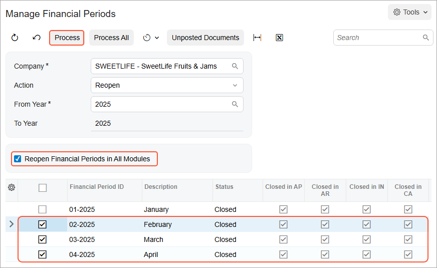

# Financial Periods: To Reopen a Period {#_03518bca-e4d1-42d8-924a-76901667332f .task}

In this activity, you will learn how to reopen a financial period for a particular company in the general ledger and other subledgers at the same time.

## Story {#section_p1k_mjv_vxb .section}

Suppose that acting as the chief accountant of the SweetLife Fruits &amp; Jams company, you need to reopen a previously closed financial period \(*02-2025*\), so that users can post transactions to it without having to type the period manually \(as they need to do when posting to closed periods\).

## Process Overview {#section_r1k_mjv_vxb .section}

In this activity, you will review period statuses on the [Company Financial Calendar](GL_20_11_00.md) \(GL201100\) form, and then you will reopen a particular financial period on the [Manage Financial Periods](GL_50_30_00.md) \(GL503000\) form.

## System Preparation {#section_t1k_mjv_vxb .section}

To prepare the system, do the following:

1.  Launch the Acumatica ERP website with the *U100* dataset. Sign in as an accountant by using the following credentials:
    -   Username: *johnson*
    -   Password: *123*
2.  On the Company and Branch Selection menu, also on the top pane of the Acumatica ERP screen, make sure that the *SweetLife Head Office and Wholesale Center* branch is selected. If it is not selected, click the Company and Branch Selection menu button to view the list of branches that you have access to, and then click *SweetLife Head Office and Wholesale Center*.
3.  Make sure that the *02-2025* period has been closed as described in [Closing Financial Periods: To Close a Period in Subledgers and GL](Finance_ClosingPeriods_Process_Activity_2.md).

## Step: Reopening the Financial Period {#section_v1k_mjv_vxb .section}

To reopen the *02-2025* financial period, do the following:

1.  Open the [Company Financial Calendar](GL_20_11_00.md) \(GL201100\) form.
2.  In the Selection area, specify the following settings:

    -   **Company**: *SWEETLIFE* \(inserted by default\)
    -   **Financial Year**: *2025*
    Notice that several periods in the table have the *Closed* status and the **Closed in AP**, **Closed in AR**, **Closed in IN**, and **Closed in CA** check boxes are selected.

3.  On the More menu, click **Reopen Periods**.
4.  On the [Manage Financial Periods](GL_50_30_00.md) \(GL503000\) form, which opens, notice that the system has selected the *Reopen* action in the Summary area.
5.  In the table, select the unlabeled check box for the *02-2025* period. The *03-2025* period and later periods are selected automatically.
6.  To reopen the selected periods in all subledgers, select the **Reopen Financial Periods in All Modules** check box in the Selection area.
7.  On the form toolbar, click **Process**, as shown in the following screenshot.

    

8.  In the **Processing** pop-up window, which is opened, click **Close**.

**Tip:** You can reopen a financial period in a particular subledger by performing similar instructions on the [Close Financial Periods](AP_50_60_00.md) \(AP506000\), [Close Financial Periods](AR_50_90_00.md) \(AR509000\), [Close Financial Periods](CA_50_60_00.md) \(CA506000\), [Close Financial Periods](FA_50_90_00.md) \(FA509000\), and [Close Financial Periods](IN_50_90_00.md) \(IN509000\) forms.

**Parent topic:**[Managing Financial Periods](../UserGuide/Finance_ManagingPeriods_Mapref.md)

