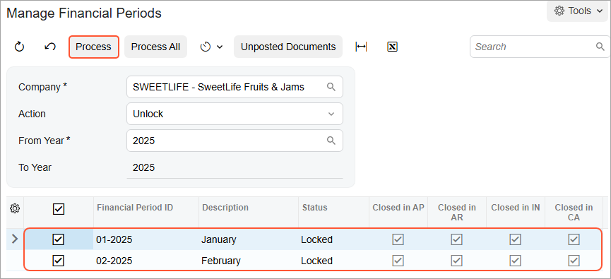

# Financial Periods: To Unlock a Period {#_f1b04bec-0f6a-4e0a-b010-ae9fc3cbc4f9 .task}

In this activity, you will learn how to unlock financial periods and post a GL batch to a closed financial period.

## Story {#section_izj_mjv_vxb .section}

Suppose that at the end of January 2025, the *01-2025* financial period was locked for the SweetLife Fruits &amp; Jams company. Acting as SweetLife's chief accountant, you have realized that it should not have been locked yet, because a transaction hasn't been entered in the system \(a purchase of office supplies on January 31, 2025, in the amount of $300\).

You need to unlock the *01-2025* period and post this transaction to it.

## Process Overview {#section_lzj_mjv_vxb .section}

In this activity, you will review period statuses on the [Company Financial Calendar](GL_20_11_00.md) \(GL201100\) form, and unlock a particular financial period on the [Manage Financial Periods](GL_50_30_00.md) \(GL503000\) form. You will then create and post a GL batch for this period on the [Journal Transactions](GL_30_10_00.md) \(GL301000\) form.

## System Preparation {#section_nzj_mjv_vxb .section}

To prepare the system, do the following:

1.  Launch the Acumatica ERP website with the *U100* dataset. Sign in as an accountant by using the following credentials:
    -   Username: *johnson*
    -   Password: *123*
2.  In the info area, in the upper-right corner of the top pane of the Acumatica ERP screen, click the Business Date menu button and select *1/31/2025*. For simplicity, in this process activity, you will create and process all documents in the system on this business date.
3.  On the Company and Branch Selection menu, also on the top pane of the Acumatica ERP screen, make sure that the *SweetLife Head Office and Wholesale Center* branch is selected. If it is not selected, click the Company and Branch Selection menu button to view the list of branches that you have access to, and then click *SweetLife Head Office and Wholesale Center*.
4.  Mare sure that the *01-2025* period has been locked as described in [Financial Periods: To Lock a Period](Finance_ManagingPeriods_LockingPeriod_Activity.md).

## Step 1: Unlocking the Financial Period {#section_pzj_mjv_vxb .section}

To unlock the *01-2025* financial period, do the following:

1.  Open the [Company Financial Calendar](GL_20_11_00.md) \(GL201100\) form.
2.  In the Selection area, specify the following settings:

    -   **Company**: *SWEETLIFE* \(inserted by default\)
    -   **Financial Year**: *2025*
    Notice that several periods have the *Locked* status.

3.  On the More menu, click **Unlock Periods**.
4.  On the [Manage Financial Periods](GL_50_30_00.md) \(GL503000\) form, which opens, notice that the system has selected the *Unlock* action in the Summary area. In the table, select the unlabeled check box for the *01-2025* period. The following *02-2025* period is selected automatically.
5.  On the form toolbar, click **Process**, as shown in the following screenshot.

    

6.  In the **Processing** pop-up window, which is opened, click **Close**.

    The status of the periods has changed from *Locked* to *Closed*.

## Step 2: Posting a GL Batch to the Closed Period {#section_tzj_mjv_vxb .section}

To create a GL batch and post it to the closed *01-2025* period, which you unlocked in the previous step, do the following:

1.  Open the [Journal Transactions](GL_30_10_00.md) \(GL301000\) form.

    **Tip:** To open the form for creating a new record, type the form ID in the Search box, and on the Search form, point at the form title and click **New** right of the title.

2.  On the form toolbar, click **Add New Record**, and specify the following settings in the Summary area:
    -   **Module**: *GL* \(inserted by default\)
    -   **Branch**: *HEADOFFICE* \(inserted by default\)
    -   **Ledger**: *ACTUAL* \(inserted by default\)
    -   **Transaction Date**: *01/31/2025*
    -   **Post Period**: *01-2025*
    -   **Description**: `Office supplies`
3.  On the table toolbar, click **Add Row**, and specify the following settings for the added row:
    -   **Branch**: *HEADOFFICE* \(inserted by default\)
    -   **Account**: *62400*
    -   **Debit Amount**: `300`
4.  Click **Add Row**, and specify the following settings for the added row:
    -   **Branch**: *HEADOFFICE* \(inserted by default\)
    -   **Account**: *10200*
    -   **Credit Amount**: `300`
5.  On the form toolbar, click **Remove Hold**.
6.  Notice the warning message that is displayed next to the **Post Period** box. It informs you that the *01-2025* period is closed in the *SWEETLIFE* company \(but you still can post to this closed period\). Click **Save** to save your changes.
7.  On the form toolbar, click **Release** to release the transaction.

**Parent topic:**[Managing Financial Periods](../UserGuide/Finance_ManagingPeriods_Mapref.md)

