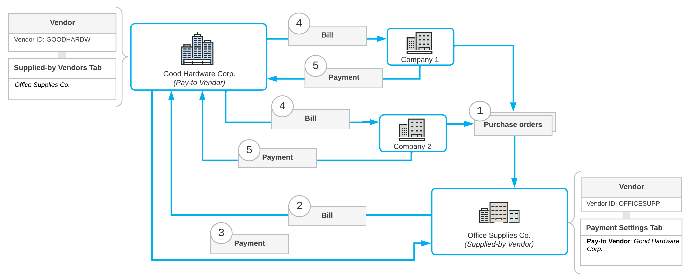

# Vendor Relations: General Information {#_59fb000e-e055-4516-819c-3c1601f579d3 .concept}

In Acumatica ERP, you can track the vendor that receives payment and the vendor that supplies the needed items if these vendors are different. You can specify these vendor relations on the [Vendors](AP_30_30_00.md) \(AP303000\) form so that the system will handle the relations in documents \(such as purchase orders, purchase receipts, and AP bills and debit adjustments\).

**Attention:** This functionality is available in the system if the *Vendor Relations* feature is enabled on the [Enable/Disable Features](CS_10_00_00.md) \(CS100000\) form. If your business uses purchase orders, the *Inventory and Order Management* group of features must be enabled.

## Learning Objectives { .section}

In this chapter, you will learn how to do the following:

-   Set up the vendor relations functionality
-   Process a purchase from one vendor and the payment for this purchase to a different vendor

## Applicable Scenarios { .section}

You set up vendor relations in the system if the vendor that receives payments and the vendor that supplies goods or services are different and you need the system to automatically handle these relations in AP documents.

## Setup of Vendor Relations { .section}

In Acumatica ERP, you can define the appropriate vendor settings to set up vendor relations. With this configuration, once you use a particular vendor in a purchase order or purchase receipt \(the supplied-by vendor\), the system will insert the appropriate vendor account in the AP document based on that purchase order \(the pay-to vendor\).

To establish vendor relations, a particular vendor account can be defined as the following on the [Vendors](AP_30_30_00.md) \(AP303000\) form:

-   The *supplied-by vendor*: A vendor that the system indicates in documents and reports as a supplier of goods or services that are paid for.
-   The *pay-to vendor*: A vendor that the system uses by default in documents \(such as AP bills\) as the recipient of payments when one of this vendor's supplied-by vendors provides billed goods or services.

## Setup of a Pay-to Vendor {#section_t1h_njv_vxb .section}

For each vendor that supplies \(but does not directly receive payment for\) goods or services and that should be involved in the vendor relations, you specify this vendor's pay-to vendor on the **Payment** tab of the [Vendors](AP_30_30_00.md) \(AP303000\) form. In the **Pay-to Vendor** box, you select the vendor to which the payment should be made for the goods or services supplied by the vendor currently selected on the form.

With this setting specified, when an accounts payable bill or debit adjustment is created based on a purchase order or purchase receipt, the system populates the **Vendor** box of the [Bills and Adjustments](AP_30_10_00.md) \(AP301000\) form with this vendor by default.

**Attention:** A pay-to vendor can be overridden directly in a particular document \(such as purchase order, purchase receipt, AP bill, or debit adjustment\).

## Pay-to Vendor Restrictions {#section_v1h_njv_vxb .section}

When you attempt to select a vendor account in the **Pay-to Vendor** box of the [Vendors](AP_30_30_00.md) form, the following vendor accounts are not available in this list:

-   The vendor account currently selected on the form.
-   Vendor accounts for which a pay-to vendor has already been defined \(that is, a vendor that is already defined as a supplied-by vendor\). A vendor cannot be both a paid-to vendor and a supplied-by vendor.
-   Vendor accounts with the statuses of *On Hold* and *Inactive*.
-   Tax agencies, labor unions, and 1099 vendors. That is, a vendor is not listed if any of the following check boxes is selected in the vendor's settings on the **General** tab of the [Vendors](AP_30_30_00.md) form: **Vendor Is Tax Agency**, **Vendor Is Labor Union**, and **1099 Vendor**.

## Supplied-By Vendors List {#section_x1h_njv_vxb .section}

On the [Vendors](AP_30_30_00.md) form, if you open an account of a pay-to vendor, the **Supplied-By Vendors** tab appears on the form. On this tab, you can see the list of vendors for which the selected vendor has been specified as a pay-to vendor. Note that this list cannot be edited.

The system automatically adds a vendor to the list on the **Supplied-By Vendors** tab for the pay-to vendor once you specify a pay-to vendor in the settings of supplied-by vendor.

## Example of Vendor Relations {#section_lzg_njv_vxb .section}

Suppose that two small companies \(Company 1 and Company 2\) want to order office supplies from a big vendor \(Office Supplies Co.\). If they collectively order supplies, they can get a discount for a large number of items in this joint purchase. The companies organize into an alliance to place their orders with the vendor, with a bigger company \(Good Hardware Corp.\) making payments to this vendor. The flow of documents between these vendors consists of the following general steps, whose numbers correspond to the numbers in the screenshot below:

1.  The companies send their purchase orders to Office Supplies Co. \(see Item 1 in the diagram below\).
2.  The supplied-by vendor \(Office Supplies Co.\) issues a bill to Good Hardware Corp. \(Item 2\).
3.  The pay-to vendor \(Good Hardware Corp.\) pays that bill \(Item 3\).
4.  Good Hardware Corp. issues bills for Company 1 and Company 2 \(Item 4\).
5.  Company 1 and Company 2 each pay the bill for the supplied goods to Good Hardware Corp.\(which is specified in Acumatica ERP as the vendor in the bill\), even though those companies have ordered the goods from another vendor.

The following diagram illustrates the flow of documents between the companies and the vendors in this vendor relations workflow.

**Parent topic:**[Managing Vendor Relations](../UserGuide/Finance_Managing_Vendor_Relations_Mapref.md)

