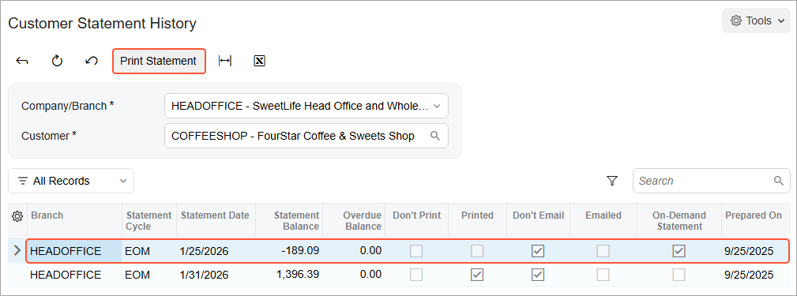

# On-Demand Statements: Process Activity {#_64b78dc9-bb2d-4fd2-86bb-57f4be701af8 .task}

The following activity will walk you through the process of preparing an on-demand customer statement.

## Story {#section_atd_hjv_vxb .section}

Suppose that one of the customers of the SweetLife Fruits &amp; Jams company, FourStar Coffee &amp; Sweets Shop \(*COFFEESHOP*\) has called the accounting department and asked for a statement dated 1/25/2026, to reconcile it with their records. Because a regular statement for this customer was generated on 1/31/2026, the new statement must be an on-demand one.

Acting as a SweetLife accountant, you have to generate an on-demand statement as of 1/25/2026 for the *COFFEESHOP* customer.

## Configuration Overview {#section_dtd_hjv_vxb .section}

For the purposes of this activity, the following features have been enabled on the [Enable/Disable Features](CS_10_00_00.md) \(CS100000\) form:

-   *Standard Financials*, which provides the standard financial functionality
-   *Multibranch Support*, which supports multiple branches in your instance of Acumatica ERP
-   *Multicompany Support*, which supports multiple companies within one tenant.

On the [Statement Cycles](AR_20_28_00.md) \(AR202800\) form, the *EOM* \(End of Month\) statement cycle has been defined and specified for the customers assigned to the *DEFAULT* customer class \(local customers\).

On the [Customers](AR_30_30_00.md) \(AR303000\) form, the *COFFEESHOP \(FourStar Coffee &amp; Sweets Shop\)* customer has been defined. For this customer, the **Print Statements** check box has been selected in the **Print and Email Settings** section on the **Billing** tab.

On the [Accounts Receivable Preferences](AR_10_10_00.md) \(AR101000\) form, in the **Consolidation Settings** section, *For Each Branch* has been selected in the **Prepare Statements** box.

## Process Overview {#section_itd_hjv_vxb .section}

You will generate an on-demand statement on the [Customers](AR_30_30_00.md) \(AR303000\) form and then review and print it on the [Customer Statement History](AR_40_46_00.md) \(AR404600\) form.

## System Preparation {#section_ktd_hjv_vxb .section}

To prepare the system, do the following:

1.  Launch the Acumatica ERP website with the *U100* dataset. Sign in as an accountant by using the following credentials:
    -   Username: *johnson*
    -   Password: *123*
2.  In the info area, in the upper-right corner of the top pane of the Acumatica ERP screen, make sure that the business date in your system is set to *1/31/2026*. If a different date is displayed, click the Business Date menu button and select *1/31/2026*. For simplicity, in this activity, you will create and process all documents in the system on this business date.
3.  On the Company and Branch Selection menu, also on the top pane of the Acumatica ERP screen, make sure that the *SweetLife Head Office and Wholesale Center* branch is selected. If it is not selected, click the Company and Branch Selection menu to view the list of branches that you have access to, and then click *SweetLife Head Office and Wholesale Center*.
4.  As a prerequisite activity, make sure that a statement has been prepared for the *COFFEESHOP* customer in the needed financial period, as described in [Customer Statements: Process Activity](Finance_Preparing_Customer_Statements_Activity.md).

## Step: Preparing and Printing a Statement {#section_mtd_hjv_vxb .section}

To prepare and print an on-demand statement for a particular customer, do the following:

1.  Open the [Customers](AR_30_30_00.md) \(AR303000\) form.
2.  In the **Customer ID** box, select *COFFEESHOP*.
3.  On the More menu \(under **Statements**\), click **Generate on Demand**.
4.  In the **Generate On-Demand Statement** dialog box, which is opened, enter *01/25/2026* in the **Statement Date** box, and then click **OK**.
5.  On the More menu \(under **Statements**\), click **Statement History** to review the history of statements generated for this customer.
6.  On the [Customer Statement History](AR_40_46_00.md) \(AR404600\) form, which opens, review the statements in the table.

    Notice that the statement dated 1/25/2026 has the **On-Demand Statement** check box selected.

7.  Select the statement dated 1/25/2026 and, on the form toolbar, click **Print Statement** to print the statement, as shown in the following screenshot.

    

**Parent topic:**[Preparing an On-Demand Statement](../UserGuide/Finance_On-Demand_Customer_Statements_Mapref.md)

