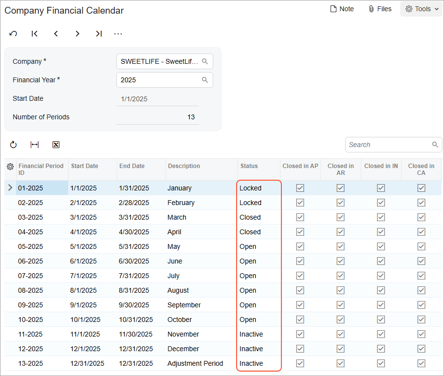
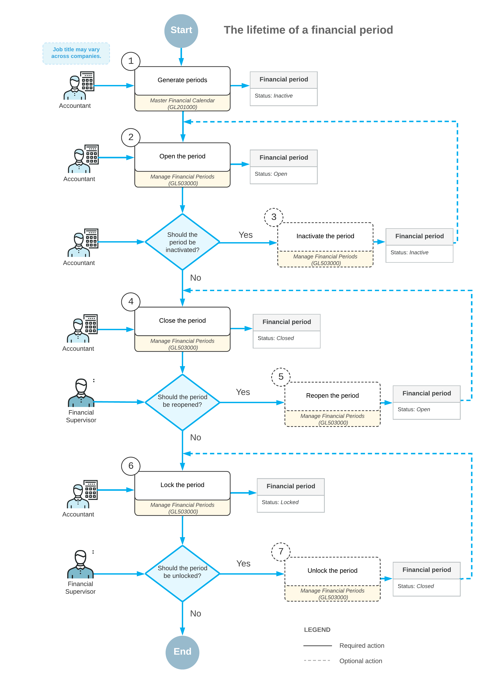

# Opening Financial Periods: General Information {#_73db4512-8c28-4a8f-b653-113a55a0ac7e .concept}

You have to open the financial periods to which users will post transactions and documents. If you need to review the statuses of periods before opening periods, you open the [Master Financial Calendar](GL_20_10_00.md) \(GL201000\) form if the *Centralized Period Management* feature is enabled on the [Enable/Disable Features](CS_10_00_00.md) \(CS100000\) form, or the [Company Financial Calendar](GL_20_11_00.md) \(GL201100\) form if this feature is disabled. On either form, you click **Open Periods** on the More menu to navigate to the [Manage Financial Periods](GL_50_30_00.md) \(GL503000\) form. You can also navigate to this form directly if you do not need to review the statuses of periods.

**Tip:** If the *Centralized Period Management* feature is disabled, you have to open financial periods separately in each company on the [Manage Financial Periods](GL_50_30_00.md) form.

After you have opened periods, they can be used in the general ledger module and subledgers of Acumatica ERP. At any time, you can have multiple open periods; opening one period does not require you to close the previous one.

## Statuses of Financial Periods { .section}

Every financial period belongs to a range of periods that have a particular status—*Inactive*, *Open*, *Closed*, or *Locked*. The system can contain four period ranges, each with a different status.

The example shown in the following screenshot illustrates multiple period ranges in the system, with the periods in each range having a particular status that is valid in the system. You can see the following ranges of periods:

-   *01-2025* to *02-2025*, whose periods have the *Locked* status
-   *03-2025* to *04-2025*, whose periods have the *Closed* status
-   *05-2025* to *10-2025*, whose periods have the *Open* status
-   *11-2025* to *13-2025*, whose periods have the *Inactive* status

The following table lists the possible statuses of financial periods, describes each status, and presents the action or actions that you can perform to change the statuses of periods of each listed status. You can perform actions on periods on the [Manage Financial Periods](../Shared/../UserGuide/GL_50_30_00.md) \(GL503000\) form by clicking buttons on the form toolbar or the equivalent commands on the More menu.

|Status|Description of a Period with This Status|Actions That Can Be Performed|
|------|----------------------------------------|-----------------------------|
|*Inactive*|An inactive period has been generated in the system but has not yet been opened. Transactions cannot be posted to the period.|Open the period by clicking **Open**|
|*Open*|An open period can be selected in records, and transactions can be posted to it.|Close the period by clicking **Close** or deactivate it by clicking **Deactivate**|
|*Closed*|A closed period cannot be selected in records, and users can be restricted from posting to it.

 If the **Restrict Access to Closed Periods** check box is selected on the [General Ledger Preferences](../Shared/../UserGuide/GL_10_20_00.md) \(GL102000\) form, transactions can be posted to a closed period by only users to whom the *Financial Supervisor* role has been assigned. If this check box is cleared, any user can post to closed periods.

|Lock the period by clicking **Lock** or reopen it by clicking **Reopen**|
|*Locked*|A locked period cannot be selected in a record, and transactions cannot be posted to it in any subledger.

 You lock a period to prevent changes to period-specific data that has been verified and disclosed in reports.

|Unlock the period by clicking **Unlock**|

The following diagram illustrates the statuses in the lifetime of financial periods in the system, along with the actions that change the statuses of these periods.

The lifetime of a financial period in the system includes the following actions:

1.  A financial administrator generates the financial period with the *Inactive* status.
2.  To give users the ability to create a record in this period or post a transaction to the period under one of the company branches, the financial administrator must open the needed period in the company. This gives the period the *Open* status, and it can be used in all subledgers.
3.  Optional: The financial administrator inactivates an open period in the system to prevent users from posting transactions to this period. The inactivated period and the preceding periods will be assigned the *Inactive* status again.
4.  When all the needed records have been processed in the period, the financial administrator closes the period to prevent erroneous posting. For a period to be closed in a subledger, it must not contain any unreleased documents \(except for rejected and scheduled documents\), and the previous period has to be closed in this subledger. For a period to be closed in the general ledger, it must not contain any unposted transactions \(except for scheduled ones\), it has to be closed in all other subledgers, and the previous period has to be closed in the general ledger. When the financial administrator closes the period, the period and the preceding periods in the range \(that is, with the same status\) will be assigned the *Closed* status.
5.  Optional: A user to which the *Financial Supervisor* role is assigned reopens a closed period for posting. The reopening process sets the period's status to *Open* for the selected period or range of periods; optionally, the periods can be reopened in all subledgers.
6.  To keep the data unchanged by all the users and the validation processes, the financial administrator locks a closed period. The period can be locked only if the previous period is locked as well. This process assigns the *Locked* status to the range of periods to which the selected period belongs.
7.  Optional: If necessary, a user to which the *Financial Supervisor* role is assigned unlocks the period to assign the *Closed* status to it again so that the needed transactions can be posted to it.

**Parent topic:**[Opening Financial Periods](../UserGuide/Finance_OpeningPeriods_Mapref.md)

