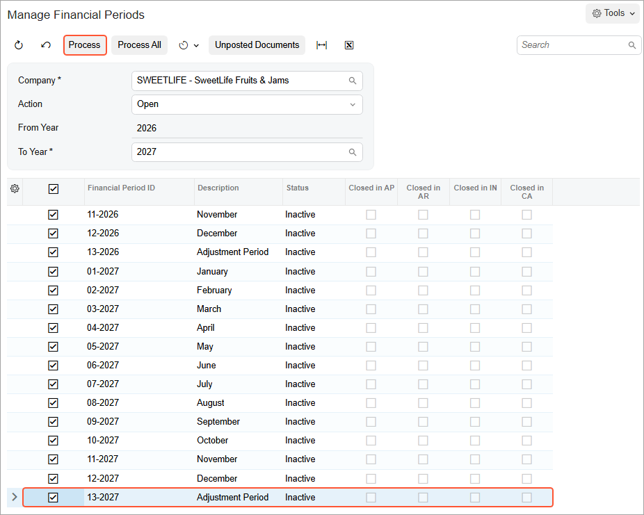

# Opening Financial Periods: Process Activity {#_b5336beb-de46-4de4-8e58-d9a3961d4ac8 .task}

In this activity, you will learn how to open a period in the subledgers and in the general ledger.

## Story {#section_hkj_mjv_vxb .section}

Suppose that at the end of November 2027, acting as an accountant of the SweetLife Fruits &amp; Jams company, you need to open the next financial period—*12-2027*—to enable users to post transactions to it.

## Process Overview {#section_jkj_mjv_vxb .section}

In this activity, you will review the statuses of periods on the [Company Financial Calendar](GL_20_11_00.md) \(GL201100\) form, and open a new financial period on the [Manage Financial Periods](GL_50_30_00.md) \(GL503000\) form.

**Tip:** In a production environment, before opening a period, you would make sure the following conditions are met:

-   The *2027* financial year for which you want to open the financial period has been created.
-   Financial periods \(that have the *Inactive* status\) have been generated for the *2027* year.

## System Preparation {#section_mkj_mjv_vxb .section}

To prepare the system, do the following:

1.  Launch the Acumatica ERP website with the *U100* dataset. Sign in as an accountant by using the following credentials:
    -   Username: *johnson*
    -   Password: *123*
2.  On the Company and Branch Selection menu, also on the top pane of the Acumatica ERP screen, make sure that the *SweetLife Head Office and Wholesale Center* branch is selected. If it is not selected, click the Company and Branch Selection menu button to view the list of branches that you have access to, and then click *SweetLife Head Office and Wholesale Center*.
3.  Make sure that the 2027 financial year has been created as described in [Financial Calendar Generation: Process Activity](Finance_Fin_Clanedar_for_New_FinYear_Activity.md).

## Step 1: Preparing to Open the Financial Period {#section_okj_mjv_vxb .section}

To prepare for opening the financial period, do the following:

1.  Open the [Company Financial Calendar](GL_20_11_00.md) \(GL201100\) form.
2.  In the Selection area, specify the following settings:

    -   **Company**: *SWEETLIFE* \(inserted by default\)
    -   **Financial Year**: *2027*
    In the table, notice that all of the periods have the *Inactive* status. These periods can be opened in the system.

## Step 2: Opening the Financial Period {#section_rkj_mjv_vxb .section}

To open the financial period, do the following:

1.  On the More menu of the [Company Financial Calendar](GL_20_11_00.md) \(GL201100\) form, click **Open Periods**.
2.  On the [Manage Financial Periods](GL_50_30_00.md) \(GL503000\) form, which opens, notice that the system has selected the *Open* action in the Summary area. In the table, select the unlabeled check box for the *13-2027* period, and on the form toolbar, click **Process**, as shown in the following screenshot.

    

3.  In the **Processing** pop-up window, which is opened, click **Close**.

**Parent topic:**[Opening Financial Periods](../UserGuide/Finance_OpeningPeriods_Mapref.md)

