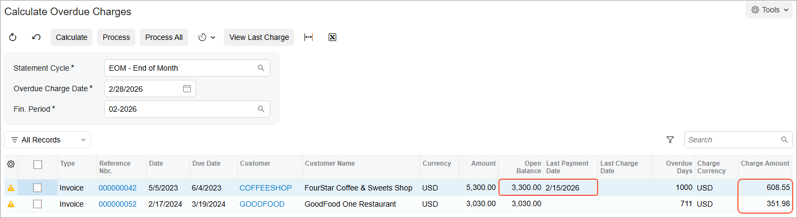

# Overdue Charges: Process Activity {#_c401af2c-defe-47b2-a7e6-b522d0d4d7b3 .task}

The following activity will walk you through the process of calculating overdue charges for overdue documents of particular customers.

## Story { .section}

Suppose that in February 2026, SweetLife Fruits &amp; Jams started to send overdue charge documents to some of its customers and want these documents to be shown in customer statements. Further suppose that on February 15, 2026, *COFFEESHOP* made a payment of $2,000 that should be applied to one of the customer's outstanding documents. On February 28, an accountant of SweetLife prepared customer statements for February 2026, which is the next statement date according to the *EOM* statement cycle.

Acting as the SweetLife accountant, you need to record the payment of $2,000 from *COFFEESHOP*, generate and release overdue charge documents for the *COFFEESHOP* and *GOODFOOD* customers, and generate customer statements for February 2026.

## Configuration Overview {#section_tz4_djx_cnb .section}

In the *U100* dataset, the following tasks have been performed to support this activity:

-   On the [Enable/Disable Features](CS_10_00_00.md) \(CS100000\) form, the *Overdue Charges* feature has been enabled.
-   On the [Customers](AR_30_30_00.md) \(AR303000\) form, the *COFFEESHOP* and *GOODFOOD* customers have been created.
-   On the [Invoices and Memos](AR_30_10_00.md) \(AR301000\) and [Payments and Applications](AR_30_20_00.md) \(AR302000\) forms, multiple documents \(invoices, credit memos, payments, and prepayments\) for the *COFFEESHOP* and *GOODFOOD* customers have been created. These documents should be overdue and have the *Open* status.

## Process Overview { .section}

In this activity, on the [Payments and Applications](AR_30_20_00.md) \(AR302000\) form, you will process a partial payment for one of the customers. On the [Calculate Overdue Charges](AR_50_70_00.md) \(AR507000\) form, you will calculate and generate overdue charges for the two customers. On the [Invoices and Memos](AR_30_10_00.md) \(AR301000\) form, you will release the *Overdue Charge* documents. On the [Customer Details](AR_40_20_00.md) \(AR402000\) form, you will review the updated customer balances. Finally, on the [Prepare Statements](AR_50_30_00.md) \(AR503000\) form, you will prepare statements for the customers, print the statements, and review them.

## System Preparation { .section}

Before you begin calculating overdue charges and generating customer statements, do the following:

1.  Launch the Acumatica ERP website with the *U100* dataset preloaded, and sign in as Anna Johnson by using the *johnson* username and the *123* password.
2.  In the info area, in the upper-right corner of the top pane of the Acumatica ERP screen, make sure that the business date in your system is set to *2/28/2026*. If a different date is displayed, click the Business Date menu button, and select *2/28/2026* on the calendar.
3.  As a prerequisite activity, in the company to which you are signed in, be sure you have configured the overdue charge functionality, as described in [Overdue Charges: Implementation Activity](Finance_Overdue_Charges_Implem_Activity.md).
4.  On the Company and Branch Selection menu on the top pane of the Acumatica ERP screen, select the *SweetLife Head Office and Wholesale Center* branch.

## Step 1: Processing a Partial Payment { .section}

To process a partial payment of $2,000 from the *COFFEESHOP* customer, do the following:

1.  On the [Payments and Applications](AR_30_20_00.md) \(AR302000\) form, create a new record.
2.  In the Summary area, specify the following settings for the new record:
    -   **Type**: *Payment*
    -   **Customer**: *COFFEESHOP*
    -   **Payment Method**: *CHECK*
    -   **Cash Account**: *10200WH \(Wholesale Checking\)*
    -   **Application Date**: *2/15/2026*
    -   **Application Period**: *02-2026*
    -   **Description**: `Partial payment for training`
    -   **Payment Amount**: `2000`
3.  In the table, select the unlabeled check box for the invoice with the *000000042* reference number and the $5,300 amount.
4.  In the **Amount Paid \(USD\)** column for this row, enter `2000`.
5.  On the form toolbar, click **Save** to save the payment.
6.  On the form toolbar, click **Remove Hold** and then click **Release** to release the payment and its application.

## Step 2: Calculating Overdue Charges { .section}

To calculate overdue charges, do the following:

1.  Open the [Calculate Overdue Charges](AR_50_70_00.md) \(AR507000\) form and in the Selection area, specify the following settings:
    -   **Statement Cycle**: *EOM*
    -   **Overdue Charge Date**: *2/28/2026* \(inserted automatically based on the business date\)
    -   **Fin. Period**: *02-2026*
2.  On the form toolbar, click **Calculate** to run the calculation process.

    When you run the calculation process, the system searches for overdue invoices and debit memos among the documents of the customers of the selected statement cycle. For each found document, the system calculates the amount of overdue charges on the specified date by using the calculation method that is specified in the overdue charge code that is assigned to the selected statement cycle.

3.  Review the two invoices that appear in the table, as shown in the following screenshot. On 2/28/2026, there are two overdue documents, which are the invoices to *COFFEESHOP* and *GOODFOOD*. The **Last Payment Date** column for the *COFFEESHOP* invoice shows the date of the most recent payment applied to the invoice, which is 2/15/2026.

    

4.  On the form toolbar, click **Process All** to create *Overdue Charge* documents.

    **Tip:** If the system finds an unreleased overdue charge document for an invoice during overdue charge processing, the invoice is marked with an error and no new overdue charge document is created. You can select this invoice and click **View Last Charge** on the form toolbar to view and release the existing overdue charge document. Then you can calculate and process overdue charges for this invoice again.

## Step 3: Releasing the Overdue Charges { .section}

To release the overdue charge documents, do the following:

1.  Open the [Invoices and Memos](AR_30_10_00.md) \(AR301000\) form.
2.  In the **Type** box, select *Overdue Charge*.
3.  In the **Reference Nbr.** box, select the document for the *GOODFOOD* customer to open it.

    The system has inserted the calculated overdue charge amount into the document; you can change the amount if needed. In the **Transaction Descr.** column on the **Details** tab, the type and reference number of the overdue document are displayed, which is the *GOODFOOD* invoice from which the overdue charge document has been generated. The *30D* credit terms and the *41000 \(Overdue Charge Income\)* account have been inserted into the document from the *OVERDUE10* overdue charge code, which is specified for the *EOM* statement cycle and used for the calculation of overdue charges.

    The system has saved the created overdue charge document with the *On Hold* status, because the **Hold Documents on Entry** check box is selected on the [Accounts Receivable Preferences](AR_10_10_00.md) \(AR101000\) form.

    **Attention:** Regardless of the **Hold Documents on Entry** setting, overdue charges are saved with the *On Hold* status if the **Hold Document on Failed Credit Check** check box is selected on the [Accounts Receivable Preferences](AR_10_10_00.md) form.

4.  On the form toolbar, click **Remove Hold**, and then click **Remove Credit Hold** to give the document the *Balanced* status.
5.  Click **Release** to release the document.
6.  In the **Reference Nbr.** box, select the document for the *COFFEESHOP* customer.
7.  On the form toolbar, click **Remove Hold**, and then click **Remove Credit Hold** to give the document the *Balanced* status.
8.  Click **Release** to release the document.
9.  Go to the **Financial** tab and click the link in the **Batch Nbr.** box to open the generated GL transaction on the [Journal Transactions](GL_30_10_00.md) \(GL301000\) form.

    On release of the overdue charge document, the system has updated the current balance of the customer and generated a batch to debit the AR account specified in the document and credit the specified income account. Because the *NYSTATE* tax zone is specified for the *COFFEESHOP* customer, an entry for the Tax Payable account has been added to the GL transaction. This entry has 0.00 debit and credit amounts because the *EXEMPT* tax category has been specified for the *OVERDUE10* charge code.

## Step 4: Reviewing Customer Balances { .section}

To review the updated balances of the customers, do the following:

1.  Open the [Customer Details](AR_40_20_00.md) \(AR402000\) form.
2.  In the **Customer** box, select *COFFEESHOP*.
3.  Clear the **Show All Documents** check box.

    The customer's current balance has increased by the amount of the overdue charge. The *Overdue Charge* document is displayed in the list of open documents of the customer and should be paid in the same way as an invoice or debit memo is paid.

4.  In the **Customer** box, select *GOODFOOD* and review the list of the customer's documents.

    The *Overdue Charge* document in the amount of $351.98 is displayed in the list of open documents of the customer.

## Step 5: Preparing and Reviewing Customer Statements { .section}

To prepare and review customer statements for 2/28/2026, do the following:

1.  Open the [Prepare Statements](AR_50_30_00.md) \(AR503000\) form.
2.  In the **Prepare For** box, select *2/28/2026*.

    The **Next Statement Date** column in the table shows on which date the statements will be generated.

3.  Select the unlabeled check box for the *EOM* statement cycle row in the table, and on the form toolbar, click **Process** to generate customer statements.
4.  Open the [Customer Statement History](AR_40_46_00.md) \(AR404600\) form.
5.  In the **Customer** box, select *COFFEESHOP*.

    The table displays a row with the statement dated 2/28/2026.

6.  On the form toolbar, click **Print Statement** to review the statement.

    The *Open Item* statement shows the $4.94 debit balance due on 2/28/2026 and a list of all the customer's documents.

7.  In the **Customer** box of the [Customer Statement History](AR_40_46_00.md) form, select *GOODFOOD*.

    The table displays a row with the statement dated 2/28/2026.

8.  On the form toolbar, click **Print Statement** to review the statement.

    The *Open Item* statement shows the $4,260.79 due on 2/28/2026 and a list of all the customer's documents. The amount of the overdue charge \($351.98\) is shown in the **Current** column because it is not overdue yet. Other amounts are displayed in the respective columns showing the number of day they are past due.

**Parent topic:**[Applying Overdue Charges](../UserGuide/CreditPolicy_Overdue_Charges_Mapref.md)

