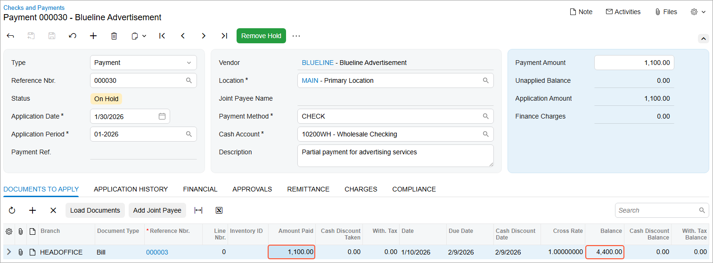

# Partial Payments: Process Activity {#_109dfe6c-6c90-4910-825c-fb2f5220d21d .task}

The following activity will walk you through the process of creating and releasing a partial payment of an AP bill.

**Attention:** This activity is based on the *U100* dataset. If you are using another dataset or if any system settings have been changed in *U100*, these changes can affect the workflow of the activity and the results of the processing. To avoid issues, restore the *U100* dataset to its initial state.

## Story {#section_kkk_njv_vxb .section}

Suppose that in January 2026, Blueline Advertisement provided advertising services to the SweetLife Fruits &amp; Jams company in the amount of $5,500 and an AP bill was entered in the system. On January 30, 2026 the company wants to partially pay this bill.

Acting as a SweetLife accountant, you need to register a partial payment of $1,100 for the advertising services.

## Configuration Overview {#section_nkk_njv_vxb .section}

For the purposes of this activity, the following features have been enabled on the [Enable/Disable Features](CS_10_00_00.md) \(CS100000\) form:

-   *Standard Financials*, which provides the standard financial functionality
-   *Multibranch Support*, which supports multiple branches in your instance of Acumatica ERP
-   *Multicompany Support*, which supports multiple companies within one tenant.

On the [Accounts Payable Preferences](AP_10_10_00.md) \(AP101000\) form, the **Hold Documents on Entry** check box has been selected in the **Data Entry Settings** section.

On the [Vendors](AP_30_30_00.md) \(AP303000\) form, the *BLUELINE \(Blueline Advertisement\)* vendor has been defined. This vendor has the *CHECK* payment method specified as the default one.

## Process Overview {#section_rkk_njv_vxb .section}

To register a partial payment in the system, you will manually create the partial payment on the [Checks and Payments](AP_30_20_00.md) \(AP302000\) form, apply the payment to a bill, and then release the payment and its application. On the [Journal Transactions](GL_30_10_00.md) \(GL301000\) form, you will review the generated GL transaction, and on the [Checks and Payments](AP_30_20_00.md) form, you review the application history of the payment.

## System Preparation {#section_tkk_njv_vxb .section}

To prepare the system, do the following:

1.  Launch the Acumatica ERP website, and sign in as an accountant by using the following credentials:
    -   Username: *johnson*
    -   Password: *123*
2.  In the info area, in the upper-right corner of the top pane of the Acumatica ERP screen, make sure that the business date in your system is set to *1/30/2026*. If a different date is displayed, click the Business Date menu button, and select *1/30/2026* from the calendar. For simplicity, in this activity, you will create and process all documents in the system during this business date.
3.  On the Company and Branch Selection menu, also on the top pane of the Acumatica ERP screen, make sure that the *SweetLife Head Office and Wholesale Center* branch is selected. If it is not selected, click the Company and Branch Selection menu to view the list of branches that you have access to, and then click *SweetLife Head Office and Wholesale Center*.

## Step 1: Creating a Partial Payment and Applying it to a Bill {#section_vkk_njv_vxb .section}

To create a partial payment and apply it to a bill, do the following:

1.  Open the [Checks and Payments](AP_30_20_00.md) \(AP302000\) form.

    **Tip:** To open the form for creating a new record, type the form ID in the Search box, and on the Search form, point at the form title and click **New** right of the title.

2.  On the form toolbar, click **Add New Record**, and in the Summary area, specify the following settings:
    -   **Type**: *Payment*
    -   **Vendor**: *BLUELINE*
    -   **Application Date**: *1/30/2026* \(inserted by default\)
    -   **Application Period**: *01-2026* \(inserted by default\)
    -   **Payment Amount**: `1100`
    -   **Description**: `Partial payment for advertising services`
3.  To select the bill to which the payment will be applied, on the **Documents to Apply** tab, click **Add Row**, and in the row, select the following settings:
    -   **Document Type**: *Bill*
    -   **Reference Number**: The bill with *Advertising services* in the description and the amount of $5,500
4.  On the form toolbar, click **Save** to save the payment. Notice that the balance of the bill applied to this payment is now $4,400, as shown in the following screenshot.

## Step 2: Releasing the Payment {#section_ykk_njv_vxb .section}

To print the and release the payment, do the following:

1.  While you are still on the [Checks and Payments](AP_30_20_00.md) \(AP302000\) form, on the form toolbar, click **Remove Hold**.

    Notice that the status of the payment has changed to *Pending Print*.

2.  On the form toolbar, click **Print/Process**.
3.  On the [Process Payments / Print Checks](AP_50_50_00.md) \(AP505000\) form, which is opened, notice that the system has added a row with the payment and selected the unlabeled check box for it. On the form toolbar, click **Process**.

    A separate browser tab is opened showing a printable version of the selected payment.

    **Tip:** In a production setting in which you are printing actual checks, you should validate the value in the **Next Check Number** box. This number should match the number on the blank check you are going to use for printing the checks.

4.  Review the printable version of the payment, and close the browser tab. \(For the purposes of this activity, you do not need to actually print the check. In a production setting, you would click **Print** on the form toolbar to print the check before closing the browser tab.\)
5.  On the [Release Payments](AP_50_52_00.md) \(AP505200\) form, which is opened, notice that the system has added a row with the payment and selected the unlabeled check box for it. On the form toolbar, click **Process**.
6.  In the **Processing** pop-up window, which is opened, click the **Processed** tab.
7.  Click the link in the **Reference Nbr.** column to open the released payment on the [Checks and Payments](AP_30_20_00.md) form.

## Step 3: Reviewing the Generated GL Transaction and Payment Application {#section_dlk_njv_vxb .section}

To review the GL transaction generated by the system and the application history of the payment, do the following:

1.  On the **Financial** tab of the [Checks and Payments](AP_30_20_00.md) \(AP302000\) form, which is opened, click the link in the **Batch Nbr.** box, and review the created GL batch on the [Journal Transactions](GL_30_10_00.md) \(GL301000\) form, which the system opens.
2.  On the **Application History** tab of the [Checks and Payments](AP_30_20_00.md) form, click the link in the **Reference Nbr.** column and review the bill balance on the [Bills and Adjustments](AP_30_10_00.md) \(AP301000\) form that opens.

    Notice that the bill retains the *Open* status because it has not been paid in full.

**Parent topic:**[Processing Partial Payments](../UserGuide/Finance_PartialPayments_Mapref.md)

