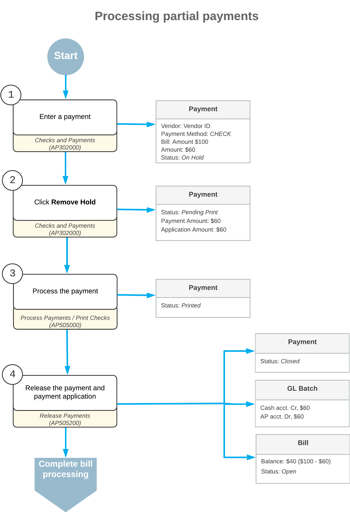

# Partial Payments: General Information {#_1f0dfa72-92aa-49ef-a2cf-bf4e1d912b04 .concept}

To partially pay an AP bill in Acumatica ERP, you have to create a payment: a document that represents the payment in the system. You can create the payment manually by using the [Checks and Payments](AP_30_20_00.md) \(AP302000\) form.

## Learning Objectives {#section_qfk_njv_vxb .section}

In this chapter, you will learn how to do the following:

-   Create a payment
-   Apply it to an AP bill to partially pay the bill
-   Release the payment and its application

## Applicable Scenarios {#section_tfk_njv_vxb .section}

You create partial payments of bills in the following cases:

-   You want to decrease your company's AP balance
-   You want to pay a bill with a large amount, but your company's checking account does not have sufficient funds

## Process Overview {#section_vfk_njv_vxb .section}

To partially pay a bill, you complete the following general steps.

1.  On the [Checks and Payments](AP_30_20_00.md) \(AP302000\) form, you manually create a payment document, and on the **Documents to Apply** tab, you select the needed bill.

    In the **Payment Amount** box in the Summary area of the form, you specify the amount you are going to pay, making sure that the **Payment Amount** and **Application Amount** boxes display the same amount.

2.  You click **Remove Hold** on the form toolbar for the payment, and then click **Print/Process** to print the payment.
3.  On the [Process Payments / Print Checks](AP_50_50_00.md) \(AP505000\) form, you print the payment and review the printed payment.
4.  On the [Release Payments](AP_50_52_00.md) \(AP505200\) form, you release the payment and its application to the AP bill.

## Workflow of Processing Partial Payments {#section_yfk_njv_vxb .section}

The following diagram describes how a partial payment of a bill is processed in Acumatica ERP.

**Parent topic:**[Processing Partial Payments](../UserGuide/Finance_PartialPayments_Mapref.md)

