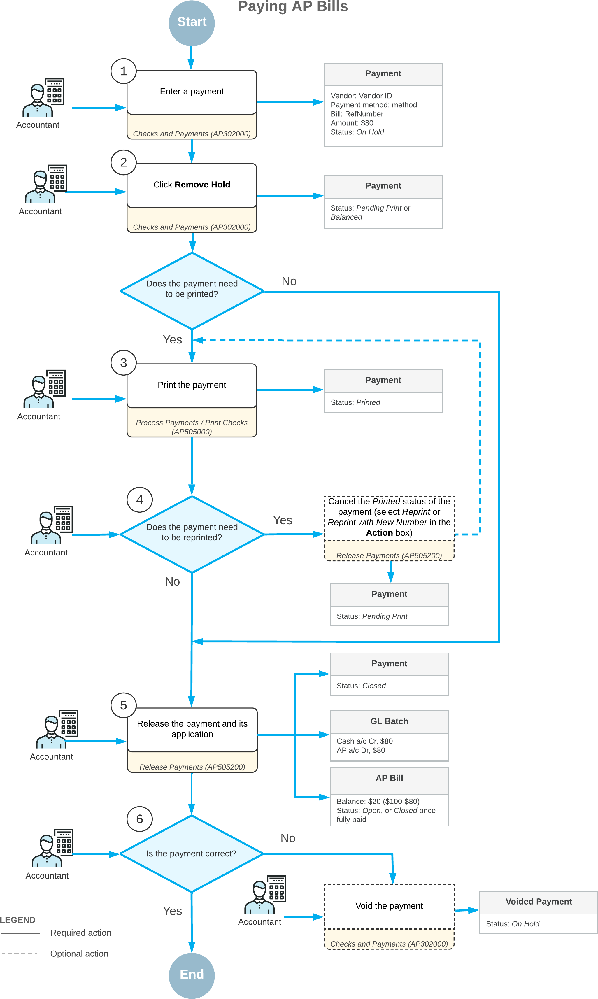

# AP Bill Payments: General Information {#_52e2c1ff-7d5e-4b81-b63b-ff6a2caac4b5 .concept}

To pay an AP bill in Acumatica ERP, you have to create a payment: a document that represents the payment in the system. You can create the payment manually by using the [Checks and Payments](AP_30_20_00.md) \(AP302000\) form.

In the payment, you specify the vendor, the payment method, the cash account, and the amount to be paid. For each bill, you can pay the full balance or a partial one. One of the payment methods you can specify on this form for a payment is a check—an internal payment document you create to pay vendors.

## Learning Objectives {#section_uv3_njv_vxb .section}

In this chapter, you will learn how to do the following:

-   Manually create a payment \(a printed check\)
-   Process the payment by printing the check and releasing the payment

## Applicable Scenarios {#section_xv3_njv_vxb .section}

You create a payment in the system in each of the following cases:

-   To pay an AP bill of a particular vendor
-   To generate a payment from one bill or multiple bills of the same vendor

## Use of Payment Methods Based on Checks {#section_zv3_njv_vxb .section}

AP payments for different vendors are paid by using different payment methods depending on how the vendor wants to be paid. Although usage of checks \(which allow a specified payee to order a payment of money from your company bank account\) has recently declined significantly, you can configure payment methods that require the printing of checks. If AP payments are created by using a payment method that requires check printing, the accounts payable checks may be taken off hold and released only after the checks for them have been printed.

You can configure the system to track check numbers for each payment method based on checks on the **Allowed Cash Accounts** tab of the [Payment Methods](CA_20_40_00.md) \(CA204000\) form by selecting the **AP - Suggest Next Number** check box and specifying in the **AP Last Reference Number** column the number of the first check in the check book minus 1. Then when a user wants to print a check for a particular AP payment by using the [Process Payments / Print Checks](AP_50_50_00.md) \(AP505000\) form, the system generates the check number based on how many checks had been generated for this payment method. If a check has been damaged during printing, the user can manually enter the next check number in the **Next Check Number** box and print another check for the same AP payment.

For details on printing checks, including MICR-encoded checks, see [To Print Checks](AP__how_Printing_Checks.md).

## AP Payment Statuses {#section_dw3_njv_vxb .section}

During processing, an AP payment can have the following statuses:

-   *On Hold*: The payment is being edited and cannot be released. The system assigns this status to each created payment by default if the **Hold Documents on Entry** check box is selected on the [Accounts Payable Preferences](AP_10_10_00.md) \(AP101000\) form by default.
-   *Pending Approval*: The payment needs to be approved before it is processed by the responsible person or persons. The system assigns this status to a payment to be approved once it is removed from hold. This status can be assigned to the payment only if the *Approval Workflow* feature is enabled on the [Enable/Disable Features](CS_10_00_00.md) \(CS100000\) form.
-   *Rejected*: The payment has been rejected by at least one assigned approver.
-   *Pending Print*: The payment must be printed or processed before it can be released.
-   *Printed*: The payment is ready and can be released. The system assigns this status to payments that have been processed \(if the payment method requires that payments undergo additional processing\).
-   *Balanced*: The payment is ready to be released. The system assigns this status to payments whose payment method does not require the payments to undergo additional processing. \(An approved payment is assigned this status if its payment method does not require the payment to undergo additional processing.\)
-   *Open*: The payment has been released and still has an unapplied balance \(meaning that the application amount is less than the payment amount\).
-   *Reserved*: The payment has been released and then put on hold to be excluded from the automatic application process.
-   *Closed*: The payment has been released and fully applied to the appropriate bill or bills.
-   *Voided*: The payment has been voided.

## Manual Creation of AP Payments {#section_fw3_njv_vxb .section}

You can create an AP payment by using the [Checks and Payments](AP_30_20_00.md) \(AP302000\) form. On this form, you specify the date, the vendor, and the vendor location, and you select a payment method available for this vendor. On the **Documents to Apply** tab, you can add bills and adjustments from this vendor to be paid by this payment. Alternatively, you can automatically load the open bills and adjustments of the vendor, including open debit adjustments, and select which of the documents will be paid by this payment.

The **Unapplied Balance** box in the Summary area displays the current unapplied balance as you add bills or adjustments to the **Documents to Apply** list for the payment. You can take the payment off hold only if it has an unapplied balance of zero \(that is, if the **Payment Amount** is equal to the **Application Amount**\). If the **Set Zero Payment Amount to Application Amount** check box is selected on the [Accounts Payable Preferences](AP_10_10_00.md) \(AP101000\) form, the system automatically specifies a **Payment Amount** that is equal to the **Application Amount** when a user saves a payment in which the payment amount has not been specified.

If you want to be able to create AP payments for bills posted to future periods and dates, you can select the **Enable Early Payments** check box on the [Accounts Payable Preferences](AP_10_10_00.md) form.

If the payments of the selected payment method will be processed by a bank, the bank may apply finance charges. On the **Charges** tab, you can add these charges and specify their particular amounts for the payment. For an overview of this functionality, see [Registration of Finance Charges](CA__CON_FinCharges.md).

## AP Check Statuses {#section_kw3_njv_vxb .section}

Each AP check has one of the following statuses to indicate its stage in processing:

-   *On Hold*: Generally, this status is used for a check that is a draft. This is the default status for new checks if the **Hold Documents on Entry** check box is selected on the [Accounts Payable Preferences](AP_10_10_00.md) \(AP101000\) form or if approvals have been configured for checks. You cannot apply a payment with the *On Hold* status to bills or adjustments.
-   *Pending Approval*: If approvals have been configured for checks, the check is assigned this status after you take it off hold; it needs to be approved by responsible approvers, which are assigned according to the approval map specified on the **Approval** tab of the [Accounts Payable Preferences](AP_10_10_00.md) form.
-   *Rejected*: If approvals have been configured for checks, this status indicates that the check has been rejected by at least one assigned approver. You can delete a document with this status or click **Hold** on the form toolbar, edit the document, and again submit it for approval.
-   *Pending Print*: If printing is required, the system assigns this status to an AP check after it has been taken off hold or approved \(if required\); the status indicates that the check has not been printed yet. You can print it on the [Process Payments / Print Checks](AP_50_50_00.md) \(AP505000\) form, which you open by clicking **Print/Process** \(under **Processing**\) on the More menu.
-   *Printed*: If printing is required, after the payment is taken off hold and a check has been printed, the system changes the status of the payment to *Printed*. A payment with this status can be released.
-   *Balanced*: If no additional processing is required \(approval or printing\), the system assigns this status to the payment when it is taken off hold. If approval is required and printing is not required, the system assigns this status to the payment when it is approved by the responsible approvers. A payment with this status can be released.
-   *Closed*: This status indicates that the payment has been released.
-   *Voided*: This status indicates that the payment has been voided.

## Printing of AP Checks {#section_mw3_njv_vxb .section}

You print physical checks for AP payments by using the [Process Payments / Print Checks](AP_50_50_00.md) \(AP505000\) form.

Check printing is required for payments if their payment methods have the **Print Checks** check box selected on the [Payment Methods](CA_20_40_00.md) \(CA204000\) form.

## Voiding of AP Payments {#section_pw3_njv_vxb .section}

You can void a payment on the [Checks and Payments](../Shared/../UserGuide/AP_30_20_00.md) \(AP302000\) form by clicking **Void** on the form toolbar. The system creates a new document of the *Voided Payment* type, which has a negative amount in the **Payment Amount** box to reverse the original transactions on all accounts involved. When this document is posted, all original entries to the general ledger are also reversed.

For more details on voiding payments, see [Voiding Payments: General Information](Finance_VoidingChecks_GeneralInfo.md).

## Process Diagram {#section_sw3_njv_vxb .section}

The following diagram illustrates the workflow of processing AP payments without approvals.

**Parent topic:**[Paying AP Bills](../UserGuide/Finance_PayingAPBills_Mapref.md)

