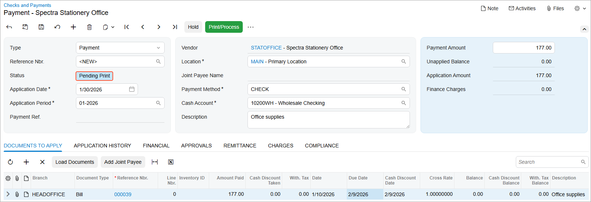

# AP Bill Payments: Process Activity {#_74572c90-a9a4-4ff5-89aa-5189e5d3c7fc .task}

The following activity will walk you through the process of creating a payment of an AP bill.

**Attention:** This activity is based on the *U100* dataset. If you are using another dataset or if any system settings have been changed in *U100*, these changes can affect the workflow of the activity and the results of the processing. To avoid issues, restore the *U100* dataset to its initial state.

## Story {#section_icj_njv_vxb .section}

Suppose that on 1/30/2026, the SweetLife Fruits &amp; Jams company has to pay an AP bill in the amount of $177 for the purchase of office supplies from Spectra Stationery Office. The company usually pays such bills by check and sends the check to the vendor.

Acting as a SweetLife accountant, you need to create a payment in the system, release it, and print the check to be sent to the vendor.

## Configuration Overview {#section_lcj_njv_vxb .section}

For the purposes of this activity, the following features have been enabled on the [Enable/Disable Features](CS_10_00_00.md) \(CS100000\) form:

-   *Standard Financials*, which provides the standard financial functionality
-   *Multibranch Support*, which supports multiple branches in your instance of Acumatica ERP
-   *Multicompany Support*, which supports multiple companies within one tenant.

On the [Accounts Payable Preferences](AP_10_10_00.md) \(AP101000\) form, the **Hold Documents on Entry** check box has been selected in the **Data Entry Settings** section.

On the [Vendors](AP_30_30_00.md) \(AP303000\) form, the *STATOFFICE \(Spectra Stationery Office\)* vendor has been configured. This vendor has the *CHECK* payment method specified as the default one.

## Process Overview {#section_pcj_njv_vxb .section}

In this activity, you will create a payment on the [Checks and Payments](AP_30_20_00.md) \(AP302000\) form. You will then print the payment on the [Process Payments / Print Checks](AP_50_50_00.md) \(AP505000\) form and release the payment on the [Release Payments](AP_50_52_00.md) \(AP505200\) form.

## System Preparation {#section_rcj_njv_vxb .section}

To prepare the system, do the following:

1.  Launch the Acumatica ERP website, and sign in to a company with the *U100* dataset preloaded. To sign in as an accountant, use the following credentials:
    -   Username: *johnson*
    -   Password: *123*
2.  In the info area, in the upper-right corner of the top pane of the Acumatica ERP screen, make sure that the business date in your system is set to *1/30/2026*. If a different date is displayed, click the Business Date menu button and select *1/30/2026*. For simplicity, in this process activity, you will create and process all documents in the system on this business date.
3.  On the Company and Branch Selection menu, also on the top pane of the Acumatica ERP screen, make sure that the *SweetLife Head Office and Wholesale Center* branch is selected. If it is not selected, click the Company and Branch Selection menu to view the list of branches that you have access to, and then click *SweetLife Head Office and Wholesale Center*.

## Step 1: Creating a Payment {#section_tcj_njv_vxb .section}

To create a payment, do the following:

1.  Open the [Checks and Payments](AP_30_20_00.md) \(AP302000\) form.

    **Tip:** To open the form for creating a new record, type the form ID in the Search box, and on the Search form, point at the form title and click **New** right of the title.

2.  Click **Add New Record** on the form toolbar, and specify the following settings in the Summary area:
    -   **Type**: *Payment* \(inserted by default\)
    -   **Vendor**: *STATOFFICE*
    -   **Payment Method**: *CHECK* \(inserted automatically based on the selected vendor\)
    -   **Payment Amount**: `177`
    -   **Application Date**: *1/30/2026* \(inserted by default\)
    -   **Description**: `Office supplies`
3.  On the **Documents to Apply** tab, click **Add Row** on the table toolbar, and in the **Reference Nbr.** column for the added row, select the bill with the amount of $177.
4.  On the form toolbar, click **Remove Hold**.

    The status of the payment has changed to *Pending Print*, as shown in the following screenshot.

## Step 2: Printing the Payment {#section_xcj_njv_vxb .section}

To print the payment, do the following:

1.  While you are still on the [Checks and Payments](AP_30_20_00.md) \(AP302000\) form, on the form toolbar, click **Print/Process**.

    The system opens the [Process Payments / Print Checks](AP_50_50_00.md) \(AP505000\) form.

2.  Review the details of the payment selected in the row with the unlabeled check box selected for it.
3.  On the form toolbar, click **Process**.

    A separate browser tab is opened showing the printable version of the check.

4.  Review the printable version of the check and close the browser tab. \(For the purposes of this activity, you do not need to actually print the check.\)

    **Tip:** In a production setting, you would click **Print** on the form toolbar to print the check before closing the browser tab.

## Step 3: Releasing the Payment {#section_cdj_njv_vxb .section}

To release the payment, do the following:

1.  On the [Release Payments](AP_50_52_00.md) \(AP505200\) form, which the system has opened, review the details of the payment you are going to release.
2.  On the form toolbar, click **Process**.
3.  Open the Checks and Payments \(AP3020PL\) list of records.
4.  Open the payment you have just released. \(It should be the top record in the table and have the *Closed* status.\)
5.  On the **Application History** tab, click the link in the **Batch Number** column to review the transaction generated by the system.
6.  On the [Journal Transactions](GL_30_10_00.md) \(GL301000\) form, which the system opens, review the details of the transaction.

**Parent topic:**[Paying AP Bills](../UserGuide/Finance_PayingAPBills_Mapref.md)

