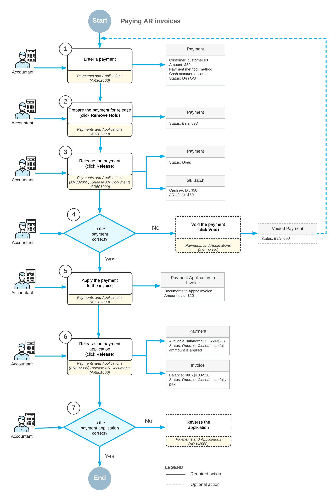

# Invoice Payments: General Information {#_82732121-f009-4b4f-a172-71088649dc2a .concept}

You create a payment document by using the [Payments and Applications](AR_30_20_00.md) \(AR302000\) form. In the payment, you specify the customer from which you have received the payment, the cash account to which the payment amount should be recorded, the payment method, and the payment amount. The payment method denotes the actual means of payment: cash, printed check, or wire transfer.

When you are entering the payment, you can specify the documents to which the payment applies and then release the payment and the application at once.

## Learning Objectives {#section_wg4_4jv_vxb .section}

In this chapter, you will learn how to do the following:

-   Enter a payment
-   Apply the payment to an AR invoice
-   Release the payment and the payment application to the AR invoice

## Applicable Scenarios {#section_zg4_4jv_vxb .section}

Payments can be created in the following cases:

-   Manually by the user on the [Payments and Applications](AR_30_20_00.md) \(AR302000\) form. For step-by-step instructions, see [Invoice Payments: To Enter a Payment for a Specific Invoice](Finance_PayingARInvoices_Process_Activity.md).
-   By the system when the user clicks **Pay** or **Apply** on the form toolbar of the [Invoices and Memos](AR_30_10_00.md) \(AR301000\) form. In this case, the system creates a document with the *Payment* type automatically. \(This scenario is described in the process activity later.\)
-   On the [Generate Payments](AR_51_10_00.md) \(AR511000\) form when the user initiates creation of payment documents for customers with the *Credit Card* default payment method.

## Payment Processing Stages {#section_bh4_4jv_vxb .section}

You use this documents of the *Payment* type to record a customer payment for goods or services sold. Also, you can use this type to record a customer's prepayments, if you do not need to track prepayments separately. The system includes the sum of all open customer payment documents with the *Payment* type in the customer balance, which it displays in the **Balance** box on the [Customers](AR_30_30_00.md) \(AR303000\) form. Thus, balances of open payments decrease the customer's balance. You can apply outstanding documents to a payment before or after you release it.

To identify payments, the system uses the numbering sequence specified in the **Payment Numbering Sequence** box on the **General** tab of the [Accounts Receivable Preferences](AR_10_10_00.md) form.

**Attention:** If the **Manual Numbering** check box is selected for the specified numbering sequence on the [Numbering Sequences](../Shared/../UserGuide/CS_20_10_10.md) \(CS201010\), the system validates each new reference number you enter in order to prevent the creation of payments and prepayments with the same reference number.

The main stages of payment processing are the following:

1.  *Recording*: In this stage, you create a payment—that is, provide all the necessary information to the system. By default, the system assigns to the payment the *Balanced* status when you save it for the first time, if the **Hold Documents on Entry** check box is cleared on the [Accounts Receivable Preferences](AR_10_10_00.md) \(AR101000\) form. This status indicates that the user has finished editing the payment and it is ready to be released, although you still can edit a payment with this status. Alternatively, if you click **Hold** on the form toolbar to indicate to the system that this payment is not ready to be released, the system changes the payment status to *On Hold*.
2.  *Application*: In this stage, you specify the list of the outstanding documents to which the system should apply the payment. You can do this while you record the payment or after you have released the payment. You can fully or partially apply the payment amount to an outstanding document, or distribute the payment amount among multiple outstanding documents. The system creates application records, which include the paid amount, for each included outstanding document. The system does not change the payment status during this stage; it remains *Balanced*, *On Hold* \(if you clicked **Hold** on the form toolbar\), or *Open* \(if the payment has been released\). For details, see [Invoice Payments: Manual Payment Application](AR__CON_PaymentApplication.md).
3.  *Releasing a payment*: You can release a payment only if it has the *Balanced* status. When you release the payment, the system checks the available payment balance and processes the payment accordingly. If the available payment balance is zero \(that is, if the payment has been fully applied to an outstanding document\), the system changes the statuses of both the payment and the paid document to *Closed*. If the available payment balance is nonzero, the system changes the payment status to *Open*. This status indicates to users and to the system that the payment is ready to be applied to the outstanding documents of a customer. For details, see [Invoice Payments: Release of Payments](AR__CON_PaymentRelease.md).
4.  *Releasing application records*: If you specify a list of outstanding documents for a payment with the *Open* status, you should release the application records after you have finished distributing the payment amount between the outstanding documents. You can fully or partially apply the payment amount to outstanding documents. When you release the applications the system checks the available payment balance. Based on this data, the system processes the payment differently, in one of the following ways:
    -   If the payment amount is fully applied to an outstanding document, the system does the following: releases application records; changes the statuses of the payment and the paid document to *Closed*; and decreases the balances of the paid document and the payment. The system may change the balance of the customer, if documents with different currencies are involved.
    -   If the payment amount is partially applied, the system leaves the payment status as *Open*; it also decreases the balances of the paid document, the payment, and the customer. If some outstanding documents were fully paid with the applied amount, the system changes the status of the paid document to *Closed*.

## Document Structure {#section_dh4_4jv_vxb .section}

Regardless of how a payment document is created, it has the same groups of settings, which are described in this section:

-   *Summary*: Settings that are located in the Summary area of the form define the general information required for issuing the payment. When you create a new document, the system inserts the current business date as the date of application and the corresponding post period. When you select the identifier of the customer account, the system uses the customer as a source to automatically fill in most settings needed for processing the payment. All settings filled in by the system can be manually overridden.
-   *Financial details*: This group of settings, located on the **Financial** tab, defines the General Ledger accounts where the payment transactions are recorded after a user releases the payment. The system fills in the values for these settings automatically when you select a customer account, but they can be manually overridden. When you create a new document, the system also inserts the current business date as the payment date and the corresponding post period.
-   *Application details*: Each outstanding document that you want to pay with the payment is specified in a separate line of the table on the **Documents to Apply** tab. The payment document can be applied to multiple outstanding documents. For each line, you specify the amount to be paid in the **Amount Paid** column. For details, see [Invoice Payments: Manual Payment Application](AR__CON_PaymentApplication.md).
-   *Balance details*: Read-only elements in the Summary area of the form display how the amount of the payment document has been distributed and currently available balance \(the amount that is not applied\). The system updates the values of these elements when you modify application details.

When you save the document for the first time, the system generates a unique reference number for the payment document in accordance with the numbering sequence assigned to the corresponding payment document on the **General** tab of the [Accounts Receivable Preferences](AR_10_10_00.md) \(AR101000\) form.

## Payment Recording {#section_gh4_4jv_vxb .section}

In Acumatica ERP, you can create the following types of payment documents: *Payment*, *Prepayment*, and *Customer Refund*. The information in this topic applies to documents of all these types.

In Acumatica ERP, a user can manually enter an AR payment from the following forms:

-   The [Invoices and Memos](AR_30_10_00.md) form \(AR301000\) form, by clicking **Pay** or **Apply** on the form toolbar. The system opens the [Payments and Applications](AR_30_20_00.md) \(AR302000\) form where a payment document with the *Payment* type is created automatically: The elements of the form are filled in with the customer information, the invoice amount is specified as the document amount, and the application record of the invoice is added. You simply release the payment the system has created, and the system releases the application record as well and closes both documents.
-   The [Payments and Applications](AR_30_20_00.md) form. You create a payment document here from scratch.

## Invoice Payment Workflow {#section_jh4_4jv_vxb .section}

An open payment can be applied to customer documents, for example an invoice. To apply the payment to an invoice \(see 5 on the diagram below\), you specify the invoice and the amount to apply by using the [Payments and Applications](AR_30_20_00.md) \(AR302000\) form. After that, you release the payment application \(6\), and the system decreases the balances of the invoice and the payment by the application amount. The invoice appears in the application history of the payment. Once the invoice is settled, it has a balance of zero and becomes closed. The payment becomes closed once the full payment amount is applied to documents. If you have applied the payment to an invoice incorrectly, you can reverse the application \(7\) and reapply the payment to the appropriate invoice.

The following diagram illustrates the invoice payment workflow.

## Voided Payments {#section_ekm_4jv_vxb .section}

The system creates a document of this type when you void a document of the *Payment*, *Prepayment*, or *Balance WO* type that was erroneously recorded or is otherwise invalid. When you release a document of this type, the system reverses the original payment transactions. The system increases the customer's balance by the balance of the voided payment. For step-by-step instructions, see [To Void a Payment](AR__How_Voiding_a_Prepayment.md).

To identify documents of this type, the system uses the reference number of the voided payment.

**Parent topic:**[Paying AR Invoices](../UserGuide/Finance_PayingARInvoices_Mapref.md)

