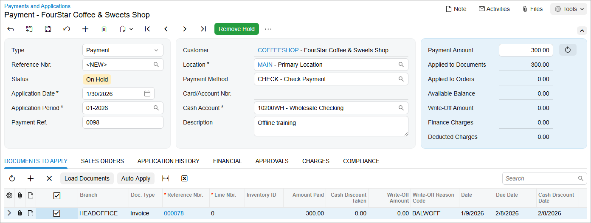

# Invoice Payments: To Enter a Payment for a Specific Invoice {#_faaa00e3-3d46-4b3a-a6fe-dfa88465c47a .task}

The following activity will walk you through the process of creating a payment and applying it to an invoice.

**Attention:** This activity is based on the *U100* dataset. If you are using another dataset or if any system settings have been changed in *U100*, these changes can affect the workflow of the activity and the results of the processing. To avoid issues, restore the *U100* dataset to its initial state.

## Story {#section_av4_4jv_vxb .section}

Suppose that on January 30, 2026, the SweetLife Fruits &amp; Jams company received a check for $300 from one of its customers, which had purchased an offline training course on January 9, 2026.

Acting as a SweetLife accountant, you need to create the payment in the system and apply it to the $300 invoice dated 1/9/2026.

## Process Overview {#section_dv4_4jv_vxb .section}

In this activity, you will find the needed invoice on the [Invoices and Memos](AR_30_10_00.md) \(AR301000\) form and click **Pay** on the form toolbar to create a payment for it on the [Payments and Applications](AR_30_20_00.md) \(AR302000\) form. You will then apply this payment to the invoice and release the payment with its application to the invoice.

## System Preparation {#section_fv4_4jv_vxb .section}

To prepare the system, do the following:

1.  Launch the Acumatica ERP website, and sign in to a company with the *U100* dataset preloaded. To sign in as an accountant, use the following credentials:
    -   Username: *johnson*
    -   Password: *123*
2.  In the info area, in the upper-right corner of the top pane of the Acumatica ERP screen, make sure that the business date in your system is set to *1/30/2026*. If a different date is displayed, click the Business Date menu button and select *1/30/2026*. For simplicity, in this exercise, you will create and process all documents in the system on this business date.
3.  On the Company and Branch Selection menu, also on the top pane of the Acumatica ERP screen, make sure that the *SweetLife Head Office and Wholesale Center* branch is selected. If it is not selected, click the Company and Branch Selection menu to view the list of branches that you have access to, and then click *SweetLife Head Office and Wholesale Center*.

## Step 1: Creating a Payment for a Specific Invoice {#section_hv4_4jv_vxb .section}

To create a payment for a specific invoice, do the following:

1.  Open the [Invoices and Memos](AR_30_10_00.md) \(AR301000\) form.
2.  Find the $300 invoice for the *COFFEESHOP* customer, which is dated 1/9/2026, and open it.
3.  On the form toolbar, click **Pay**.

    When you click this button, the system opens the [Payments and Applications](AR_30_20_00.md) \(AR302000\) form, creates a new payment in the amount of the invoice's open balance, and inserts the information from the invoice into the payment. You can change this default payment information in the payment before release.

4.  In the Summary area, make sure that the following information is displayed:
    -   **Application Date**: *1/30/2026*
    -   **Application Period**: *01-2026*
    -   **Description**: *Offline training*
    -   **Payment Amount**: `300` \(the amount you have received from the customer\)
5.  On the **Documents to Apply** tab, in the **Amount Paid** column for the invoice, leave the full amount to be applied, $300, as shown in the following screenshot.

    

6.  On the form toolbar, click **Remove Hold** and click **Save** to save the document.

## Step 2: Releasing the Payment and Its Application to the Invoice {#section_kv4_4jv_vxb .section}

To release the payment and its application to the invoice, do the following:

1.  While you are still on the [Payments and Applications](AR_30_20_00.md) \(AR302000\) form, click **Release** on the form toolbar.
2.  On the **Application History** tab, review the row that the system has added, and click the link in the **Batch Number** column.
3.  The system opens the [Journal Transactions](GL_30_10_00.md) \(GL301000\) form with the GL transaction that was generated after the release of the payment.

**Parent topic:**[Paying AR Invoices](../UserGuide/Finance_PayingARInvoices_Mapref.md)

