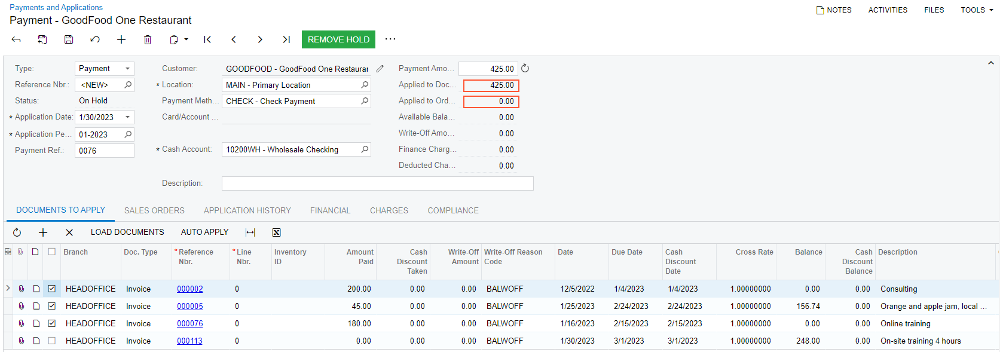
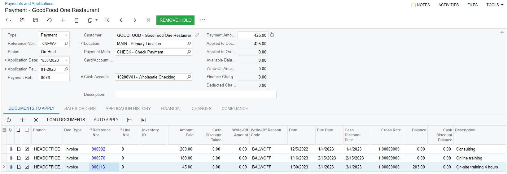
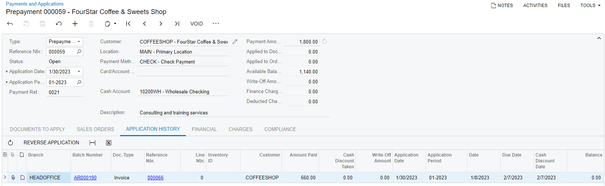
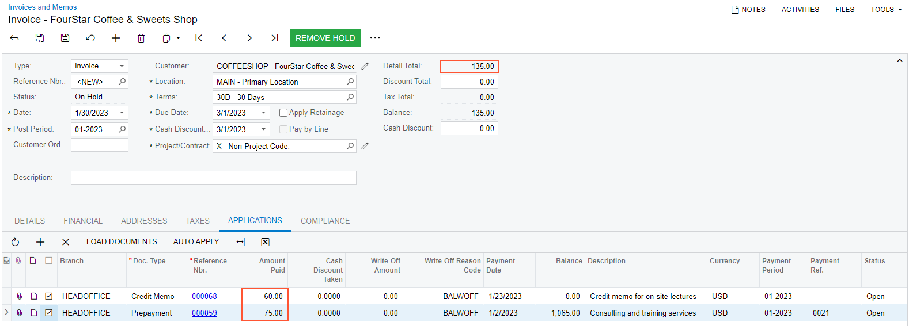

# Invoice Payments: To Load AR Documents Automatically {#_62a55f03-6c40-4cf2-82b6-5c8afedf82f0 .task}

In this activity, you will explore how the system loads AR documents for payment application and how payment amounts can be automatically applied to multiple documents. You will also review how multiple payments can be automatically applied to an AR document.

**Attention:** This activity is based on the *U100* dataset. If you are using another dataset or if any system settings have been changed in *U100*, these changes can affect the workflow of the activity and the results of the processing. To avoid issues, restore the *U100* dataset to its initial state.

## Story {#section_cw4_4jv_vxb .section}

On January 30, 2026, you received a $135 payment from the CoffeeShop company. Acting as a SweetLife accountant, you need to enter it in Acumatica ERP and apply it to the corresponding invoice.

You have also received a $425 payment from the Good Food company for two of the outstanding invoices of the customer \(in the amounts of $200 and $225, respectively\). You need to enter the payment and apply it to the invoices.

CoffeeShop's accountant has asked you to use a $1800 prepayment to settle invoices issued to the CoffeeShop company between January 1, 2026 and January 14, 2026. You need to identify the relevant invoices and apply the prepayment to them.

The CoffeeShop company has bought another offline course from SweetLife. For this purchase, you need to apply an invoice, a credit memo, and the remainder of the prepayment.

## Process Overview {#section_hw4_4jv_vxb .section}

During the completion of this activity, on the [Payments and Applications](AR_30_20_00.md) \(AR302000\) form, you will start entering a new payment from a customer and analyze how the system automatically loads the AR documents to which the payment can be applied. In the list of loaded documents, you will select an invoice for payment application, and then update the payment amount to reflect the invoice amount.

While still on the [Payments and Applications](AR_30_20_00.md) form, you will enter a payment from a customer, review how the system automatically loads the AR documents to which the payment can be applied, and then explore how the payment amount can be automatically applied to the loaded documents.

Then on the same form, you will open an existing open prepayment, invoke the **Load Options** dialog box, and specify the selection criteria for the AR documents to be loaded for payment application. You will also analyze how the **Load** and **Reload** buttons determine whether the AR documents that have already been added to the table on the **Documents to Apply** tab are kept or removed when you load AR documents by using the **Load Options** dialog box.

Finally, on the [Invoices and Memos](AR_30_10_00.md) \(AR301000\) form, you will create an invoice and load to the **Applications** tab the list of payments that can be applied to this invoice. You also explore how the auto-application of multiple payments works.

## System Preparation {#section_mw4_4jv_vxb .section}

Perform the following initial actions to prepare the system:

1.  Launch the Acumatica ERP website, and sign in as an accountant by using the following credentials:
    -   Username: *johnson*
    -   Password: *123*
2.  In the info area, in the upper-right corner of the top pane of the Acumatica ERP screen, make sure that the business date in your system is set to *1/30/2026*. If a different date is displayed, click the Business Date menu button and select *1/30/2026*. For simplicity, in this lesson, you will create and process all documents in the system on this business date.
3.  On the Company and Branch Selection menu, also on the top pane of the Acumatica ERP screen, make sure that the *SweetLife Head Office and Wholesale Center* branch is selected. If it is not selected, click the Company and Branch Selection menu button to view the list of branches that you have access to, and then click *SweetLife Head Office and Wholesale Center*.

## Step 1: Entering a Payment for a Particular Invoice {#section_ow4_4jv_vxb .section}

To enter a payment for the $135 invoice for the *COFFEESHOP* customer, do the following:

1.  Open the [Payments and Applications](AR_30_20_00.md) \(AR302000\) form.
2.  On the form toolbar, click **Add New Record**.
3.  In the Summary area of the form, select the *Payment* document type and the *COFFEESHOP* customer. Do not specify the payment amount yet.

    On the **Documents to Apply** tab, notice that a list of AR documents is now displayed in the table.

    The system has added all AR documents created for the *COFFEESHOP* customer that have not been closed and that have no unreleased payment applications. Also notice that the credit memo dated *1/23/2026* is displayed in the first row of the table. If there are any credit memos for the selected customer, the system always displays them at the top of the list.

4.  In the list of loaded documents, find the $135 invoice dated *1/10/2026*, and in the row of the invoice, select the unlabeled check box to select the invoice for payment application.

    Notice that when you selected the check box, the outstanding invoice balance \(that is, the value in the **Balance** column\) became *0*, and the applied payment amount \(that is, the amount in the **Amount Paid \(USD\)** column\) changed to *135*. This means that the applied amount fully covered the outstanding amount of the invoice \(that is, the invoice has been paid in full\).

5.  In the Summary area of the form, click the Refresh button right of the **Payment Amount** box.

    The amount in the **Payment Amount** box has now been updated to reflect the amount of the selected invoice.

6.  On the form toolbar, click **Save** to save your changes.

    Notice that the table on the **Documents to Apply** tab now shows only the $135 invoice to which you have applied the payment. All other AR documents that the system previously loaded have disappeared.

You do not have to process this payment any further. You have created it to observe how the system automatically loads AR documents for payment application and how you can quickly update the payment amount to reflect the amount applied to the documents.

## Step 2: Entering a Payment and Auto-Applying It to Multiple Invoices {#section_ww4_4jv_vxb .section}

To enter a payment that covers multiple invoices for the *GOODFOOD* customer, do the following:

1.  Open the [Payments and Applications](AR_30_20_00.md) \(AR302000\) form.
2.  In the Summary area of the form, create a new payment, and specify the following settings in the Summary area:

    -   **Type**: *Payment*
    -   **Application Date**: *1/30/2026* \(selected by default\)
    -   **Customer**: *GOODFOOD*
    -   **Payment Amount**: `425`
    On the **Documents to Apply** tab, notice that the system has added multiple invoices to which this payment can be applied.

3.  On the table toolbar of the **Documents to Apply** tab, click **Auto-Apply**.

    In the Summary area, notice that the **Available Balance** of the payment has become *0*, and the **Applied to Documents** amount is now *425*, as shown in the following screenshot.

    

    The system has applied the full amount of the payment to the three invoices in the table as follows:

    -   The outstanding balances of two invoices with the earliest due dates are now *0* \(as indicated in the **Balance** box\), which means that the invoices have been paid in full.
    -   The third invoice, for *201.74* and dated *1/25/2026*, has been paid only in part. The payment balance available after the application to the first two invoices \(*45*\) has been applied to the third invoice.
    The system applies the payment balance to the documents in the table starting with the document having the earliest due date. If after applying the payment to the first document, there is still available balance, the system applies it to the document whose due date is the earliest one among the rest. This process continues until the available payment balance becomes zero or until there are no more documents to which the payment can be applied.

    **Attention:** The system always auto-applies the available payment balance to the documents in the table starting with the document whose due date is the earliest.

4.  Delete the row with the $201.74 invoice from the table.
5.  On the table toolbar, click **Auto-Apply**.

    Notice that the system has reapplied the payment amount \($425\) to the three invoices in the table, and now the first two invoices are paid in full, as shown in the following screenshot.

You do not need to save or process this payment any further. You started entering it only to see how the system loads documents to which it can be applied and how auto-application of payment works.

## Step 3: Applying an Existing Prepayment to Multiple Invoices {#section_fx4_4jv_vxb .section}

To apply a prepayment to multiple invoices for the *COFFEESHOP* customer, do the following:

1.  On the [Payments and Applications](AR_30_20_00.md) \(AR302000\) form, open the $1,800 prepayment made by the *COFFEESHOP* customer.

    On the **Documents to Apply** tab, notice that the system has not loaded to the table any AR documents to which this prepayment can be applied; the system automatically loads documents to this table only when you create a new payment or prepayment and select a customer in the Summary area of the form.

2.  On the table toolbar, click **Load Documents**.

    In the **Load Options** dialog box, which opens, you can specify the selection criteria for the documents to be loaded.

3.  Leave the default settings and click **Load**.

    The system has loaded AR documents \(a credit memo and six invoices\) to the table based on the default settings.

    The invoice to which you applied the payment in Step 1 is not shown on the list because the system does not load to the table AR documents with unreleased applications.

    Because the **Automatically Apply Amount Paid** check box was selected in the **Load Options** dialog box, the system has applied the available prepayment balance to the loaded documents, which is indicated by the unlabeled check box selected in the four rows of the table.

    **Attention:** The system always auto-applies the available payment balance to the documents in the table starting with the document whose due date is the earliest.

4.  On the table toolbar, click **Load Documents**.
5.  In the **Load Options** dialog box, which opens, specify the following selection criteria:
    -   **From Date**: *1/1/2026*
    -   **To Date**: *1/14/2026*
6.  Click **Load**.

    Notice that the list of AR documents in the table has not changed. This is because when you click **Load** in the **Load Options** dialog box, the system adds AR documents matching the selected criteria to the documents in the table; the documents that are already present in the table are not removed, even if they do not match the selected criteria.

7.  On the table toolbar, click **Load Documents** again.
8.  In the **Load Options** dialog box, keep the current selection criteria, and click **Reload**.

    Notice that now the table on the **Documents to Apply** tab contains only one invoice that matches the selection criteria specified in the **Load Options** dialog box. When you click **Reload** in this dialog box, the system removes any documents from the table and loads only the documents matching the selected criteria.

    The invoice has been paid in full \(*660* has been applied to it, as shown in the **Amount Paid \(USD\)** column\), and the prepayment still has *1140* of available balance \(displayed in the **Available Balance** box of the Summary area\).

9.  Save your changes to the prepayment.
10. On the form toolbar, click **Release**.

    **Attention:** You must release this prepayment and its application at this point; otherwise, it will not be displayed in Step 4.

The released prepayment is shown in the following screenshot.

## Step 4: Creating an Invoice and Applying It to Multiple Payments {#section_sx4_4jv_vxb .section}

To create an an AR invoice and apply it to multiple payments that already exist in the system, do the following:

1.  Open the [Invoices and Memos](AR_30_10_00.md) \(AR301000\) form.
2.  In the Summary area of the form, click **Add New Record**, and specify the following settings in the Summary area:
    -   **Type**: *Invoice*
    -   **Customer**: *COFFEESHOP*
    -   **Date**: *1/30/2026* \(selected by default\)
3.  On the **Details** tab, click **Add Row** on the table toolbar, and specify the following settings in the added row:
    -   **Branch**: *HEADOFFICE* \(selected by default\)
    -   **Inventory ID**: *OFLCOURSE*
    -   **Quantity**: `3`
    -   **UOM**: *DAY* \(selected by default\)
    -   **Unit Price**: `45` \(selected by default\)
4.  On the **Applications** tab, click **Load Documents**.

    Notice that the system has loaded a $60 credit memo and a $1140 prepayment that can be applied to the invoice.

5.  Select the unlabeled check box in the rows of the credit memo and the prepayment, and save the invoice.

    Notice that the system displays an error. When you select the unlabeled check box in the row of a payment, the payment's available amount is fully applied to the current AR document. In this case, the amount of the prepayment \($1140\) is greater than the outstanding amount of the invoice \($75\).

6.  On the table toolbar, click **Auto-Apply**.

    Notice that the **Amount Paid \(USD\)** in the row of the prepayment has changed from *1140* to *75*. Now the total of the applied amounts of the credit memo and the prepayment is equal to the invoice amount, as shown in the following screenshot.

You do not need to save or process this invoice any further.

**Parent topic:**[Paying AR Invoices](../UserGuide/Finance_PayingARInvoices_Mapref.md)

