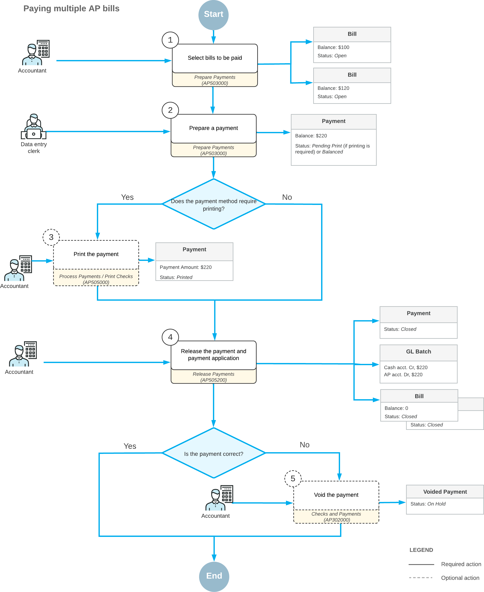

# Multiple Bill Payments: General Information {#_720ade89-eee5-4c0c-8d09-6253f08e4abe .concept}

You can initiate the process of paying multiple bills automatically on the [Prepare Payments](AP_50_30_00.md) \(AP503000\) form. You can select bills for payment by payment date, cash account, payment method, vendor, and discount availability. AP payments will be created for the selected bills and grouped by vendor. For a specific bill, you may require a separate payment if the **Pay Separately** option was selected for this bill. Also, if the **Pay Separately** option is selected for the vendor on the [Vendors](AP_30_30_00.md) \(AP303000\) form, each bill or credit adjustment of the vendor will be paid by a separate AP payment.

## Learning Objectives {#section_hqk_njv_vxb .section}

In this chapter, you will learn how to do the following:

-   Select the bills to be paid
-   Prepare and release payments for multiple bills

## Applicable Scenarios {#section_kqk_njv_vxb .section}

You prepare a payment to pay multiple bills when you have multiple bills from the same vendor that are due.

## Payment Processing {#section_mqk_njv_vxb .section}

To pay multiple bills, you have to create a payment: a document that represents the payment in the system. You use the [Prepare Payments](AP_50_30_00.md) \(AP503000\) form to generate a payment for multiple bills of the same vendor.

During processing, a payment can have the following statuses.

|Status|Description|
|------|-----------|
|*On Hold*|The payment is being edited and cannot be released. The system assigns this status to each created payment by default if the **Hold Documents on Entry** check box is selected on the [Accounts Payable Preferences](AP_10_10_00.md) \(AP101000\) form or if approvals have been configured for payments.|
|*Pending Approval*|The payment needs to be approved before it is processed by the responsible person or persons. The system can assign this status to a payment to be approved once it is removed from hold, or when the payment is created if the **Hold Documents on Entry** check box is cleared on the [Accounts Payable Preferences](AP_10_10_00.md) form. This status can be assigned to the payment only if the *Approval Workflow* feature is enabled on the [Enable/Disable Features](CS_10_00_00.md) \(CS100000\) form.|
|*Rejected*|The payment has been rejected by at least one assigned approver. The system can assign this status to the document only if the *Approval Workflow* feature is enabled on the [Enable/Disable Features](CS_10_00_00.md) form.|
|*Pending Print*|The payment must be printed or processed before it can be released.|
|*Printed*|The payment is ready and can be released. The system assigns this status to payments that have been processed \(if the payment method requires that payments undergo additional processing\).|
|*Balanced*|The payment is ready to be released. The system assigns this status to payments whose payment method does not require the payments to undergo additional processing. \(An approved payment is assigned this status if its payment method does not require the payment to undergo additional processing.\)|
|*Open*|The payment has been released and still has an unapplied balance \(meaning that the application amount is less than the payment amount\).|
|*Reserved*|The payment has been released and then put on hold to be excluded from the automatic application process.|
|*Closed*|The payment has been released and fully applied to the appropriate bill or bills.|
|*Voided*|The payment has been voided.|

## Process Diagram {#section_pqk_njv_vxb .section}

The following diagram illustrates the workflow of processing multiple bill payments without approval.

**Parent topic:**[Paying Multiple AP Bills](../UserGuide/Finance_PayingMultipleBills_Mapref.md)

